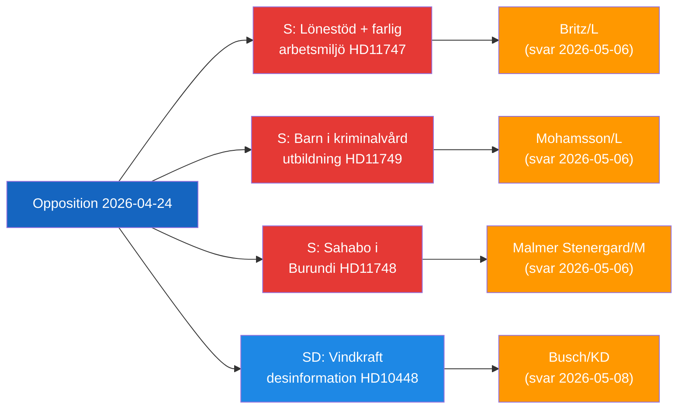

# Executive Brief — Opposition Parliamentary Activity, 2026-04-24

**Classification**: Public | **F3EAD Stage**: DISSEMINATE
**Author**: James Pether Sörling | **Date**: 2026-04-26

---

## BLUF

Swedish opposition MPs are targeting three distinct government accountability gaps: dangerous workplaces receiving wage subsidies for disabled workers, incarcerated children lacking educational legal safeguards, and a detained Swedish citizen in Burundi. Simultaneously, SD challenges the energy-disinformation narrative used by EU industry and public broadcasters to delegitimise wind energy criticism.

---

## Top-3 Decisions Facing the Government

| # | Decision | Deadline | Stakes |
|---|----------|----------|--------|
| 1 | **Britz (L)** must respond to Haraldsson (S) on Arbetsförmedlingen oversight of lönebidrag placements at hazardous workplaces | 2026-05-06 | Union trust + disability rights credibility |
| 2 | **Mohamsson (L)** must commit to legal framework timeline for education in new juvenile incarceration units | 2026-05-06 | Children's constitutional rights + implementation legitimacy |
| 3 | **Malmer Stenergard (M)** must show active consular engagement for Christophe Sahabo in Burundi | 2026-05-06 | Sweden's human rights credibility in authoritarian contexts |

---

## 60-Second Intelligence Read

Three Socialdemokraterna MPs filed written questions on 2026-04-24 targeting three L/M ministers on distinct but thematically linked governance failures: Johanna Haraldsson asks Labour Minister Britz why Arbetsförmedlingen continues wage-subsidy placements at a Skåne firm where IF Metall repeatedly warned of toxic chemical exposure; Anna Wallentheim asks Education Minister Mohamsson how children in the new juvenile prisons will receive constitutionally-guaranteed equal education before enabling legislation exists; Olle Thorell asks Foreign Minister Malmer Stenergard what active measures are underway to free Swedish citizen Christophe Sahabo detained in Burundi's deteriorating authoritarian state. SD's Josef Fransson separately filed an interpellation asking Energy Minister Busch whether Sweden's energy policy should be reconsidered in light of an industry report that labels critical questions about wind energy as Russian disinformation. Four committee reports also progressed through Riksdagen: a new firearms law (JuU10 approved), an assessment of the failed 2015 police reform (JuU31), a building process efficiency bill (CU24), and elder care strengthening (SoU25).

The dominant intelligence theme: **the opposition is successfully identifying implementation and oversight gaps** in the current government's reform agenda, creating accountability pressure heading into the 2026 election cycle.

---

