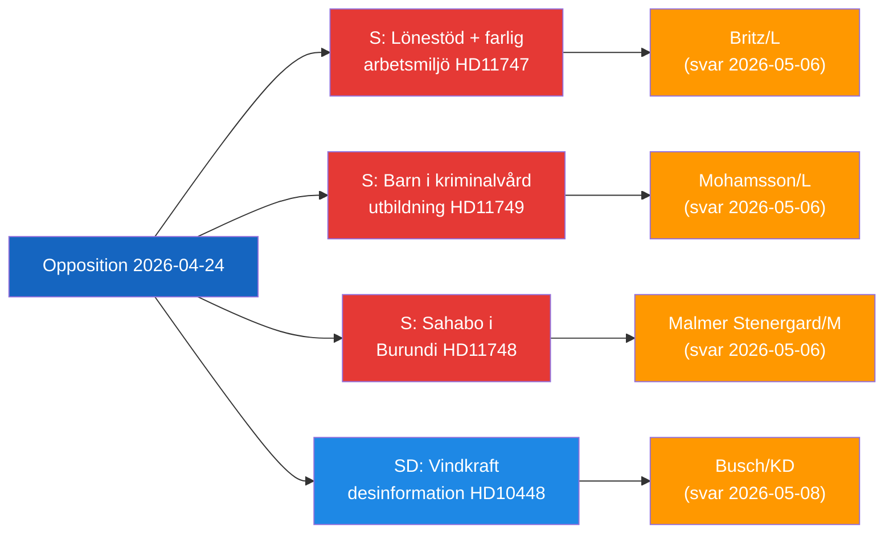

<!-- dir: rtl -->
# موجز تنفيذي — النشاط البرلماني للمعارضة، 2026-04-24

**التصنيف**: عام | **مرحلة F3EAD**: النشر
**المؤلف**: James Pether Sörling | **التاريخ**: 2026-04-26

---

## الموجز (BLUF)

يستهدف نواب المعارضة السويديون ثلاثة ثغرات متميزة في المساءلة الحكومية: أماكن العمل الخطرة التي تتلقى دعماً للأجور للعمال ذوي الإعاقة، والأطفال المحتجزون الذين يفتقرون إلى ضمانات قانونية للتعليم، ومواطن سويدي محتجز في بوروندي. في الوقت ذاته، يتحدى حزب SD السرد المتعلق بالتضليل في مجال الطاقة الذي تستخدمه صناعة الاتحاد الأوروبي والمذيعون العامون لتشكيك في شرعية انتقاد طاقة الرياح.

---

## أهم 3 قرارات تواجهها الحكومة

| # | القرار | الموعد النهائي | المخاطر |
|---|--------|---------------|---------|
| 1 | يجب على **Britz (L)** الرد على Haraldsson (S) بشأن إشراف Arbetsförmedlingen على توظيفات lönebidrag في أماكن العمل الخطرة | 2026-05-06 | ثقة النقابات + مصداقية حقوق ذوي الإعاقة |
| 2 | يجب على **Mohamsson (L)** الالتزام بجدول زمني للإطار القانوني للتعليم في وحدات احتجاز الأحداث الجديدة | 2026-05-06 | الحقوق الدستورية للأطفال + شرعية التنفيذ |
| 3 | يجب على **Malmer Stenergard (M)** إظهار مشاركة قنصلية نشطة لـ Christophe Sahabo في بوروندي | 2026-05-06 | مصداقية السويد في حقوق الإنسان في السياقات الاستبدادية |

---

## نقطة الاستخبارات في 60 ثانية

أودع ثلاثة من برلمانيي Socialdemokraterna أسئلة مكتوبة في 2026-04-24 موجهة إلى ثلاثة وزراء L/M بشأن إخفاقات حوكمة متميزة لكنها مرتبطة موضوعياً: تسأل Johanna Haraldsson وزير العمل Britz لماذا تواصل Arbetsförmedlingen توظيفات الدعم الأجري في شركة بمنطقة سكانيا حيث حذر IF Metall مراراً من التعرض للمواد الكيميائية السامة؛ وتسأل Anna Wallentheim وزير التعليم Mohamsson كيف سيتلقى الأطفال في السجون الجديدة للأحداث تعليماً متكافئاً مضموناً دستورياً قبل وجود التشريع المُمَكِّن؛ ويسأل Olle Thorell وزير الخارجية Malmer Stenergard عن الإجراءات النشطة الجارية لتحرير المواطن السويدي Christophe Sahabo المحتجز في دولة بوروندي الاستبدادية المتردية. قدّم Josef Fransson من SD بشكل منفصل استجواباً لوزير الطاقة Busch حول ما إذا كان ينبغي إعادة النظر في سياسة السويد للطاقة في ضوء تقرير صناعي يصف الأسئلة النقدية حول طاقة الرياح بأنها تضليل روسي. كما تقدمت أربعة تقارير لجان: قانون أسلحة ناري جديد (JuU10 موافق عليه)، وتقييم للإصلاح الفاشل لعام 2015 للشرطة (JuU31)، ومقترح كفاءة لعملية البناء (CU24)، وتعزيز رعاية المسنين (SoU25).

الموضوع الاستخباراتي السائد: **المعارضة تنجح في تحديد ثغرات التنفيذ والرقابة** في أجندة الإصلاح للحكومة الحالية، مما يخلق ضغطاً على المساءلة في اتجاه دورة انتخابات 2026.

---

