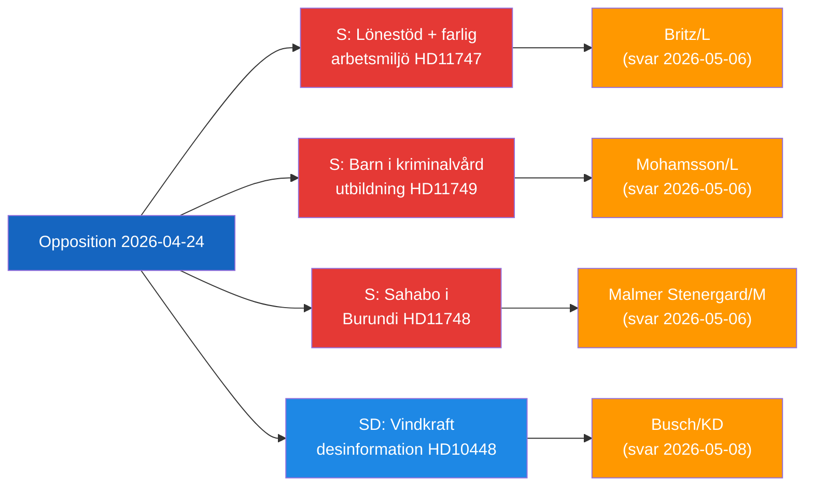

# Executive Brief — Oppositionens parlamentariske aktivitet, 2026-04-24

**Klassifikation**: Offentlig | **F3EAD-fase**: DISSEMINER
**Forfatter**: James Pether Sörling | **Dato**: 2026-04-26

---

## BLUF

Svenske oppositionspolitikere retter sig mod tre distinkte statslige ansvarsgab: farlige arbejdspladser, der modtager lønsubsidier for handicappede arbejdere, fængslede børn uden juridisk uddannelsesbeskyttelse, og en tilbageholdt svensk statsborger i Burundi. Desuden udfordrer SD energidesinformationsnarrativen, der bruges af EU-industrien og public service til at delegitimere vindkraftkritik.

---

## Top-3 beslutninger, som regeringen skal træffe

| # | Beslutning | Deadline | Indsats |
|---|------------|----------|---------|
| 1 | **Britz (L)** skal svare Haraldsson (S) om Arbetsförmedlingens tilsyn med lönebidrag-placeringer på farlige arbejdspladser | 2026-05-06 | Faglig tillid + troværdighed i handicaprettigheder |
| 2 | **Mohamsson (L)** skal forpligte sig til en tidsplan for den juridiske ramme for uddannelse i nye ungdomsfængsler | 2026-05-06 | Børns forfatningsmæssige rettigheder + implementeringslegitimitet |
| 3 | **Malmer Stenergard (M)** skal vise aktivt konsulært engagement for Christophe Sahabo i Burundi | 2026-05-06 | Sveriges troværdighed i menneskerettigheder i autoritære kontekster |

---

## 60-sekunders intelligens

Tre Socialdemokraterna-parlemetarikere indsendte skriftlige spørgsmål den 2026-04-24 rettet mod tre L/M-ministre vedrørende distinkte, men tematisk forbundne styringsfejl: Johanna Haraldsson spørger arbejdsmarkedsminister Britz, hvorfor Arbetsförmedlingen fortsætter lønsubsidieringssplaceringer hos en skånsk virksomhed, hvor IF Metall gentagne gange har advaret om toksisk kemisk eksponering; Anna Wallentheim spørger uddannelsesminister Mohamsson, hvordan børn i de nye ungdomsfængsler vil modtage forfatningsmæssigt garanteret ligeværdig uddannelse, inden muliggørende lovgivning eksisterer; Olle Thorell spørger udenrigsminister Malmer Stenergard, hvilke aktive foranstaltninger der er i gang for at frigive den svenske statsborger Christophe Sahabo, der tilbageholdes i Burundis forværrede autoritære stat. SDs Josef Fransson indsendte separat en interpellation til energiminister Busch om, hvorvidt Sveriges energipolitik bør genovervejesi lyset af en brancherapport, der betegner kritiske spørgsmål om vindenergi som russisk desinformation. Fire udvalgsrapporter gik også videre: en ny skydevabenlov (JuU10 godkendt), en vurdering af den mislykkede 2015-politireform (JuU31), et effektivitetsforslag til byggeprocessen (CU24) og styrkelse af ældrepleje (SoU25).

Det dominerende intelligensetema: **oppositionen formår at identificere implementerings- og tilsynsgab** i den nuværende regerings reformdagsorden, hvilket skaber ansvarspres frem mod valgcyklussen 2026.

---

