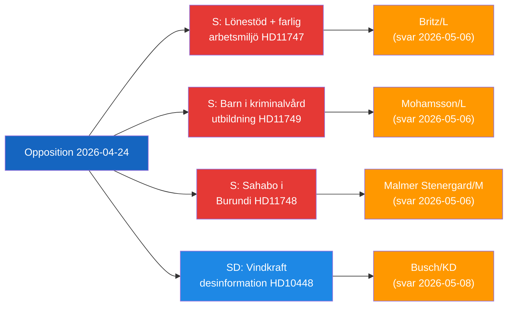

# Exekutivbriefing — Parlamentarische Oppositionsaktivität, 2026-04-24

**Klassifizierung**: Öffentlich | **F3EAD-Phase**: VERBREITEN
**Autor**: James Pether Sörling | **Datum**: 2026-04-26

---

## BLUF

Schwedische Oppositionsabgeordnete zielen auf drei unterschiedliche staatliche Rechenschaftslücken ab: gefährliche Arbeitsplätze, die Lohnzuschüsse für behinderte Arbeitnehmer erhalten, inhaftierte Kinder ohne rechtliche Bildungsschutzmaßnahmen und ein inhaftierter schwedischer Staatsbürger in Burundi. Gleichzeitig hinterfragt die SD die Energiedesinformationserzählung, die von der EU-Industrie und öffentlich-rechtlichen Sendern verwendet wird, um Windenergie-Kritik zu delegitimieren.

---

## Top-3-Entscheidungen für die Regierung

| # | Entscheidung | Frist | Einsätze |
|---|--------------|-------|----------|
| 1 | **Britz (L)** muss Haraldsson (S) auf die Frage zur Aufsicht der Arbetsförmedlingen über lönebidrag-Vermittlungen an gefährlichen Arbeitsplätzen antworten | 2026-05-06 | Gewerkschaftliches Vertrauen + Glaubwürdigkeit in Behindertenrechten |
| 2 | **Mohamsson (L)** muss sich zu einem Zeitplan für den Rechtsrahmen für Bildung in neuen Jugendstrafeinrichtungen verpflichten | 2026-05-06 | Verfassungsrechte von Kindern + Implementierungslegitimität |
| 3 | **Malmer Stenergard (M)** muss aktives konsularisches Engagement für Christophe Sahabo in Burundi zeigen | 2026-05-06 | Schwedens Menschenrechtsglaubwürdigkeit in autoritären Kontexten |

---

## 60-Sekunden-Geheimdienstbericht

Drei Socialdemokraterna-Abgeordnete reichten am 2026-04-24 schriftliche Anfragen ein, die sich an drei L/M-Minister wegen unterschiedlicher, aber thematisch verbundener Regierungsversagen richten: Johanna Haraldsson fragt Arbeitsminister Britz, warum die Arbetsförmedlingen weiterhin Lohnsubventionsvermittlungen bei einem schonischen Unternehmen fortsetzt, wo IF Metall wiederholt vor toxischer Chemikalienexposition gewarnt hat; Anna Wallentheim fragt Bildungsminister Mohamsson, wie Kinder in den neuen Jugendgefängnissen verfassungsrechtlich garantierte Bildungsgleichheit erhalten sollen, bevor die entsprechende Gesetzgebung existiert; Olle Thorell fragt Außenminister Malmer Stenergard, welche aktiven Maßnahmen ergriffen werden, um den schwedischen Staatsbürger Christophe Sahabo zu befreien, der im sich verschlechternden autoritären Burundi inhaftiert ist. SDs Josef Fransson reichte separat eine Interpellation bei Energieminister Busch ein, ob Schwedens Energiepolitik angesichts eines Branchenberichts überdacht werden sollte, der kritische Fragen zur Windenergie als russische Desinformation bezeichnet. Vier Ausschussberichte wurden ebenfalls vorangebracht: ein neues Waffengesetz (JuU10 genehmigt), eine Bewertung der gescheiterten Polizeireform 2015 (JuU31), ein Effizienzvorschlag für Bauprozesse (CU24) und die Stärkung der Altenpflege (SoU25).

Das dominante Geheimdienstthema: **Die Opposition identifiziert erfolgreich Implementations- und Aufsichtslücken** in der Reformagenda der aktuellen Regierung und schafft Rechenschaftsdruck im Vorfeld des Wahlzyklus 2026.

---

