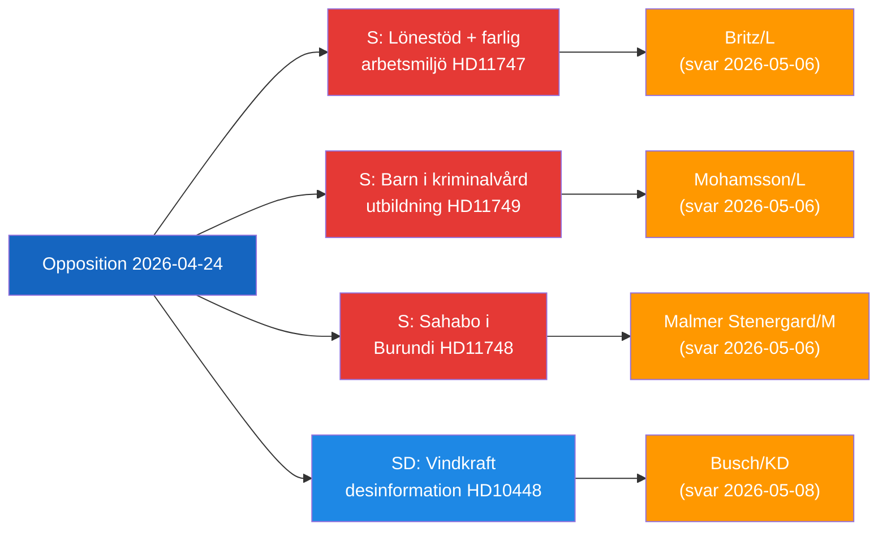

# Informe ejecutivo — Actividad parlamentaria de la oposición, 2026-04-24

**Clasificación**: Público | **Fase F3EAD**: DIFUNDIR
**Autor**: James Pether Sörling | **Fecha**: 2026-04-26

---

## BLUF

Diputados de la oposición sueca apuntan a tres brechas distintas en la rendición de cuentas del gobierno: lugares de trabajo peligrosos que reciben subsidios salariales para trabajadores con discapacidad, niños detenidos sin garantías legales de educación y un ciudadano sueco detenido en Burundi. Simultáneamente, el SD cuestiona la narrativa de desinformación energética utilizada por la industria de la UE y los radiodifusores públicos para deslegitimar las críticas a la energía eólica.

---

## Las 3 decisiones prioritarias del gobierno

| # | Decisión | Plazo | Apuestas |
|---|----------|-------|----------|
| 1 | **Britz (L)** debe responder a Haraldsson (S) sobre la supervisión de Arbetsförmedlingen de las colocaciones de lönebidrag en lugares de trabajo peligrosos | 2026-05-06 | Confianza sindical + credibilidad en derechos de personas con discapacidad |
| 2 | **Mohamsson (L)** debe comprometerse con un calendario para el marco legal de educación en los nuevos centros de internamiento juvenil | 2026-05-06 | Derechos constitucionales de los niños + legitimidad de implementación |
| 3 | **Malmer Stenergard (M)** debe mostrar un compromiso consular activo con Christophe Sahabo en Burundi | 2026-05-06 | Credibilidad de Suecia en derechos humanos en contextos autoritarios |

---

## Punto de inteligencia de 60 segundos

Tres parlamentarios de Socialdemokraterna presentaron preguntas escritas el 2026-04-24 dirigidas a tres ministros L/M sobre fallas de gobernanza distintas pero temáticamente vinculadas: Johanna Haraldsson pregunta al ministro de Trabajo Britz por qué Arbetsförmedlingen continúa las colocaciones con subsidio salarial en una empresa de Escania donde IF Metall ha advertido repetidamente sobre exposición química tóxica; Anna Wallentheim pregunta al ministro de Educación Mohamsson cómo los niños en las nuevas prisiones juveniles recibirán educación igualitaria garantizada constitucionalmente antes de que exista la legislación habilitante; Olle Thorell pregunta al ministro de Asuntos Exteriores Malmer Stenergard qué medidas activas están en curso para liberar al ciudadano sueco Christophe Sahabo detenido en el deteriorado estado autoritario de Burundi. Josef Fransson del SD presentó por separado una interpelación al ministro de Energía Busch preguntando si la política energética sueca debería reconsiderarse a la luz de un informe industrial que califica las preguntas críticas sobre la energía eólica como desinformación rusa. Cuatro informes de comité también avanzaron: una nueva ley de armas de fuego (JuU10 aprobada), una evaluación de la fallida reforma policial de 2015 (JuU31), un proyecto de eficiencia para el proceso de construcción (CU24) y el fortalecimiento del cuidado de personas mayores (SoU25).

El tema de inteligencia dominante: **la oposición está identificando exitosamente las brechas de implementación y supervisión** en la agenda de reforma del gobierno actual, creando presión de responsabilidad de cara al ciclo electoral 2026.

---

