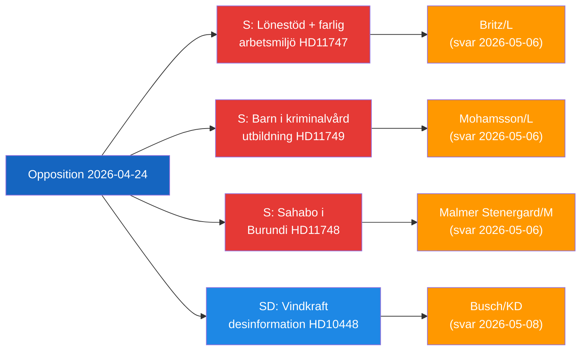

# Toimeenpaneva tiedote — Opposition parlamentaarinen toiminta, 2026-04-24

**Luokittelu**: Julkinen | **F3EAD-vaihe**: LEVITÄ
**Tekijä**: James Pether Sörling | **Päiväys**: 2026-04-26

---

## BLUF

Ruotsalaiset oppositiokansanedustajat kohdistavat kritiikkinsä kolmeen erilliseen hallituksen vastuuaukkoon: vaarallisiin työpaikkoihin, jotka saavat palkkatukia vammaisille työntekijöille, vankilassa oleviin lapsiin ilman koulutuksen oikeudellisia suojauksia, ja pidätettyyn ruotsalaiseen kansalaiseen Burundissa. SD kyseenalaistaa samanaikaisesti EU-teollisuuden ja julkisen palvelun käyttämän energiadesinformaationarratiivin tuulienergiakritiikkiä vastaan.

---

## Hallituksen kolme tärkeintä päätöstä

| # | Päätös | Määräaika | Panokset |
|---|--------|-----------|----------|
| 1 | **Britz (L)** on vastattava Haraldssonin (S) kysymykseen Arbetsförmedlingenin valvonnasta lönebidrag-sijoituksissa vaarallisille työpaikoille | 2026-05-06 | Ammattiliittojen luottamus + vammaisten oikeuksien uskottavuus |
| 2 | **Mohamsson (L)** on sitouduttava aikataluun oikeudelliselle kehykselle koulutuksesta uusissa nuorisovankiloissa | 2026-05-06 | Lasten perustuslailliset oikeudet + toimeenpanon legitimiteetti |
| 3 | **Malmer Stenergard (M)** on osoitettava aktiivinen konsulaarinen sitoutuminen Christophe Sahabo'n asiaan Burundissa | 2026-05-06 | Ruotsin ihmisoikeususkottavuus autoritaarisissa konteksteissa |

---

## 60 sekunnin tiedustelu

Kolme Socialdemokraterna-kansanedustajaa jätti kirjallisia kysymyksiä 2026-04-24 kolmelle L/M-ministerille erillisistä mutta temaattisesti yhteenliitetyistä hallinnon epäonnistumisista: Johanna Haraldsson kysyy työministeri Britziltä, miksi Arbetsförmedlingen jatkaa palkkatukisijoituksia skånelaisessa yrityksessä, jossa IF Metall on toistuvasti varoittanut myrkyllisestä kemiallisesta altistuksesta; Anna Wallentheim kysyy opetusministeri Mohamssonilta, kuinka uusien nuorisovankiloiden lapset saavat perustuslaillisesti taatun tasa-arvoisen koulutuksen ennen mahdollistavan lainsäädännön olemassaoloa; Olle Thorell kysyy ulkoministeri Malmer Stenergardilta, mitä aktiivisia toimenpiteitä on käynnissä ruotsalaisen kansalaisen Christophe Sahabo'n vapauttamiseksi Burundin heikentyneestä autoritaarisesta valtiosta. SD:n Josef Fransson jätti erikseen interpellaation energiministeri Buschille siitä, pitäisikö Ruotsin energiapolitiikka harkita uudelleen alan raportin valossa, joka leimaa kriittiset tuulienergiakysymykset venäläiseksi disinformaatioksi. Neljä valiokuntaraporttia eteni myös: uusi ampuma-aselaki (JuU10 hyväksytty), arviointi epäonnistuneesta 2015 poliisiuudistuksesta (JuU31), rakennusprosessin tehokkuusehdotus (CU24) ja vanhustenhuollon vahvistaminen (SoU25).

Hallitseva tiedusteluteema: **oppositio onnistuu tunnistamaan toimeenpano- ja valvontaaukkoja** nykyisen hallituksen uudistusagendassa, luoden vastuuvelvollisuuspainetta vuoden 2026 vaalikierroksen lähestyessä.

---

