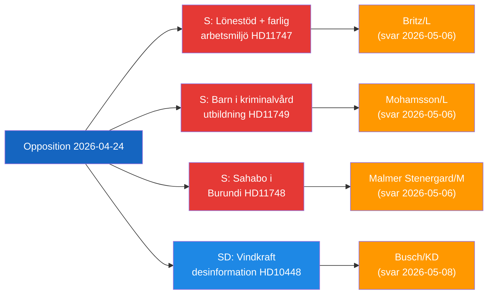

# Note de synthèse — Activité parlementaire de l'opposition, 2026-04-24

**Classification**: Public | **Phase F3EAD**: DIFFUSER
**Auteur**: James Pether Sörling | **Date**: 2026-04-26

---

## BLUF

Des parlementaires de l'opposition suédoise ciblent trois lacunes distinctes dans la responsabilité gouvernementale : des lieux de travail dangereux recevant des subventions salariales pour les travailleurs handicapés, des enfants détenus sans garanties légales en matière d'éducation et un citoyen suédois détenu au Burundi. Simultanément, le SD remet en question le récit sur la désinformation énergétique utilisé par l'industrie européenne et les diffuseurs publics pour délégitimer la critique de l'énergie éolienne.

---

## Les 3 décisions prioritaires du gouvernement

| # | Décision | Échéance | Enjeux |
|---|----------|----------|--------|
| 1 | **Britz (L)** doit répondre à Haraldsson (S) sur la supervision par l'Arbetsförmedlingen des placements lönebidrag dans des lieux de travail dangereux | 2026-05-06 | Confiance syndicale + crédibilité en matière de droits des personnes handicapées |
| 2 | **Mohamsson (L)** doit s'engager sur un calendrier pour le cadre juridique de l'éducation dans les nouveaux établissements d'incarcération pour mineurs | 2026-05-06 | Droits constitutionnels des enfants + légitimité de la mise en œuvre |
| 3 | **Malmer Stenergard (M)** doit montrer un engagement consulaire actif pour Christophe Sahabo au Burundi | 2026-05-06 | Crédibilité de la Suède en matière de droits de l'homme dans des contextes autoritaires |

---

## Point de renseignement en 60 secondes

Trois parlementaires Socialdemokraterna ont déposé des questions écrites le 2026-04-24 ciblant trois ministres L/M sur des défaillances de gouvernance distinctes mais thématiquement liées : Johanna Haraldsson demande au ministre du Travail Britz pourquoi l'Arbetsförmedlingen continue les placements subventionnés dans une entreprise de Scanie où IF Metall a répété des avertissements sur l'exposition à des produits chimiques toxiques ; Anna Wallentheim demande au ministre de l'Éducation Mohamsson comment les enfants dans les nouvelles prisons pour mineurs recevront une éducation égale garantie par la constitution avant que la législation habilitante existe ; Olle Thorell demande au ministre des Affaires étrangères Malmer Stenergard quelles mesures actives sont en cours pour libérer le citoyen suédois Christophe Sahabo détenu dans l'État autoritaire en détérioration du Burundi. Josef Fransson du SD a séparément déposé une interpellation auprès du ministre de l'Énergie Busch demandant si la politique énergétique suédoise devrait être reconsidérée à la lumière d'un rapport industriel qui qualifie les questions critiques sur l'énergie éolienne de désinformation russe. Quatre rapports de commission ont également progressé : une nouvelle loi sur les armes à feu (JuU10 approuvée), une évaluation de la réforme policière ratée de 2015 (JuU31), un projet d'efficacité pour le processus de construction (CU24) et le renforcement des soins aux personnes âgées (SoU25).

Le thème de renseignement dominant : **l'opposition identifie avec succès les lacunes d'implémentation et de supervision** dans l'agenda de réforme du gouvernement actuel, créant une pression de responsabilité à l'approche du cycle électoral 2026.

---

