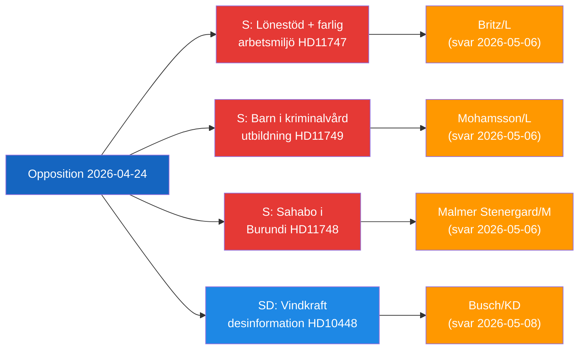

<!-- dir: rtl -->
# תקציר מנהלים — פעילות פרלמנטרית של האופוזיציה, 2026-04-24

**סיווג**: ציבורי | **שלב F3EAD**: הפצה
**מחבר**: James Pether Sörling | **תאריך**: 2026-04-26

---

## תמצית (BLUF)

חברי כנסת שוודים מהאופוזיציה מכוונים לשלושה פערי אחריות ממשלתיים נבדלים: מקומות עבודה מסוכנים המקבלים סובסידיות שכר לעובדים עם מוגבלויות, ילדים עצורים הנעדרים הגנות משפטיות לחינוך, ואזרח שוודי עצור בבורונדי. במקביל, SD מאתגר את נרטיב דיסאינפורמציה האנרגיה שמשתמשת בו תעשיית האיחוד האירופי ומשדרים ציבוריים לדה-לגיטימציה של ביקורת על אנרגיית הרוח.

---

## 3 ההחלטות המובילות של הממשלה

| # | החלטה | דדליין | נסיבות |
|---|-------|--------|--------|
| 1 | **Britz (L)** חייב להשיב לHaraldsson (S) על פיקוח Arbetsförmedlingen על השמות lönebidrag במקומות עבודה מסוכנים | 2026-05-06 | אמון האיגודים + אמינות זכויות מוגבלויות |
| 2 | **Mohamsson (L)** חייב להתחייב לציר זמן מסגרת משפטית לחינוך ביחידות כליאת קטינים חדשות | 2026-05-06 | זכויות חוקתיות של ילדים + לגיטימציית יישום |
| 3 | **Malmer Stenergard (M)** חייב להראות מעורבות קונסולרית פעילה עבור Christophe Sahabo בבורונדי | 2026-05-06 | אמינות שוודיה בזכויות אדם בהקשרים סמכותניים |

---

## נקודת מודיעין של 60 שניות

שלושה חברי כנסת של Socialdemokraterna הגישו שאלות כתובות ב-2026-04-24 המכוונות לשלושה שרים L/M על כשלי ממשל נבדלים אך קשורים נושאית: Johanna Haraldsson שואלת את שר העבודה Britz מדוע Arbetsförmedlingen ממשיכה בהשמות סובסידיות שכר בחברה בסקאניה שבה IF Metall הזהיר שוב ושוב מחשיפה לכימיקלים רעילים; Anna Wallentheim שואלת את שר החינוך Mohamsson כיצד ילדים בבתי הכלא החדשים לנוער יקבלו חינוך שוויוני המובטח חוקתית לפני שהחקיקה המאפשרת קיימת; Olle Thorell שואל את שר החוץ Malmer Stenergard אילו צעדים פעילים נמצאים בתהליך לשחרור האזרח השוודי Christophe Sahabo העצור במדינה הסמכותנית המתדרדרת של בורונדי. Josef Fransson מSD הגיש בנפרד שאילתה לשר האנרגיה Busch האם יש לשקול מחדש את מדיניות האנרגיה של שוודיה לאור דוח תעשייה המכנה שאלות ביקורתיות על אנרגיית הרוח כדיסאינפורמציה רוסית. ארבעה דוחות ועדה גם התקדמו: חוק נשק חדש (JuU10 אושר), הערכת הרפורמה הכושלת במשטרה משנת 2015 (JuU31), הצעת יעילות לתהליך הבנייה (CU24), וחיזוק טיפול בקשישים (SoU25).

נושא המודיעין הדומיננטי: **האופוזיציה מזהה בהצלחה פערי יישום ופיקוח** בסדר יום הרפורמה של הממשלה הנוכחית, ויוצרת לחץ אחריות לקראת מחזור הבחירות 2026.

---

