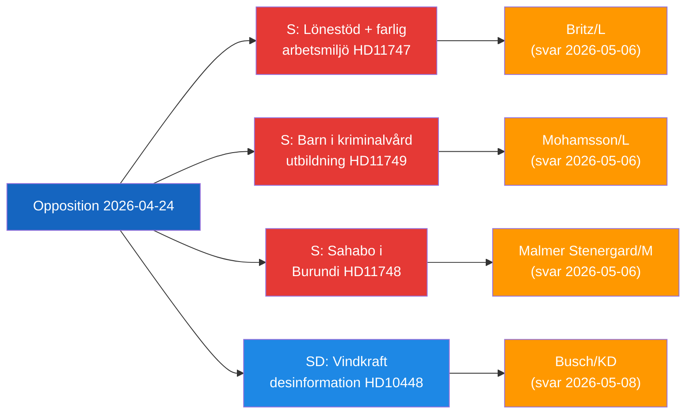

# エグゼクティブブリーフ — 野党の議会活動 2026-04-24

**著者**：James Pether Sörling | **日付**：2026-04-26

---

## 要旨（BLUF）

スウェーデンの野党議員たちは政府の3つの異なる説明責任の欠落を標的としている：障害のある労働者への賃金補助を受けている危険な職場、法的教育保護を欠く収監された子供たち、そしてブルンジで拘留されているスウェーデン市民。同時に、SDは風力エネルギー批判を不当化するためにEU産業と公共放送局が使用するエネルギー偽情報のナラティブに異議を唱えている。

---

## 政府が直面する重要決定トップ3

| # | 決定 | 期限 | 関係するもの |
|---|------|------|------------|
| 1 | **Britz (L)** はHaraldsson (S) に対し、危険な職場でのlönebidrag配置に関するArbetsförmedlingenの監督について回答しなければならない | 2026-05-06 | 組合の信頼 + 障害者の権利の信頼性 |
| 2 | **Mohamsson (L)** は新しい少年収監施設での教育のための法的枠組みの時間軸にコミットしなければならない | 2026-05-06 | 子供の憲法上の権利 + 実施の正当性 |
| 3 | **Malmer Stenergard (M)** はブルンジでのChristophe Sahaboのために積極的な領事関与を示さなければならない | 2026-05-06 | 権威主義的文脈におけるスウェーデンの人権信頼性 |

---

## 60秒インテリジェンスポイント

3人のSocialdemokraterna議員が2026-04-24に、異なるが主題的に結びついた統治の失敗について3人のL/M大臣に対する書面による質問を提出した：Johanna HaraldssonはIF Metallが繰り返し毒性化学物質への暴露を警告したスコーネの企業での賃金補助配置をArbetsförmedlingenが継続している理由を労働大臣Britzに質問；Anna Wallentheim は教育大臣Mohamssonに、可能にする法律が存在する前に新しい少年刑務所の子供たちがどのように憲法で保障された平等な教育を受けるかを質問；Olle Thorell は外務大臣Malmer Stenergardに、ブルンジの悪化する権威主義国家で拘留されているスウェーデン市民Christophe Sahaboを解放するためにどのような積極的な措置が進行中かを質問した。SDのJosef Fransson は別途、風力エネルギーに関する批判的な質問をロシアの偽情報と呼ぶ業界報告書を踏まえてスウェーデンのエネルギー政策を見直すべきかどうかをエネルギー大臣Buschに問う質問主意書を提出した。4つの委員会報告書も進展した：新しい銃器法（JuU10承認）、2015年の失敗した警察改革の評価（JuU31）、建設プロセス効率化法案（CU24）、高齢者ケア強化（SoU25）。

支配的なインテリジェンステーマ：**野党は現政権の改革アジェンダにおける実施と監督のギャップを特定することに成功しており**、2026年選挙サイクルに向けた説明責任の圧力を生み出している。

---

