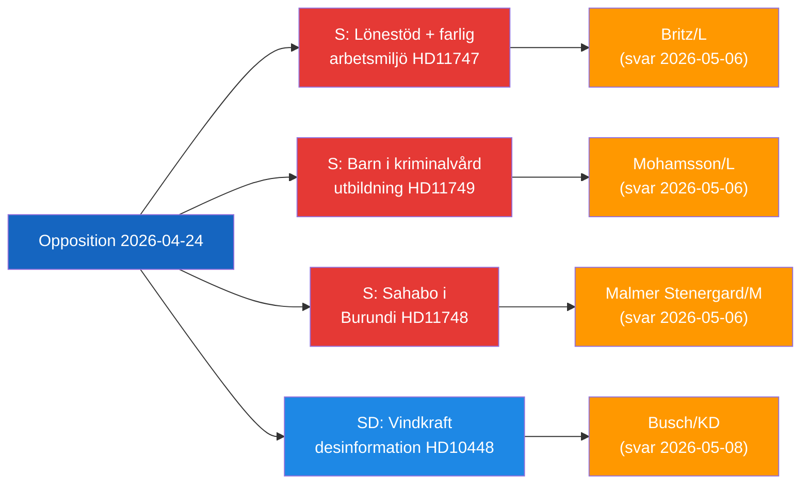

# 임원 브리핑 — 야당 의회 활동, 2026-04-24

**저자**: James Pether Sörling | **날짜**: 2026-04-26

---

## 핵심 요약(BLUF)

스웨덴 야당 의원들은 세 가지 명확히 구분되는 정부 책임 공백을 겨냥하고 있다: 장애 근로자를 위한 임금 보조금을 받는 위험한 직장, 법적 교육 보호 장치가 없는 수감된 아이들, 그리고 부룬디에 억류된 스웨덴 시민. 동시에 SD는 풍력 에너지 비판을 불법화하기 위해 EU 산업계와 공영 방송사들이 사용하는 에너지 허위 정보 서사에 도전한다.

---

## 정부가 직면한 최우선 결정 3가지

| # | 결정 | 기한 | 이해관계 |
|---|------|------|---------|
| 1 | **Britz (L)** 는 위험한 직장에서의 lönebidrag 배치에 대한 Arbetsförmedlingen 감독에 관해 Haraldsson (S) 에게 답변해야 한다 | 2026-05-06 | 노조 신뢰 + 장애인 권리 신뢰성 |
| 2 | **Mohamsson (L)** 는 새로운 소년 구금 시설의 교육을 위한 법적 프레임워크 일정에 헌신해야 한다 | 2026-05-06 | 아동의 헌법적 권리 + 이행 정당성 |
| 3 | **Malmer Stenergard (M)** 는 부룬디의 Christophe Sahabo를 위한 적극적인 영사 참여를 보여야 한다 | 2026-05-06 | 권위주의 맥락에서의 스웨덴 인권 신뢰성 |

---

## 60초 인텔리전스

세 명의 Socialdemokraterna 의원들이 2026-04-24에 세 명의 L/M 장관들을 대상으로 별개이지만 주제적으로 연관된 거버넌스 실패에 관한 서면 질문을 제출했다: Johanna Haraldsson은 IF Metall이 반복적으로 독성 화학물질 노출에 대해 경고한 스코네 기업에서 Arbetsförmedlingen이 임금 보조 배치를 계속하는 이유를 노동부 장관 Britz에게 질문; Anna Wallentheim은 가능화 법안이 존재하기 전에 새로운 청소년 교도소의 아이들이 헌법으로 보장된 평등한 교육을 어떻게 받을 것인지를 교육부 장관 Mohamsson에게 질문; Olle Thorell은 부룬디의 악화되는 권위주의 국가에 억류된 스웨덴 시민 Christophe Sahabo를 석방하기 위한 적극적인 조치가 어떻게 진행되고 있는지를 외무부 장관 Malmer Stenergard에게 질문했다. SD의 Josef Fransson은 별도로 풍력 에너지에 관한 비판적 질문을 러시아 허위정보로 규정한 업계 보고서에 비추어 스웨덴의 에너지 정책을 재고해야 하는지 에너지부 장관 Busch에게 질의서를 제출했다. 네 개의 위원회 보고서도 진행되었다: 새로운 총기법(JuU10 승인), 2015년 실패한 경찰 개혁 평가(JuU31), 건설 프로세스 효율성 법안(CU24), 노인 돌봄 강화(SoU25).

지배적인 인텔리전스 주제: **야당은 현 정부 개혁 의제에서 이행 및 감독 공백을 성공적으로 식별하고 있으며**, 2026년 선거 주기를 앞두고 책임 압력을 조성하고 있다.

---

