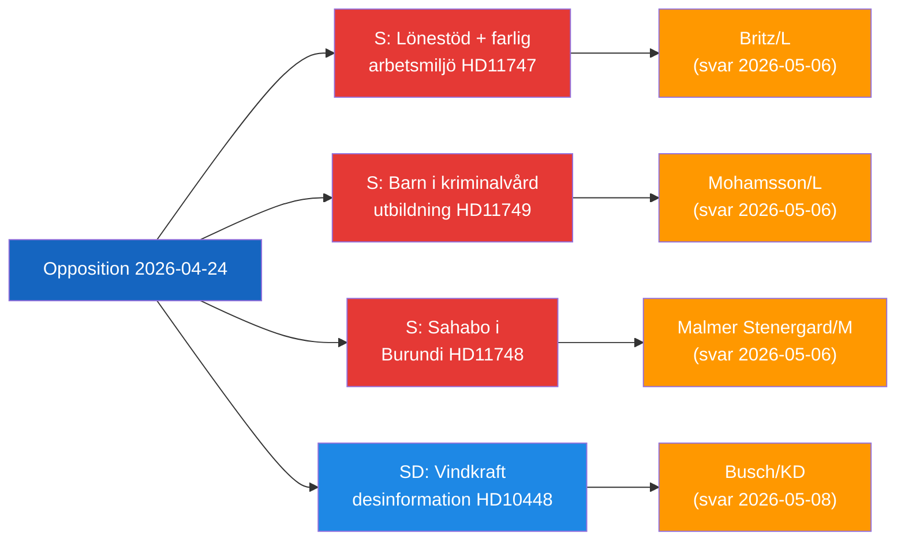

# Managementbrief — Parlementaire oppositieactiviteit, 2026-04-24

**Classificatie**: Openbaar | **F3EAD-fase**: VERSPREIDEN
**Auteur**: James Pether Sörling | **Datum**: 2026-04-26

---

## BLUF

Zweedse oppositieparlementariërs richten zich op drie afzonderlijke hiaten in de overheidsverantwoording: gevaarlijke werkplekken die loonsubsidies ontvangen voor gehandicapte werknemers, gedetineerde kinderen zonder wettelijke onderwijsbescherming en een gedetineerde Zweedse staatsburger in Burundi. Tegelijkertijd daagt de SD het energiedesinformatieverhaal uit dat door de EU-industrie en publieke omroepen wordt gebruikt om windenergie-kritiek te delegitimeren.

---

## Top-3 beslissingen voor de regering

| # | Beslissing | Deadline | Inzet |
|---|------------|----------|-------|
| 1 | **Britz (L)** moet Haraldsson (S) antwoorden over het toezicht van Arbetsförmedlingen op lönebidrag-plaatsingen op gevaarlijke werkplekken | 2026-05-06 | Vakbondsvertrouwen + geloofwaardigheid handicaprechten |
| 2 | **Mohamsson (L)** moet zich verbinden aan een tijdlijn voor het wettelijk kader voor onderwijs in nieuwe jeugddetentie-eenheden | 2026-05-06 | Grondwettelijke rechten van kinderen + implementatielegitimiteit |
| 3 | **Malmer Stenergard (M)** moet actieve consulaire betrokkenheid tonen voor Christophe Sahabo in Burundi | 2026-05-06 | Zweedse geloofwaardigheid op het gebied van mensenrechten in autoritaire contexten |

---

## 60-seconden inlichtingenrapport

Drie Socialdemokraterna-parlementariërs dienden op 2026-04-24 schriftelijke vragen in gericht aan drie L/M-ministers over afzonderlijke maar thematisch verbonden bestuursfalen: Johanna Haraldsson vraagt arbeidsminister Britz waarom Arbetsförmedlingen loonsubsidieplaatsingen voortzet bij een Schanens bedrijf waar IF Metall herhaaldelijk gewaarschuwd heeft voor toxische chemische blootstelling; Anna Wallentheim vraagt onderwijsminister Mohamsson hoe kinderen in de nieuwe jeugdgevangenissen grondwettelijk gegarandeerd gelijk onderwijs zullen ontvangen voordat de benodigde wetgeving bestaat; Olle Thorell vraagt buitenlandminister Malmer Stenergard welke actieve maatregelen worden genomen om de Zweedse burger Christophe Sahabo te bevrijden die wordt vastgehouden in Burundi's verslechterende autoritaire staat. SDs Josef Fransson diende afzonderlijk een interpellatie in bij energieminister Busch over of Zweden's energiebeleid heroverwogen moet worden in het licht van een industrierapport dat kritische vragen over windenergie bestempelt als Russische desinformatie. Vier commissierapporten zijn ook gevorderd: een nieuwe vuurwapenwet (JuU10 goedgekeurd), een beoordeling van de mislukte politiehervorming van 2015 (JuU31), een efficiëntievoorstel voor het bouwproces (CU24) en versterking van de ouderenzorg (SoU25).

Het dominante inlichtingenthema: **de oppositie identificeert succesvol implementatie- en toezichtshiaten** in de huidige regeringshervormagenda, waardoor verantwoordingsdruk wordt gecreëerd in aanloop naar de verkiezingscyclus 2026.

---

