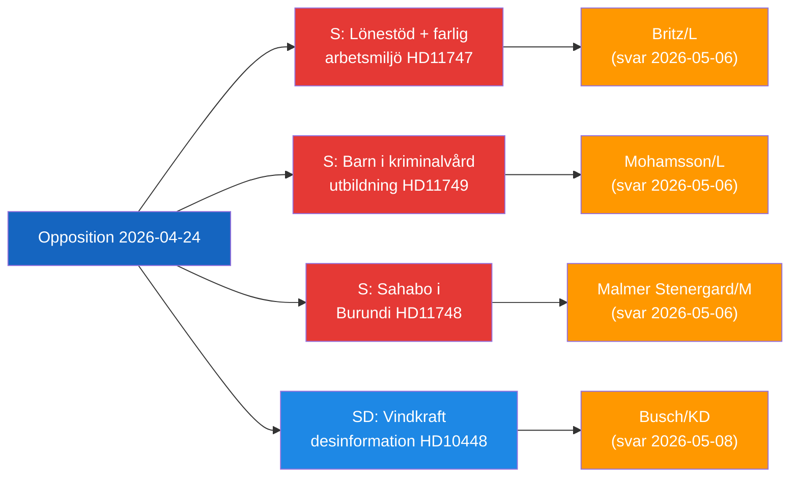

# Ledelsesorientering — Opposisjonens parlamentariske aktivitet, 2026-04-24

**Klassifisering**: Offentlig | **F3EAD-fase**: FORMIDLE
**Forfatter**: James Pether Sörling | **Dato**: 2026-04-26

---

## BLUF

Svenske opposisjonspolitikere retter seg mot tre distinkte statlige ansvarsgap: farlige arbeidsplasser som mottar lønnstilskudd for funksjonshemmede arbeidere, fengslede barn uten juridiske utdanningsbeskyttelser, og en tilbakeholdt svensk statsborger i Burundi. Samtidig utfordrer SD energidesinformasjonsnarrativen som brukes av EU-industrien og kringkasterne for å delegitimere vindkraftkritikk.

---

## Topp-3 beslutninger regjeringen må ta

| # | Beslutning | Frist | Innsats |
|---|------------|-------|---------|
| 1 | **Britz (L)** må svare Haraldsson (S) om Arbetsförmedlingens tilsyn med lönebidrag-plasseringer på farlige arbeidsplasser | 2026-05-06 | Faglig tillit + troverdighet i funksjonshemmedes rettigheter |
| 2 | **Mohamsson (L)** må forplikte seg til en tidslinje for det juridiske rammeverket for utdanning i nye ungdomsfengsel | 2026-05-06 | Barns konstitusjonelle rettigheter + gjennomføringslegitimitet |
| 3 | **Malmer Stenergard (M)** må vise aktivt konsulært engasjement for Christophe Sahabo i Burundi | 2026-05-06 | Sveriges troverdighet i menneskerettigheter i autoritære kontekster |

---

## 60-sekunders etterretning

Tre Socialdemokraterna-representanter innleverte skriftlige spørsmål 2026-04-24 rettet mot tre L/M-ministre om distinkte, men tematisk sammenkoblede styringssvikt: Johanna Haraldsson spør arbeidsminister Britz hvorfor Arbetsförmedlingen fortsetter lønnstilskuddsplasseringer hos et skånsk firma der IF Metall gjentatte ganger har advart om toksisk kjemisk eksponering; Anna Wallentheim spør utdanningsminister Mohamsson hvordan barn i de nye ungdomsfengslene vil motta konstitusjonelt garantert likeverdig utdanning før muliggjørende lovgivning eksisterer; Olle Thorell spør utenriksminister Malmer Stenergard hvilke aktive tiltak som er iverksatt for å frigi den svenske borgeren Christophe Sahabo som holdes tilbake i Burundis forverrede autoritære stat. SDs Josef Fransson innleverte separat en interpellasjon til energiminister Busch om Sveriges energipolitikk bør revurderes i lys av en bransjeraport som stempler kritiske spørsmål om vindkraft som russisk desinformasjon. Fire utvalgsrapporter gikk også videre: en ny skytevåpenlov (JuU10 godkjent), en vurdering av den mislykkede 2015-politireformen (JuU31), et effektivitetsforslag for byggeprosessen (CU24) og styrking av eldreomsorg (SoU25).

Det dominerende etretningstemet: **opposisjonen lykkes med å identifisere implementerings- og tilsynsgap** i den sittende regjeringens reformagenda, som skaper ansvarstrykk inn mot valgomgangen 2026.

---

