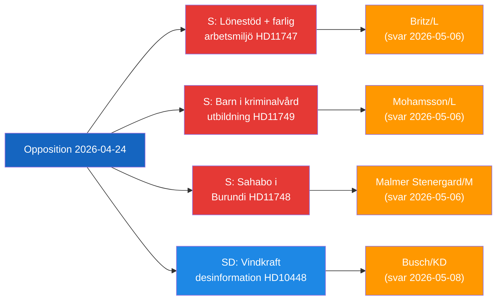

# Exekutiv sammanfattning — Oppositionens parlamentariska aktivitet, 2026-04-24

**Klassificering**: Offentlig | **F3EAD-fas**: DISSEMINERA
**Författare**: James Pether Sörling | **Datum**: 2026-04-26

---

## BLUF

Svenska oppositionsledamöter riktar in sig på tre distinkta ansvarsluckor i regeringen: farliga arbetsplatser som tar emot lönebidrag för funktionsnedsatta, frihetsberövade barn som saknar rättsliga utbildningsskydd, och en frihetsberövad svensk medborgare i Burundi. Samtidigt ifrågasätter SD energidesinformationsnarrativet som används av EU-industrin och public service för att delegitimisera vindkraftskritik.

---

## Topp-3 beslut som regeringen måste fatta

| # | Beslut | Deadline | Insatser |
|---|--------|----------|----------|
| 1 | **Britz (L)** måste svara Haraldsson (S) om Arbetsförmedlingens tillsyn av lönebidragsplaceringar på farliga arbetsplatser | 2026-05-06 | Facklig tillit + trovärdighet i funktionshinderfrågor |
| 2 | **Mohamsson (L)** måste åta sig en tidsplan för regelverket kring utbildning i nya ungdomsfängelser | 2026-05-06 | Barns konstitutionella rättigheter + genomförandelegitimitet |
| 3 | **Malmer Stenergard (M)** måste visa aktivt konsulärt engagemang för Christophe Sahabo i Burundi | 2026-05-06 | Sveriges trovärdighet i mänskliga rättigheter i auktoritära kontexter |

---

## 60-sekundersintelligens

Tre socialdemokratiska riksdagsledamöter lämnade skriftliga frågor 2026-04-24 riktade mot tre L/M-ministrar om distinkta men tematiskt sammankopplade styrningsbrister: Johanna Haraldsson frågar arbetsmarknadsminister Britz varför Arbetsförmedlingen fortsätter lönebidragsplaceringar hos ett skånskt företag där IF Metall upprepade gånger varnat för toxisk kemisk exponering; Anna Wallentheim frågar utbildningsminister Mohamsson hur barn i de nya ungdomsfängelserna ska få konstitutionellt garanterad likvärdig utbildning innan möjliggörande lagstiftning finns; Olle Thorell frågar utrikesminister Malmer Stenergard vilka aktiva åtgärder som vidtas för att frigöra den svenske medborgaren Christophe Sahabo som hålls frihetsberövad i Burundis försämrade auktoritära stat. SDs Josef Fransson lämnade separat en interpellation till energiminister Busch om huruvida Sveriges energipolitik bör omprövas mot bakgrund av en branschrapport som stämplar kritiska frågor om vindkraft som rysk desinformation. Fyra utskottsbetänkanden gick också vidare: ny vapenlagi (JuU10 godkänd), en utvärdering av den misslyckade 2015 polisreformen (JuU31), ett effektiviseringsförslag för byggprocessen (CU24) och stärkt äldreomsorg (SoU25).

Det dominerande intelligenstemat: **oppositionen lyckas identifiera implementerings- och tillsynsluckor** i den nuvarande regeringens reformagenda, vilket skapar ansvarstryck inför 2026 års valcykel.

---

