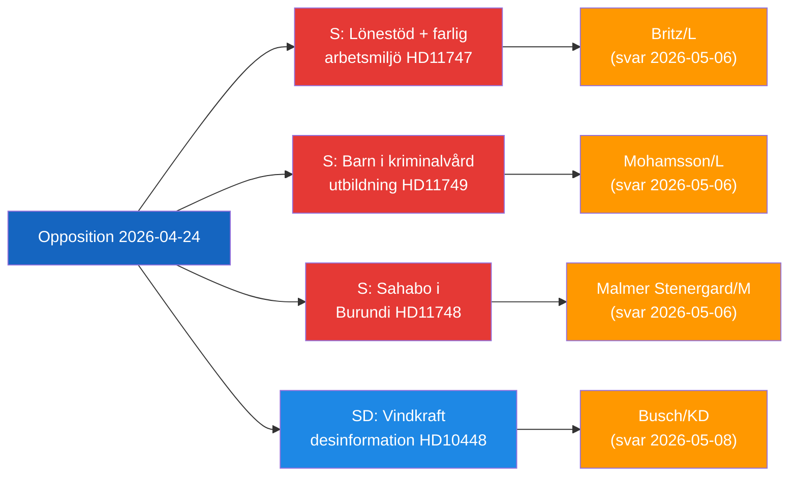

# 执行摘要 — 反对党议会活动, 2026-04-24

**作者**：James Pether Sörling | **日期**：2026-04-26

---

## 核心摘要（BLUF）

瑞典反对党议员针对三个不同的政府问责缺口：接受残障工人工资补贴的危险工作场所、缺乏法律教育保障的被关押儿童，以及一名被扣留在布隆迪的瑞典公民。与此同时，SD质疑欧盟工业界和公共广播公司用来使风能批评去合法化的能源虚假信息叙事。

---

## 政府面临的三大优先决定

| # | 决定 | 截止日期 | 利害关系 |
|---|------|----------|---------|
| 1 | **Britz (L)** 必须就Arbetsförmedlingen对危险工作场所lönebidrag安置的监督问题回复Haraldsson (S) | 2026-05-06 | 工会信任 + 残障权利可信度 |
| 2 | **Mohamsson (L)** 必须承诺新少年羁押机构教育法律框架的时间表 | 2026-05-06 | 儿童宪法权利 + 实施合法性 |
| 3 | **Malmer Stenergard (M)** 必须就布隆迪的Christophe Sahabo展现积极的领事参与 | 2026-05-06 | 瑞典在威权主义背景下的人权可信度 |

---

## 60秒情报简报

三名Socialdemokraterna议员于2026-04-24提交书面问题，针对三位L/M部长就不同但主题相关的治理失败：Johanna Haraldsson询问劳工部长Britz，为何Arbetsförmedlingen继续在一家斯科讷企业进行工资补贴安置，该企业曾多次收到IF Metall关于有毒化学品暴露的警告；Anna Wallentheim询问教育部长Mohamsson，在授权立法存在之前，新少年监狱的儿童如何获得宪法保障的平等教育；Olle Thorell询问外交部长Malmer Stenergard，正在采取哪些积极措施释放被布隆迪日益恶化的威权国家关押的瑞典公民Christophe Sahabo。SD的Josef Fransson单独向能源部长Busch提交了一份质询书，询问鉴于一份将风能批评性问题定性为俄罗斯虚假信息的行业报告，是否应重新考虑瑞典的能源政策。四份委员会报告也有所进展：新枪支法（JuU10获批）、对2015年失败警察改革的评估（JuU31）、建筑流程效率法案（CU24）和老年护理强化（SoU25）。

主导情报主题：**反对党正在成功识别**现任政府改革议程中的实施和监督缺口，在2026年选举周期临近之际制造问责压力。

---

