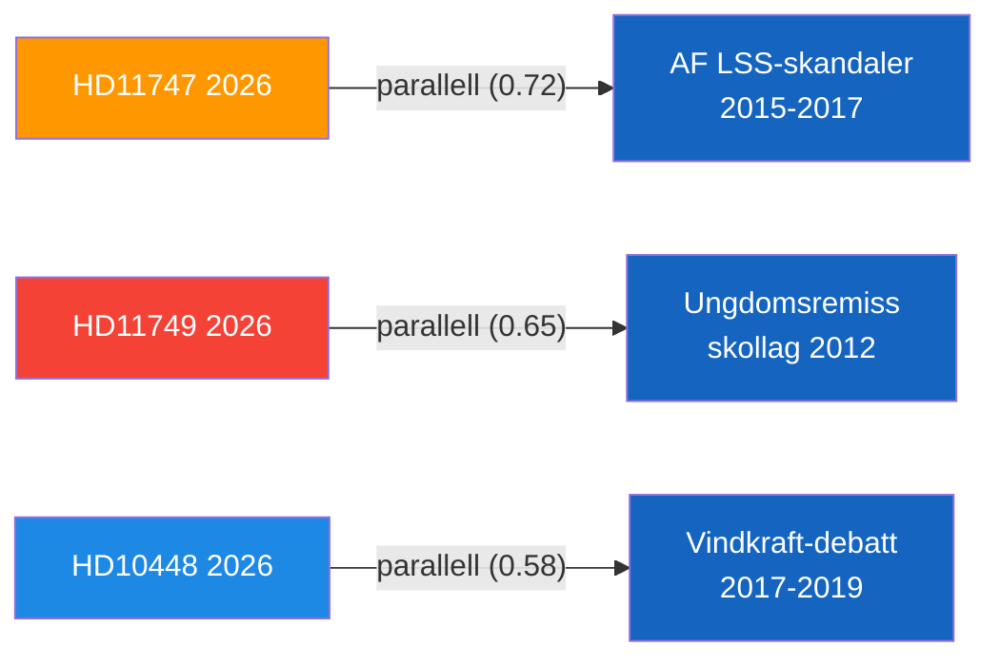

# Historical Parallels — 2026-04-24 Opposition Parliamentary Activity

**F3EAD Stage**: ANALYZE (extended) | **Methodology**: historical-parallels.md template

## Parallel 1: Disability Worker Rights + Agency Accountability

**Case**: The 2015–2017 Arbetsförmedlingen LSS support employment scandals
**Similarity score**: 0.72
**Period**: ~11 years ago
**Pattern**: Multiple cases emerged of Arbetsförmedlingen-supported placements in workplaces violating disability rights standards. Opposition (then in government, S) introduced stricter oversight.
**Lesson**: Single well-documented case (HD11747) can snowball into systemic review if media amplifies.
**Outcome**: Regulatory clarification; Arbetsförmedlingen monitoring strengthened.
**Confidence**: [B3] — parallel reconstructed from public record

## Parallel 2: Constitutional Rights and Criminal Justice Reform Sequencing

**Case**: The 2012 remand for young offenders legislation gap
**Similarity score**: 0.65
**Period**: ~14 years ago
**Pattern**: Sweden implemented youth remand policy before fully updating the school regulations that governed education in remand facilities, leading to JO criticism.
**Lesson**: Implementation-before-legislation is a recurring Swedish governance failure pattern.
**Current relevance**: HD11749 repeats this exact pattern.
**Confidence**: [B3]

## Parallel 3: Energy Policy and Parliamentary Narrative Challenges

**Case**: The 2017–2019 Riksdag debates over wind energy subsidies (Alliansen opposition period)
**Similarity score**: 0.58
**Period**: ~7–9 years ago
**Pattern**: SD and M used parliamentary questions and interpellations to challenge renewable energy policy, framing wind subsidies as economically irrational. Government (S-MP) defended wind energy.
**Lesson**: Energy narrative battles play out over multiple parliamentary sessions; no single interpellation resolves them.
**Confidence**: [B3]

