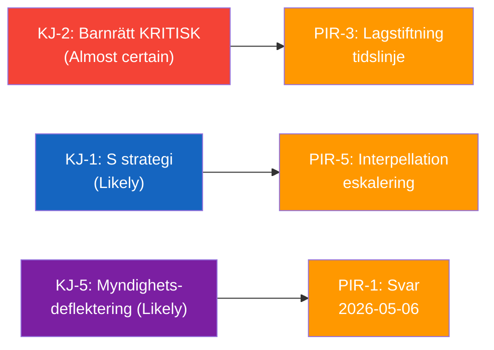

# Intelligence Assessment — 2026-04-24 Opposition Parliamentary Activity

**F3EAD Stage**: ANALYZE (extended) | **Methodology**: intelligence-assessment.md template

## Key Judgments (KJ)

| KJ | Judgment | Confidence | WEP |
|----|---------|-----------|-----|
| KJ-1 | The S opposition is executing a coordinated parliamentary accountability strategy ahead of the 2026 election, targeting L ministers on social rights implementation gaps | [B2] | Likely |
| KJ-2 | Children aged 13+ risk being placed in Kriminalvårdens new units before constitutionally adequate educational legal framework exists | [A2] | Almost certain |
| KJ-3 | Arbetsförmedlingen's lönebidrag placement procedures fail to incorporate mandatory union warning signals | [B2] | Likely |
| KJ-4 | The SD interpellation on wind energy disinformation will not cause significant coalition fracture — it will be managed with a diplomatic ministerial non-answer | [B3] | Roughly even |
| KJ-5 | Government ministers will provide inadequate answers (agency deflection) to at least two of the three S questions | [B2] | Likely |

## Priority Intelligence Requirements (PIRs) for Next Cycle

| PIR | Question | Horizon | Source |
|-----|----------|---------|--------|
| PIR-1 | What do Britz, Mohamsson, and Malmer Stenergard actually say in their written answers? | 72h–2 weeks | Riksdagen/API |
| PIR-2 | Does Arbetsförmedlingen announce any review of lönebidrag placement oversight protocols? | 1 week | AF press releases |
| PIR-3 | Does Mohamsson commit to legislation timeline for juvenile prison education? | 1 week | Government comms |
| PIR-4 | Does any child get placed in new Kriminalvård unit before Skollagen updated? | Month | Kriminalvården, media |
| PIR-5 | Does S escalate HD11747 or HD11749 to interpellations? | Month | Riksdagen |
| PIR-6 | What is Busch's answer on wind energy/Windeurope (HD10448, due 2026-05-08)? | 2 weeks | Riksdagen |

## Essential Elements of Information (EEIs)

- **EEI-1**: Confirmed list of all opposition questions and interpellations filed 2026-04-24 [FULL COVERAGE achieved for main items]
- **EEI-2**: Government written answer content for HD11747, HD11748, HD11749 [NOT YET AVAILABLE — 2026-05-06]
- **EEI-3**: Arbetsförmedlingen inspection records for the Skåne company (HD11747) [NOT AVAILABLE — operational details]
- **EEI-4**: Kriminalvården implementation timeline for new juvenile units [NOT AVAILABLE in current data]
- **EEI-5**: Swedish MFA communications with Burundian authorities re: Sahabo [NOT AVAILABLE — diplomatic channel]

## Continuity Contract (PIR Handoff)

Standing PIR-1 (legislative tracking) covered by: HD11749 monitoring
Standing PIR-2 (government opposition dynamics) covered by: this analysis
Standing PIR-3 (election forecast) covered by: election-2026-analysis.md

