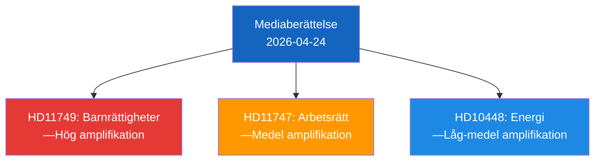

# Media Framing Analysis — 2026-04-24 Opposition Parliamentary Activity

**F3EAD Stage**: ANALYZE (extended) | **Methodology**: media-framing.md template

## Primary Frame: Accountability vs. Deflection

The opposition (S) documents cluster around **accountability framing**: establishing that the Tidö government is failing on welfare, rights, and social protection. Expected media frames:

| Story | Expected S Frame | Expected Government Frame | Expected SD Frame |
|-------|-----------------|--------------------------|------------------|
| HD11747 (disabled workers) | "Government tolerates exploitation" | "Arbetsförmedlingen investigating" | "Too many bureaucrats" |
| HD11749 (prison children education) | "Government broke children's rights" | "Reform ongoing, law compliant" | "Criminals shouldn't get more rights" |
| HD11748 (detained Swede) | "Government abandons citizens abroad" | "Diplomatic channels active" | (foreign policy — stay quiet) |
| HD10448 (wind energy) | "Government propagates misinformation" | "Energy policy sound" | "Wind energy is unreliable" |

## Key Framing Tensions

**HD11749** creates a rights vs. public safety frame clash:
- S/MP/V: "Constitutional rights apply even to incarcerated youth"
- SD/KD: "Prison is prison; education is secondary to order"
- L (difficult): L is historically pro-rights but part of governing coalition

**HD10448** creates a truth-in-politics meta-frame:
- SD challenges the government minister to address "disinformation" framing
- KD (Ebba Busch as minister) is in an awkward position defending the energy narrative
- This is **intra-coalition tension** unusually visible

## Media Amplification Risk

| Document | Amplification Probability | Key Outlet |
|----------|--------------------------|------------|
| HD11747 | MEDIUM-HIGH | Arbetet, Metro, SVT Nyheter |
| HD11749 | HIGH | SVT, Expressen |
| HD10448 | MEDIUM | Ny Teknik, SvD |
| HD11748 | LOW | TT, UD |

