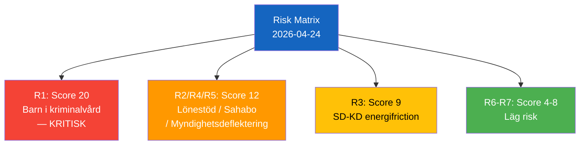

# Risk Assessment — 2026-04-24 Opposition Parliamentary Activity

**F3EAD Stage**: ANALYZE | **Methodology**: political-risk-methodology.md (5×5 L×I matrix)

## Risk Register

| # | Risk | L (1–5) | I (1–5) | Score | Category | Mitigation |
|---|------|---------|---------|-------|----------|------------|
| R1 | Children placed in Kriminalvårdens new units before legal educational framework enacted | 4 | 5 | 20 | Constitutional / Legal | Immediate legislation; delay placement until framework ready |
| R2 | Continued Arbetsförmedlingen placements at unsafe workplaces for disabled workers | 3 | 4 | 12 | Labour / Welfare | Mandatory fackliga consultation in placement decisions |
| R3 | SD-KD coalition friction on energy narrative | 3 | 3 | 9 | Coalition stability | Busch gives diplomatic non-committal answer |
| R4 | Swedish citizen Sahabo detained long-term without resolution | 3 | 4 | 12 | Consular / Human rights | Active MFA diplomatic engagement with Burundi |
| R5 | Opposition questions not answered substantively (agency deflection) | 4 | 3 | 12 | Democratic accountability | Parliamentary escalation to interpellations |
| R6 | Police reform accountability gaps persist post-JuU31 | 2 | 4 | 8 | Public safety | Government's strengthened Polismyndigheten steering |
| R7 | New firearms law implementation challenges | 2 | 2 | 4 | Legislative | Standard regulatory implementation |

## Top-3 Risk Deep Dives

### R1: Children in Prison Without Educational Legal Framework (Score: 20)
**Cascading chain**: Placement → absence of legal framework → educational rights denied → ECHR/CRC violation → constitutional challenge → implementation halt → political crisis
**Tripwire**: First child placed before Skollagen updated for new institutional form
**Escalation path**: Institutet för mänskliga rättigheter → JO-anmälan → constitutional committee (KU)

### R4: Sahabo in Burundi (Score: 12)
**Cascading chain**: Prolonged detention → lack of consular access → international pressure insufficient → political costs for Swedish MFA → S escalation
**Tripwire**: No progress on Busch/MFA response by 2026-05-06

### R5: Democratic Accountability via Agency Deflection (Score: 12)
**Pattern risk**: Government systematically deflects parliament's questions to independent agencies — Arbetsförmedlingen, Kriminalvården — undermining direct accountability
**Mitigation**: Opposition can demand interpellations targeting agency oversight, not just outcomes

