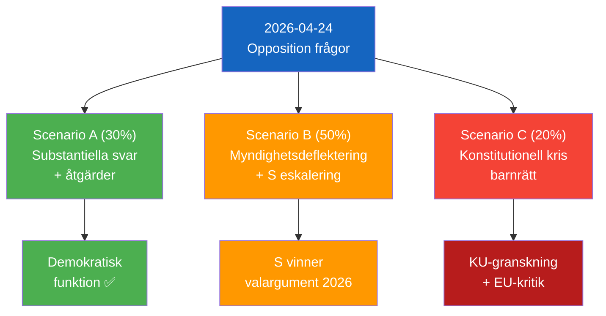

# Scenario Analysis — 2026-04-24 Opposition Parliamentary Activity

**F3EAD Stage**: ANALYZE (extended) | **Methodology**: scenario-analysis.md template, What If? + Morphological

## Three Scenarios

### Scenario A: Government Accountability Delivered (30% probability)
*"Substantive ministerial responses + policy adjustments"*

Ministers Britz, Mohamsson, and Malmer Stenergard provide detailed, substantive written answers that (a) acknowledge the specific failures identified, (b) announce concrete corrective measures — new Arbetsförmedlingen oversight protocol, immediate legislation for juvenile education, active Burundi consular engagement — and (c) Busch gives a nuanced response on energy policy that neither endorses Windeurope wholesale nor dismisses legitimate criticism.

**Outcome**: S scores a parliamentary accountability win but loses escalation material. L reputation partially recovered. SD narrows energy debate. Moderate positive for democratic function.

### Scenario B: Agency Deflection and Partial Response (50% probability)
*"Ministers deflect to independent agencies; substantive change absent"*

Britz points to Arbetsförmedlingen's own procedures; Mohamsson says legislation is coming but gives no date; Malmer Stenergard provides brief consular update; Busch gives diplomatic non-answer. Opposition gains credibility from inadequate responses. S files interpellations on HD11747 and HD11749.

**Outcome**: S builds 2026 election narrative. L's social conscience claim further damaged. Issue persists into summer.

### Scenario C: Constitutional Crisis (20% probability)
*"Implementation proceeds before legal framework — rights violations materialise"*

A child is placed in a Kriminalvårds unit before the educational legal framework exists. This triggers a JO-anmälan, potential administrative court challenge, and media investigation. HD11749 becomes a landmark case for constitutional rights in juvenile justice.

**Outcome**: Significant political damage to government. KU consideration. EU/ECHR scrutiny.

## Probability Assessment

| Scenario | Probability | Key Assumption |
|----------|------------|----------------|
| A: Substantive accountability | 30% | Government is responsive and has prepared answers |
| B: Deflection + escalation | 50% | Default government communication pattern |
| C: Constitutional violation | 20% | Implementation proceeds before Riksdag acts |

**Confidence**: Roughly even [C3] on scenario B as most likely. Unlikely [D3] on scenario C.

