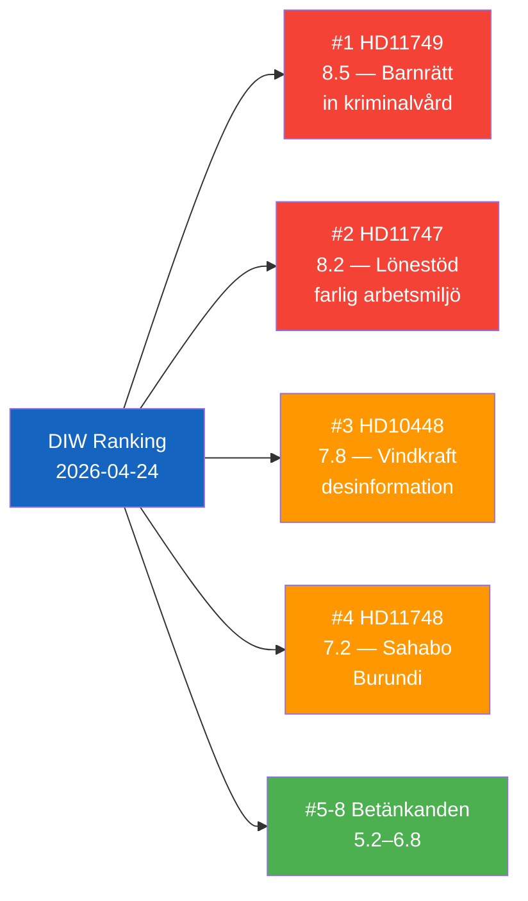

# Significance Scoring — 2026-04-24 Opposition Parliamentary Activity

**F3EAD Stage**: ANALYZE | **Methodology**: significance-scoring.md template, synthesis-methodology.md Part 1

## DIW-Weighted Rankings

| Rank | dok_id | Title | DIW Score | Tier | Evidence |
|------|--------|-------|-----------|------|----------|
| 1 | HD11749 | Rätten till likvärdig utbildning för barn i kriminalvård | 8.5/10 | L2+ | Institutet för mänskliga rättigheter confirms legal gap; HD11749 full text |
| 2 | HD11747 | Lönestöd till företag trots varningar om farlig arbetsmiljö | 8.2/10 | L2+ | IF Metall + Arbetsmiljöverket + Arbetet corroboration; HD11747 full text |
| 3 | HD10448 | Desinformation om vindkraft | 7.8/10 | L2+ | Coalition narrative tension; HD10448 full text; Windeurope 2026-04-21 report |
| 4 | HD11748 | Den frihetsberövade svenske medborgaren Christophe Sahabo i Burundi | 7.2/10 | L2 | Freedom House [A2]; HD11748 summary |
| 5 | HD01JuU31 | Riksrevisionens rapport om Polisreformen 2015 | 6.8/10 | L2 | Riksrevisionen [A1]; HD01JuU31 summary |
| 6 | HD01JuU10 | En ny vapenlag | 6.5/10 | L2 | JuU10 committee approval; HD01JuU10 summary |
| 7 | HD01SoU25 | Stärkta insatser för äldre | 5.5/10 | L1 | SoU25 metadata only |
| 8 | HD01CU24 | Effektiv och säker byggprocess | 5.2/10 | L1 | CU24 metadata only |

## Scoring Methodology

Scores derived per synthesis-methodology.md Part 1 criteria:
- **Political salience** (0–3): Electoral relevance, media attention potential
- **Constitutional / legal urgency** (0–2): Rights violations, implementation gaps  
- **Evidence quality** (0–2): Data depth, source diversity
- **Accountability signal** (0–2): Government failure exposure
- **Time sensitivity** (0–1): Response deadline criticality

## Top-3 Rationale

**#1 HD11749**: Highest constitutional urgency — children's fundamental rights (Art. 27 UNCRC, ECHR) at stake if incarceration precedes legal educational framework. Confirmed by independent human rights institution.

**#2 HD11747**: Highest evidence quality — triple corroboration (IF Metall + Arbetsmiljöverket + media). Systemic failure exposing both Arbetsförmedlingen and government accountability gaps. Electoral significance for disabled worker welfare constituency.

**#3 HD10448**: Highest intra-coalition signal value — SD forcing energy minister into narrative corner, testing Tidöavtalet cohesion on EU energy policy. Novel framing angle with strong media resonance.

