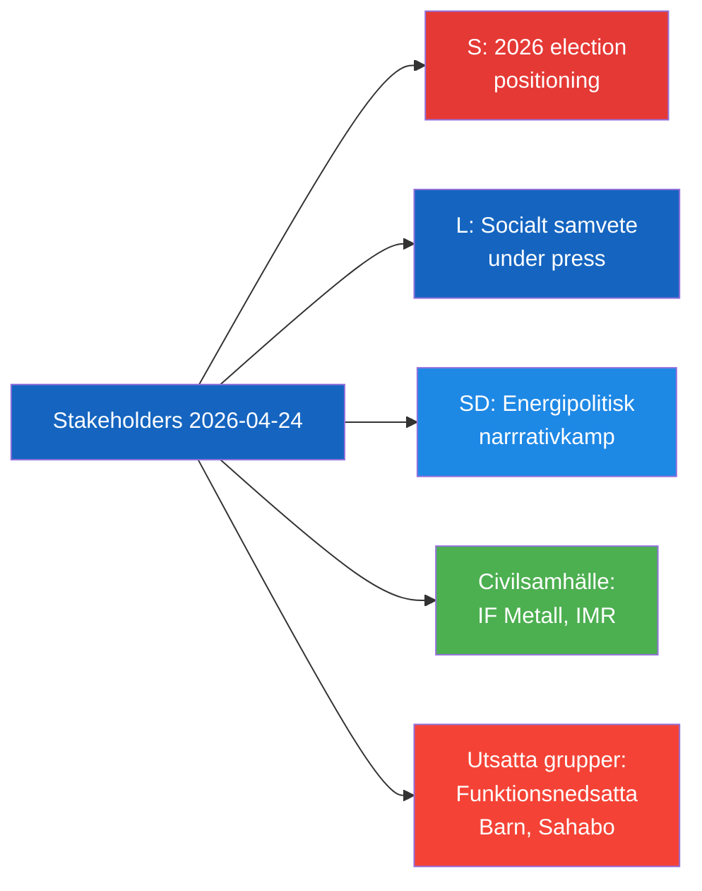

# Stakeholder Perspectives — 2026-04-24 Opposition Parliamentary Activity

**F3EAD Stage**: ANALYZE | **Methodology**: stakeholder-impact.md template, 6-lens matrix

## 6-Lens Stakeholder Impact Matrix

| Stakeholder | Economic | Social | Political | Legal | Cultural | International |
|-------------|----------|--------|-----------|-------|---------|---------------|
| Disabled workers (lönebidrag) | Direct wage/safety impact | Dignity + workplace rights | Vote signal for S | Right to safe workplace | — | — |
| Children in Kriminalvård | — | Educational rights + wellbeing | Political accountability test | UNCRC/ECHR/Skollagen | — | EU Charter |
| Christophe Sahabo | — | Detention — psychological harm | S scrutiny of MFA | Consular protection (Vienna Convention) | — | Burundi-Sweden relations |
| IF Metall | — | Union accountability vindicated | Labour movement credibility | Employer oversight | Worker solidarity | — |
| Arbetsförmedlingen | Budget/reputational risk | Agency credibility | Accountability from Riksdagen | Labour market law | — | — |
| Kriminalvården | Implementation cost | Institutional expansion | Political oversight | Legislation required | — | — |
| Liberalerna (L) | — | Social welfare narrative | Coalition pressure from S | Legal framework gap | — | — |
| KD / Ebba Busch | Energy investment certainty | — | SD-KD narrative tension | EU energy compliance | — | EU energy policy |
| M / Malmer Stenergard | — | — | Human rights credibility | Consular duty | — | Bilateral Burundi |
| S (opposition) | — | Social rights capital | 2026 election positioning | Parliamentary accountability | Values-based messaging | MR credibility |
| SD (Fransson) | — | — | Energy narrative positioning | — | Wind energy critique | Anti-Windeurope |

## Key Stakeholder Narratives

### S (Socialdemokraterna)
- **Narrative**: "The government's implementation of reforms fails to protect the most vulnerable — disabled workers, incarcerated children, detained citizens."
- **Strategic goal**: Position S as defender of vulnerable groups ahead of 2026 election.
- **Credibility anchors**: IF Metall (HD11747), Institutet för mänskliga rättigheter (HD11749), Freedom House (HD11748).

### Liberalerna (L)
- **Narrative challenge**: L markets itself as the "conscience of the coalition" on social rights. Two questions targeting L ministers undermine this narrative.
- **Risk**: If Britz/Mohamsson deflect to agencies, L appears complicit in implementation failures.

### SD (Sverigedemokraterna)
- **Narrative**: "Legitimate criticism of wind energy is being silenced by labelling it Russian disinformation."
- **Goal**: Protect SD's energy skepticism while forcing KD into uncomfortable position on EU energy agenda.

