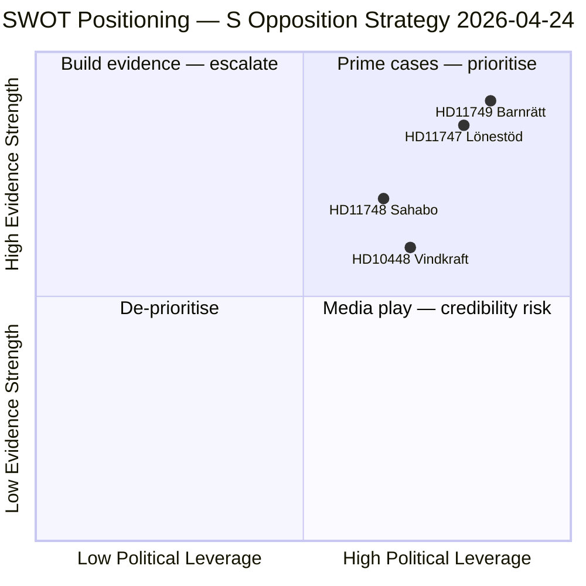

# SWOT Analysis — Swedish Opposition Parliamentary Activity, 2026-04-24

**F3EAD Stage**: ANALYZE | **Methodology**: political-swot-framework.md (SWOT + TOWS)

## Primary Stakeholder SWOT: Socialdemokraterna (S)

| Quadrant | Finding | Admiralty | Evidence |
|----------|---------|-----------|----------|
| **Strength** | Multi-front parliamentary strategy: simultaneous questions on labour, education, foreign affairs — maximises media bandwidth | [B2] | HD11747, HD11748, HD11749 |
| **Strength** | Questions backed by credible external sources (IF Metall, Arbetsmiljöverket, Institutet för mänskliga rättigheter) | [A2] | All three documents |
| **Strength** | Targets Liberalerna specifically — exploiting L's rhetorical claim as social conscience | [B2] | HD11747→Britz/L, HD11749→Mohamsson/L |
| **Strength** | Frames disability rights + children's rights as universal values — builds broad coalition | [B2] | HD11747, HD11749 |
| **Weakness** | Questions (not interpellations) carry lower parliamentary weight — answers can be brief | [B2] | Parliamentary procedure |
| **Weakness** | S supported elements of juvenile justice reform in 2022 — potential inconsistency | [C3] | Parliamentary record |
| **Weakness** | Three questions in one day may be perceived as overloading rather than focused strategy | [B3] | Communications risk |
| **Opportunity** | If government answers are inadequate → escalation to interpellations | [B2] | Parliamentary procedure |
| **Opportunity** | 2026 election positions: disability rights + child rights + MR credibility are vote-winning themes | [B2] | Electoral context |
| **Opportunity** | IF Metall and civil society allies amplify messaging | [B2] | Institutional ecosystem |
| **Threat** | Answers deflect to Arbetsförmedlingen (independent authority) or Kriminalvården (ongoing process) | [B2] | Government reply patterns |
| **Threat** | Media cycle may not amplify individual questions vs. larger news events | [C3] | Information environment |

## Secondary SWOT: Sverigedemokraterna (SD — HD10448)

| Quadrant | Finding | Admiralty | Evidence |
|----------|---------|-----------|----------|
| **Strength** | Cleverly weaponises industry report to reframe wind skepticism debate | [B2] | HD10448 text |
| **Weakness** | Lacks constructive alternative energy policy proposal | [B3] | HD10448 — question only, no alternative |
| **Opportunity** | Media loves the "is wind criticism = Russian disinformation" angle | [B3] | Information environment inference |
| **Threat** | KD/Busch may give diplomatic answer that doesn't satisfy SD base | [B2] | Coalition dynamics |

## TOWS Matrix

| | Opportunities | Threats |
|---|---|---|
| **Strengths** | Use strong evidence base + multi-front to set pre-election accountability benchmark (SO) | Proactive escalation before government deflects to agencies (ST) |
| **Weaknesses** | Choose single strongest case for interpellation focus (WO) | Coordinate with media partners on strongest HD11749 case (WT) |

