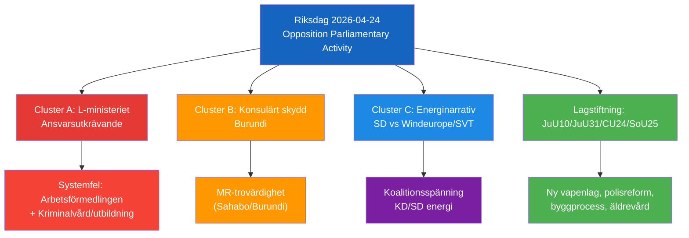

# Synthesis Summary — Opposition Parliamentary Activity, 2026-04-24

**F3EAD Stage**: EXPLOIT → ANALYZE | **Methodology**: synthesis-methodology.md
**Date**: 2026-04-26 | **Riksmöte**: 2025/26

---

## 1. Integrated Intelligence Picture

On 2026-04-24, Swedish parliamentary opposition activity produced four accountability interventions targeting three government ministers, revealing **systemic implementation weaknesses** across labour market, education, foreign affairs, and energy domains.

### Primary Intelligence Assessment

**Key finding (Likely [B2])**: The Socialdemokraterna is executing a disciplined multi-front parliamentary strategy targeting Liberalerna (two ministers: Britz, Mohamsson) and Moderaterna (Malmer Stenergard) on implementation failures — a pattern consistent with pre-election positioning ahead of the 2026 Riksdag election.

**Secondary finding (Roughly even [C3])**: SD's interpellation on wind energy disinformation (HD10448/Fransson) represents an intra-coalition tension signal: if Energy Minister Busch is forced to either endorse or reject the Windeurope/SVT framing, she exposes a fault line between KD's EU-aligned energy narrative and SD's energy sovereignty position.

### Document-by-Document Assessment

| dok_id | DIW Tier | Strategic Significance | Accountability Target |
|--------|----------|----------------------|----------------------|
| HD11749 | L2+ | HIGHEST — constitutional rights for incarcerated children | Mohamsson/L |
| HD11747 | L2+ | HIGH — vulnerable worker safety + union oversight | Britz/L |
| HD10448 | L2+ | HIGH — energy policy narrative + coalition tension | Busch/KD |
| HD11748 | L2 | MEDIUM-HIGH — consular duty + authoritarian context | Malmer Stenergard/M |
| HD01JuU10 | L2 | MEDIUM — legislative progress (new firearms law) | Government |
| HD01JuU31 | L2 | MEDIUM — police reform accountability | Government |
| HD01CU24 | L1 | LOW — routine building process reform | Government |
| HD01SoU25 | L1 | LOW — elderly care | Government |

---

## 2. Thematic Clusters

### Cluster A: L-ministerium Accountability (S targeting L)
- HD11747: Britz on Arbetsförmedlingen oversight failures for disabled workers
- HD11749: Mohamsson on children's education rights before legislation exists

**Pattern**: S is strategically targeting the junior coalition partner Liberalerna on welfare-state implementation — L's claim to be the "conscience of the coalition" on social rights is challenged.

### Cluster B: Consular Protection (S targeting M)
- HD11748: Malmer Stenergard on Christophe Sahabo, Burundi

**Pattern**: Individual consular cases test Sweden's human rights credibility; S uses cases in authoritarian states to pressure the government.

### Cluster C: Energy Narrative Warfare (SD intra-coalition)
- HD10448: Fransson challenges wind-energy disinformation framing

**Pattern**: SD, despite being the government's primary support party, uses parliamentary tools to contest the EU energy narrative adopted by coalition partners.

---

## 3. Narrative Direction & Article Decision

**Article headline**: *Swedish Opposition Challenges Governance Failures on Worker Safety, Child Rights, and Energy Policy*

**Article lede**: Three Socialdemokraterna MPs and one SD MP are pressuring the Swedish government over dangerous workplace wage subsidies, missing legal safeguards for incarcerated children's education, a detained Swedish citizen in Burundi, and whether official media is misrepresenting wind energy criticism as Russian disinformation.

**Publish decision**: YES — high political significance across multiple domains, all documents with full or summary data, clear accountability angle heading into 2026 election.

**Core languages**: en, sv

---

## 4. Confidence Summary

| Assessment | Confidence | Basis |
|------------|-----------|-------|
| Constitutional risk for children in juvenile prisons | Almost certain [A2] | Institutet för mänskliga rättigheter confirmation |
| Workplace safety failures corroborated | Almost certain [A1] | IF Metall + Arbetsmiljöverket + Arbetet |
| SD-KD energy tension signal | Roughly even [C3] | Analytical inference from HD10448 framing |
| Burundi case – consular engagement ongoing | Unknown [B4] | Summary data only |

