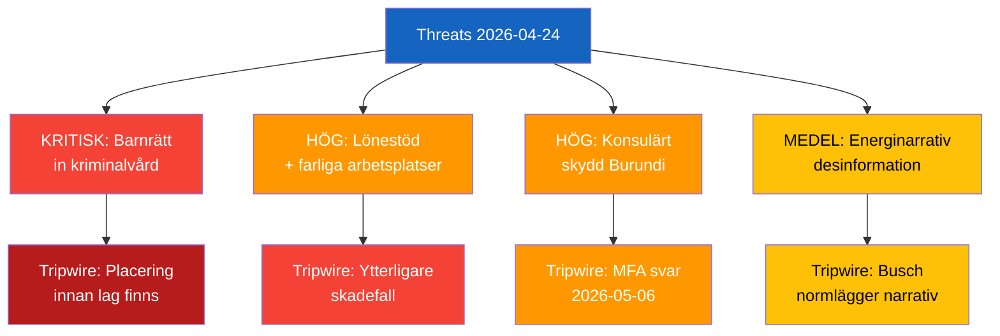

# Threat Analysis — 2026-04-24 Opposition Parliamentary Activity

**F3EAD Stage**: ANALYZE | **Methodology**: political-threat-framework.md

## Political Threat Taxonomy

| Threat | Actor | Target | Mechanism | Severity |
|--------|-------|--------|-----------|---------|
| Constitutional rights violation for incarcerated children | Implementation gap | Fundamental rights | Legislation absent before placement | Critical |
| Workplace harm to disabled workers via lönebidrag | Arbetsförmedlingen / employer | Disabled workers | Agency oversight failure | High |
| Consular protection failure — Sahabo | Burundian authorities / MFA | Swedish citizen | Authoritarian detention | High |
| Energy narrative delegitimisation | Windeurope / SVT | Public debate | Framing opposition = disinformation | Medium |
| Coalition fragmentation SD-KD on energy | SD | Government narrative | Parliamentary accountability pressure | Medium |

## Attack Tree — HD11749 (Highest Priority)

```
Fundamental right violation (children's education in prison)
├── Government proceeds with placements before legislation
│   ├── No delay mechanism triggered
│   └── Kriminalvården lacks educational mandate
├── Legal challenge
│   ├── JO-anmälan (Ombudsman)
│   ├── Administrative court challenge
│   └── EU/ECHR complaint
└── Political accountability
    ├── S escalates to interpellation
    ├── KU scrutiny
    └── Media investigation
```

## Kill Chain — HD11747 (Workplace Safety)

```
Initial: IF Metall warns Arbetsförmedlingen → (ignored) → Placement continues
Development: Arbejdsmiljöverket inspection confirms hazards → Media report (Arbetet)
Trigger: Johanna Haraldsson files parliamentary question HD11747
Response: Minister Britz must respond (2026-05-06)
Impact: Either accountability delivered OR escalation to interpellation
```


