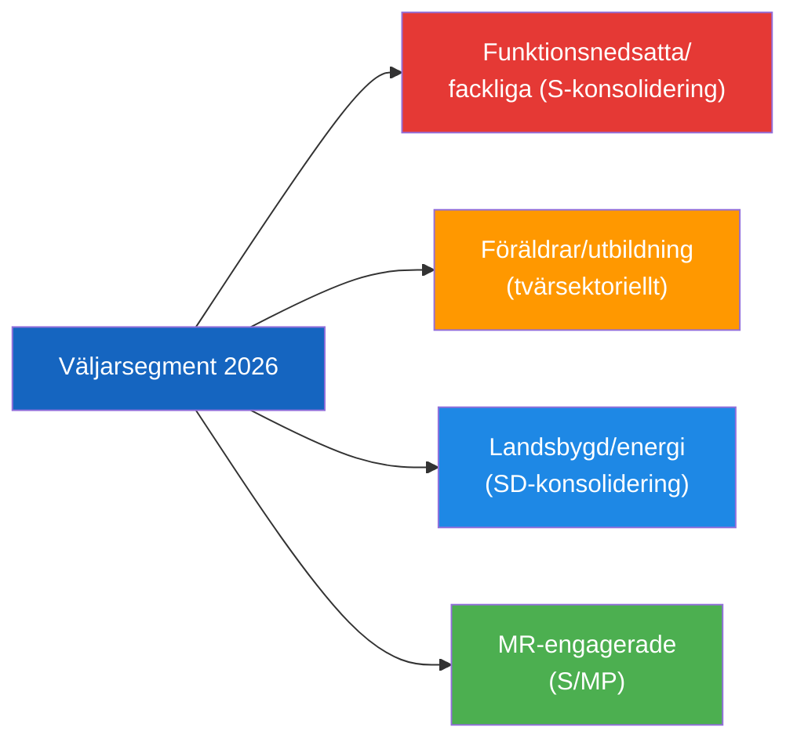

# Voter Segmentation — 2026-04-24 Opposition Parliamentary Activity

**F3EAD Stage**: ANALYZE (extended) | **Methodology**: voter-segmentation.md template, Outside-In Thinking

## Segment Impact Matrix

| Voter Segment | Size Est. | Impact | Key Document | Direction |
|---------------|----------|--------|-------------|----------|
| Disability rights/welfare | ~200,000 households | HIGH | HD11747 | S consolidation, L erosion |
| Workers/unions (LO) | ~1.5M voters | MEDIUM | HD11747 | S consolidation |
| Parents/education rights | ~1.2M voters | HIGH | HD11749 | Cross-partisan concern |
| Human rights community | ~100,000 | MEDIUM | HD11748, HD11749 | S + MP consolidation |
| Rural energy skeptics | ~300,000 | MEDIUM | HD10448 | SD consolidation |
| Hunting/sport shooting | ~400,000 | LOW | HD01JuU10 | Government positive (new law) |
| Elderly care advocates | ~500,000 | LOW | HD01SoU25 | Cross-partisan |

## Regional Segmentation

- **Skåne** (HD11747 case location): local focus on Arbetsförmedlingen + IF Metall story
- **Rural Sweden** (HD10448 energy): wind turbine host communities sensitive to energy policy narrative
- **Urban progressive** (HD11749, HD11748): human rights and children's rights resonate strongly

## Key Electoral Battlegrounds

1. **Suburban Stockholm/Göteborg**: HD11749 constitutional framing resonates with middle-class parents
2. **Rural Norrland**: HD10448 energy policy resonates with SD voters skeptical of wind
3. **Malmö/Skåne**: HD11747 directly relevant to disability employment sector

