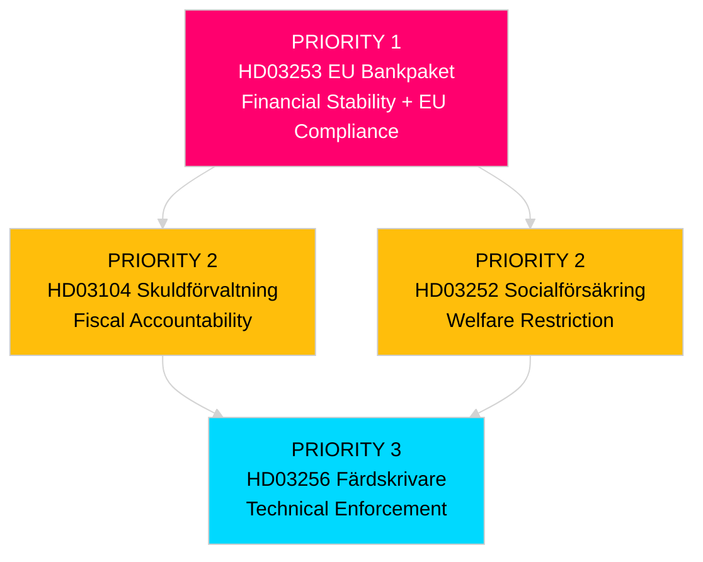

# Political Classification — Swedish Government Propositions 23 April 2026

**Author**: James Pether Sörling  
**Date**: 2026-04-26  
**Classification**: UNCLASSIFIED // PUBLIC SOURCE

---

## 7-Dimension Classification Matrix

| Dimension | HD03253 EU Bankpaket | HD03252 Socialförsäkring | HD03256 Färdskrivare | HD03104 Skuldförvaltning |
|-----------|---------------------|--------------------------|----------------------|--------------------------|
| **Policy domain** | Financial regulation / EU single rulebook | Criminal justice / social insurance | Transport / EU enforcement | Fiscal / debt management |
| **Initiator** | Government (Finansdepartementet / Niklas Wykman) | Government (Justitiedepartementet / Gunnar Strömmer) | Government (Landsbygdsdep / Andreas Carlson) | Government (Finansdep / Niklas Wykman) |
| **EU mandate** | Mandatory (CRD6 Dir. 2024/1619; CRR3 Reg. 2024/1623) | Domestic policy choice | Mandatory (EU Reg. 2020/1054) | Voluntary (evaluation skrivelse) |
| **Committee** | FiU (Finansutskottet) | SfU (Socialförsäkringsutskottet) | TU (Trafikutskottet) | FiU (Finansutskottet) |
| **Political salience** | HIGH — banking stability, EU compliance | MEDIUM-HIGH — law and order signalling | LOW — technical enforcement | MEDIUM — fiscal accountability |
| **Opposition stance** | S: compliance OK but small-bank concerns; V: anti-market; MP: neutral | S/V/MP: proportionality challenge | All parties support enforcement | S/MP: challenge on climate bond sufficiency |
| **Timeline risk** | CRD6 deadline: end 2025 (Sweden late). URGENT | Autumn 2026 entry into force proposed | Q4 2026 EU deadline | Informational; no legislative deadline |

## Priority Tiers

| Tier | Documents | Rationale |
|------|-----------|-----------|
| **Priority 1 — Immediate action** | HD03253 | Systemic banking regulation, EU compliance overdue, financial stability implications |
| **Priority 2 — Strategic tracking** | HD03104, HD03252 | Fiscal oversight + election-year welfare restriction |
| **Priority 3 — Routine monitoring** | HD03256 | Technical EU transposition, low controversy |

## Data Retention and Access Classification

- **Retention**: Public source data — no restriction. Riksdagen documents are permanent public record under *offentlighetsprincipen* (TF 2:1).
- **Personal data (GDPR Art. 9)**: HD03252 involves political opinion analysis on named minister (Gunnar Strömmer, M); basis: 9(2)(e) publicly made political position. No private personal data. No DPIA required.
- **Access**: Unrestricted. All analysis based on public primary sources.

