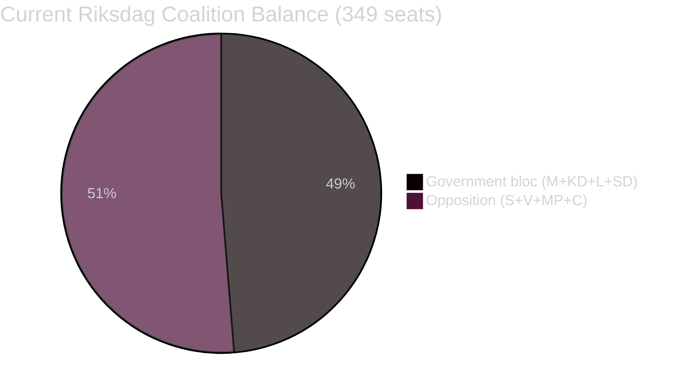

# Coalition Mathematics — Swedish Government Propositions 23 April 2026

**Author**: James Pether Sörling  
**Date**: 2026-04-26  
**Classification**: UNCLASSIFIED // PUBLIC SOURCE

---

## Current Seat Map (Riksdag 349 seats, majority threshold: 175)

| Party | Seats | Bloc |
|-------|-------|------|
| S (Socialdemokraterna) | 107 | Opposition (red-green) |
| SD (Sverigedemokraterna) | 73 | Government support |
| M (Moderaterna) | 68 | Government |
| V (Vänsterpartiet) | 24 | Opposition |
| MP (Miljöpartiet) | 24 | Opposition |
| C (Centerpartiet) | 24 | Opposition |
| KD (Kristdemokraterna) | 19 | Government |
| L (Liberalerna) | 10 | Government |
| **Total** | **349** | |

**Government bloc (M+KD+L+SD support)**: 68+19+10+73 = **170** (5 short of majority — governs with SD votes on most measures)  
**Opposition bloc (S+V+MP+C)**: 107+24+24+24 = **179** (majority if unified)

*Seat numbers based on current Riksdag composition per riksdag-regering MCP. [A1]*

---

## Pivotal-Vote Table for April 2026 Propositions

### HD03253 (EU Bankpaket) — FiU vote

| Ja | Nej | Avstår | Frånvarande | Expected outcome |
|----|-----|--------|-------------|------------------|
| M(68)+KD(19)+L(10)+SD(73) = 170 | S(107)+V(24)+MP(24) = 155 | C(24) | 0 | PASS if SD+M+KD+L unified AND C abstains. Risk: C joins opposition → 179 vs. 170 → FAIL |

**Pivotal actor**: Centerpartiet (C, 24 seats). If C votes Nej on HD03253 due to small-bank concerns, the proposal faces a 179 vs. 170 parliamentary defeat. Government must keep C in abstention or neutral position. [C3 — political analysis]

### HD03252 (Socialförsäkringsförmåner) — SfU vote

| Ja | Nej | Avstår | Frånvarande | Expected outcome |
|----|-----|--------|-------------|------------------|
| M(68)+KD(19)+L(10)+SD(73) = 170 | S(107)+V(24)+MP(24) = 155 | C(24) | 0 | PASS with government bloc if C abstains or supports |

**Pivotal actor**: L (Liberalerna, 10 seats) — historically human-rights oriented; may invoke ECHR concerns on *säkerhetsförvaring* provisions. If L abstains, government reduced to 160 vs. 155 — still passes. If L votes Nej: 160 vs. 165 → FAIL. [C3]

### HD03256 (Färdskrivare) — TU vote

Expected unanimous or near-unanimous passage. Technical EU transposition. No pivotal vote risk.

### HD03104 (Skuldförvaltning) — FiU vote (informational skrivelse)

Skrivelse are lägd till handlingarna (noted for the record) — no vote required.

---

## Sainte-Laguë Scenario: Government Majority Reconstruction

If election September 2026 shifts to S+V+C+MP majority (current polling trajectory):

| Party | Proj. seats 2026 | New bloc |
|-------|-----------------|----------|
| S | 117 | Government |
| C | 21 | Government |
| V | 35 | Government support |
| MP | 24 | Government |
| **New govt bloc** | **197** | |
| M | 64 | Opposition |
| SD | 69 | Opposition |
| KD | 19 | Opposition |
| L | 16 | Opposition |

Under this scenario, HD03253 would still pass under new government — EU compliance is cross-bloc policy. HD03252 would be repealed or substantially modified.

