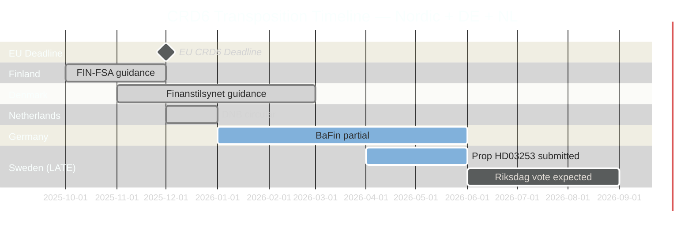

# Comparative International Analysis — Swedish Government Propositions 23 April 2026

**Author**: James Pether Sörling  
**Date**: 2026-04-26  
**Classification**: UNCLASSIFIED // PUBLIC SOURCE

---

## Comparator Set

**Comparator set**: Denmark (DK), Norway (NO), Finland (FI), Germany (DE), Netherlands (NL)  
**Focus**: CRD6/CRR3 transposition timelines; welfare restriction precedents; tachograph enforcement

---

## Outside-In Analysis: EU Bank Package (HD03253)

| Jurisdiction | CRD6 Transposition Status | Small-bank Carve-out | Supervisory Model | Source |
|---|---|---|---|---|
| **Sweden (SE)** | LATE — April 2026, deadline Q4 2025 | Proportionality debate ongoing | Finansinspektionen (FI) integrated | Riksdagen API HD03253 [A1] |
| **Denmark (DK)** | Broadly on schedule, Finanstilsynet guidance Q1 2026 | Limited carve-out for local banks | Finanstilsynet | Danish FSA 2026 press releases [B3] |
| **Finland (FI)** | On schedule, Finansinspektionen FI Q4 2025 | Minor proportionality adaptations | Integrated FIN-FSA | FIN-FSA annual report 2025 [B3] |
| **Germany (DE)** | Partial — BaFin guidance issued, full transposition Q2 2026 | Yes — Sparkassen/VR-Banken carve-out significant | BaFin + Bundesbank | Bundesbank CRD6 implementation note [B2] |
| **Netherlands (NL)** | On schedule — DNB circular December 2025 | Minor SME lending adjustments | DNB | DNB 2025 supervisory plan [B3] |

**Outside-In finding**: Sweden's delay is unusual relative to Nordic peers (Finland on schedule). Germany's Sparkassen carve-out precedent is likely the template being cited by Swedish small-bank lobby.

---

## Welfare Restriction Comparators (HD03252)

| Jurisdiction | Welfare benefit restriction for prisoners | Scope | Source |
|---|---|---|---|
| **Sweden (SE)** | Proposed: restrict sjukpenning/aktivitetsersättning for kontrollerat boende/säkerhetsförvaring | Narrow (controlled accommodation + security detention) | Prop. 2025/26:252 [A1] |
| **Norway (NO)** | Existing: social benefits suspended for prisoners in ordinary custody; partial restoration in open custody | Broader scope | Norwegian Social Insurance Act §22-2 [B2] |
| **Denmark (DK)** | Social benefits suspended for imprisonment; partial restoration in community supervision | Moderate scope | Danish Unemployment Insurance Act [B2] |
| **Germany (DE)** | Sozialgesetzbuch §16: benefits suspended during imprisonment; no analogous security detention specific provision | Broad suspension | SGB VI [A2] |
| **Finland (FI)** | Kela benefits suspended for full-time imprisonment; partial community supervision | Moderate scope | Finnish Social Insurance Institution Kela [B2] |

**Outside-In finding**: Swedish proposal (HD03252) is *narrower* than comparator Nordic countries — focusing only on controlled accommodation and security detention, not ordinary imprisonment. This suggests the proposal is politically framed for electoral effect while avoiding the broader welfare suspension that Norway and Denmark have already implemented.

---

## Mermaid Comparison: CRD6 Transposition Timeline

