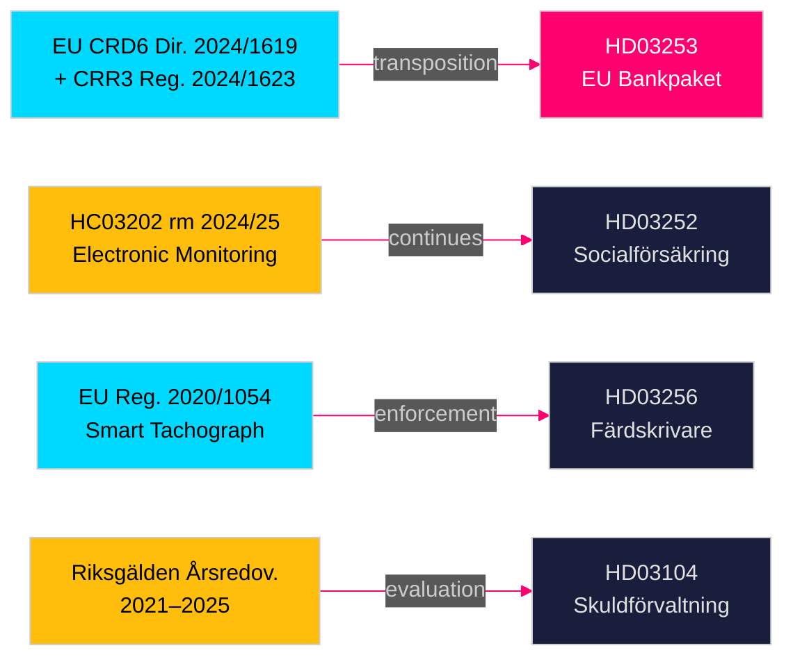

# Cross-Reference Map — Swedish Government Propositions 23 April 2026

**Author**: James Pether Sörling  
**Date**: 2026-04-26  
**Classification**: UNCLASSIFIED // PUBLIC SOURCE

---

## Policy Clusters

### Cluster A: EU Financial Regulation (FiU)
- **HD03253** (EU:s bankpaket, CRD6/CRR3) ← **continues** prior EU banking regulation
- **HD03104** (Skuldförvaltning evaluation) ← **amends** government accountability on debt policy
- Cross-link: Both submitted by Niklas Wykman (Finansdepartementet) to FiU on 2026-04-23. [A1]

### Cluster B: Law-and-Order Coalition (SfU)
- **HD03252** (Socialförsäkringsförmåner fängelsestraff) ← **continues** pattern:
  - HC03202 (rm 2024/25): Electronic monitoring (fängelsestraff) — same Justitiedepartementet, same SD-M coalition
  - HC03204 (rm 2024/25): Rules on suspension of state employees (Finansdepartementet)
  - Prior: Security detention reform 2024/25 — same legislative chain [B2]
- Cross-link: SD electoral programme 2022–26 systematically restricts welfare entitlements for those under criminal justice control. [C3]

### Cluster C: EU Transport Enforcement (TU)
- **HD03256** (Färdskrivare) ← **continues** EU ITS/tachograph reform:
  - EU Regulation (EU) 2020/1054 Article 103 (smart tachograph)
  - EU Commission 2030 Road Safety Strategy
  - Prior Swedish transposition: rm 2023/24 tachograph digital transition [B2]

## Legislative Chains

## Coordinated Filing Patterns

- **Same-day submission (2026-04-23)**: All four documents submitted on the same date — consistent with end-of-spring-session legislative batch filing (typical April government calendar). [A1]
- **FiU doubling**: Two documents (HD03253 + HD03104) routed to the same committee (FiU) on the same day — committee workload concentration.
- **Minister cluster**: Niklas Wykman responsible for 2 of 4 items — highest ministerial exposure this cycle.

## Edge Labels (Canonical Cross-Reference Vocabulary)

| Edge | From | To | Label |
|------|------|----|-------|
| EU → SE transposition | EU CRD6/CRR3 | HD03253 | `continues` |
| Law-and-order chain | HC03202 | HD03252 | `continues` |
| Enforcement enhancement | EU Reg. 2020/1054 | HD03256 | `amends` |
| Accountability | Riksgälden evaluation | HD03104 | `bundle` |
