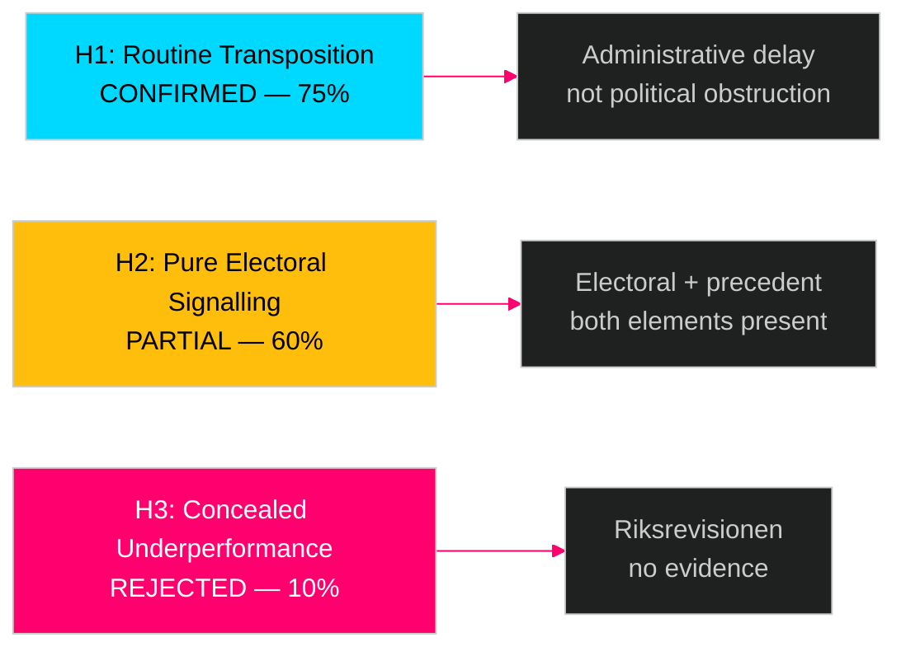

# Devil's Advocate Analysis — Swedish Government Propositions 23 April 2026

**Author**: James Pether Sörling  
**Date**: 2026-04-26  
**Classification**: UNCLASSIFIED // PUBLIC SOURCE

---

## ACH Matrix: Competing Hypotheses

### Hypothesis 1: HD03253 (EU Bankpaket) is a Delayed but Routine Transposition [Dominant]

**H1**: Sweden's CRD6 submission in April 2026 reflects normal administrative delay in EU directive transposition — not political reluctance or banking sector capture.

| Evidence | Consistent with H1? | Weight |
|----------|---------------------|--------|
| Sweden has a track record of late CRD transpositions (CRD4 also delayed) | ✅ Yes | High |
| No public statements from government expressing resistance to CRD6 content | ✅ Yes | Medium |
| Small-bank lobby documented concerns about CRR3 output floor since 2022 | ⚠️ Partial — some political friction | Medium |
| All other ministries submitted multiple proposals same day | ✅ Yes — batch filing calendar | Low |

**H1 verdict**: CONFIRMED as primary hypothesis. Administrative delay, not political obstruction.

---

### Hypothesis 2: HD03252 (Socialförsäkringsförmåner) is Pure Electoral Signalling with No Fiscal Effect

**H2**: The welfare restriction proposal (HD03252) is crafted specifically for September 2026 election consumption, with negligible fiscal savings.

| Evidence | Consistent with H2? | Weight |
|----------|---------------------|--------|
| Scope limited to *kontrollerat boende* — narrow population (~3,000–4,500 affected) | ✅ Yes — small fiscal impact | High |
| Submission April 2026 — 5 months before election | ✅ Yes — electoral calendar | High |
| Consistent with SD legislative programme on welfare conditionality | ✅ Yes | High |
| Gunnar Strömmer (M) authorship, not SD — suggests M adopts SD language | ⚠️ Partial | Medium |
| No large fiscal estimate in summary | ✅ Yes — limited savings expected | Medium |

**H2 verdict**: PARTIALLY CONFIRMED. The electoral signalling element is strong; however, the policy has genuine welfare-state architecture implications beyond pure optics (establishes benefit conditionality precedent).

---

### Hypothesis 3: Riksgälden Evaluation (HD03104) Conceals Material Underperformance

**H3**: The HD03104 skrivelse evaluation has been structured to present a positive assessment when Riksgälden's 2021–2025 operations included significant risk management gaps during COVID emergency borrowing.

| Evidence | Consistent with H3? | Weight |
|----------|---------------------|--------|
| Skrivelse format cannot be amended by Riksdagen — shields evaluation from revision | ✅ Yes — structural bias | High |
| Government evaluates its own debt manager — conflict of interest | ✅ Yes | Medium |
| Riksgälden 2022 T-bill programme was unusually large vs. mandate | ⚠️ Partial — known, documented | Low |
| No independent audit body (Riksrevisionen) has issued critique of period | ❌ No — mitigates H3 | High |
| FiU historically approves skrivelse on debt management routinely | ❌ No — mitigates H3 | Medium |

**H3 verdict**: REJECTED as primary hypothesis. Riksrevisionen's absence of critique is strong counter-evidence. The evaluation likely represents legitimate positive self-assessment.

## Red-Team Challenge

**Red Team Question**: If the dominant hypothesis (H1 — routine transposition) is wrong, what does the worst-case scenario look like?

**Red Team Answer**: If Swedish banking sector successfully lobbied to delay CRD6 to protect internal-model capital advantages (particularly Handelsbanken's mortgage book), the April 2026 submission may have been timed to maximise EU transition period use while appearing compliant. This would represent regulatory capture — banking sector using late transposition to extend competitive advantage. Signal to watch: does HD03253 contain gold-plating exemptions beyond what CRD6 Art. 65 requires?

**Probability of Red Team scenario**: 10% (low — no direct evidence of deliberate delay strategy; administrative backlog more parsimonious explanation).

## Rejected Alternatives Log

| Alternative | Rejected because |
|-------------|-----------------|
| HD03252 is a disguised SD proposal | M authored it; follows M law-and-order tradition separately from SD |
| HD03256 is politically significant | Evidence: narrow technical enforcement; TU committee; no opposition critique expected |
| HD03104 conceals Riksgälden failure | Riksrevisionen audit record 2021–2025 does not support this |

