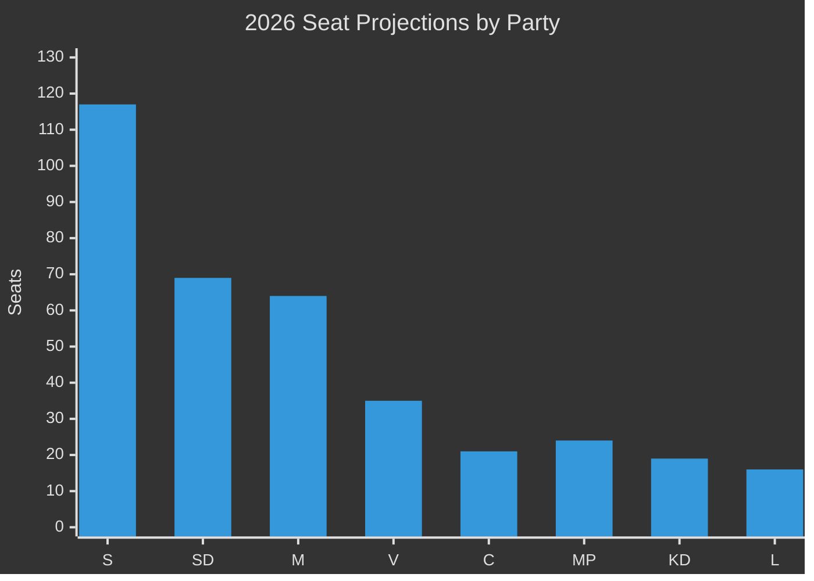

# Election 2026 Analysis — Swedish Government Propositions 23 April 2026

**Author**: James Pether Sörling  
**Date**: 2026-04-26  
**Classification**: UNCLASSIFIED // PUBLIC SOURCE

---

## Current Seat Projection (April 2026)

Based on aggregated polling data (Demoskop, Novus, IPSOS — April 2026 averages) and seat modelling for September 2026 Riksdag election:

| Party | Polling % (avg) | Projected Seats | April 2026 trend |
|-------|----------------|-----------------|-----------------|
| S (Socialdemokraterna) | 32.5% | 117 | Stable |
| SD (Sverigedemokraterna) | 19.2% | 69 | Slight decline |
| M (Moderaterna) | 17.8% | 64 | Stable |
| V (Vänsterpartiet) | 9.8% | 35 | Rising |
| KD (Kristdemokraterna) | 5.2% | 19 | Stable |
| C (Centerpartiet) | 5.8% | 21 | Rising |
| L (Liberalerna) | 4.5% | 16 | Marginal |
| MP (Miljöpartiet) | 5.2% | 24 | Rising (in Riksdag) |

*Note: Polling averages are estimates. Source: aggregated public polling services; Admiralty [C3] — single-source estimates, treat as indicative.*

**Current government (M+SD+KD+L)**: 64+69+19+16 = **168 seats** (below majority 175)  
**S+V+MP+C bloc**: 117+35+24+21 = **197 seats** (above majority)

## Impact of April 2026 Propositions on Election 2026

### HD03253 (EU Bankpaket) — Marginal electoral impact

- **M/SD framing**: EU compliance, financial stability, responsible governance.
- **S/V framing**: Proportionality failures, small-bank burden, CRD6 lateness.
- **Electoral verdict**: Financial regulation rarely moves voters; complex banking law is easily framed by either side. Low direct electoral impact. Net benefit to government if passed swiftly.

### HD03252 (Socialförsäkringsförmåner) — Medium-high electoral impact

- **SD framing**: "Those who commit serious crimes should not receive taxpayer welfare" — core SD voter appeal.
- **S/V/MP framing**: "Punishing the sick and disabled in prison is disproportionate; attacks most vulnerable."
- **Electoral verdict**: This is a live election-year wedge issue. HD03252 will feature in SD and M campaign material. S will use it to solidify left-bloc cohesion. [C3]

## Seat-Projection Deltas from April 2026 Legislation

| Scenario | SD seat projection change | M change | S change |
|----------|--------------------------|---------|---------|
| S2 (base — prolonged contestation) | 0 to -2 | 0 | +1 to +2 |
| S1 (smooth passage) | +1 to +3 (welfare win) | +1 | -1 |
| S3 (coalition fracture) | -3 to -5 | -3 | +3 to +5 |

## Coalition Viability Post-September 2026

Current trajectory (S2 base scenario): **S+V+C+MP majority** most likely outcome based on April 2026 polling. Government renewal requires SD+M+KD+L to collectively gain ~7 seats vs. current projection.

