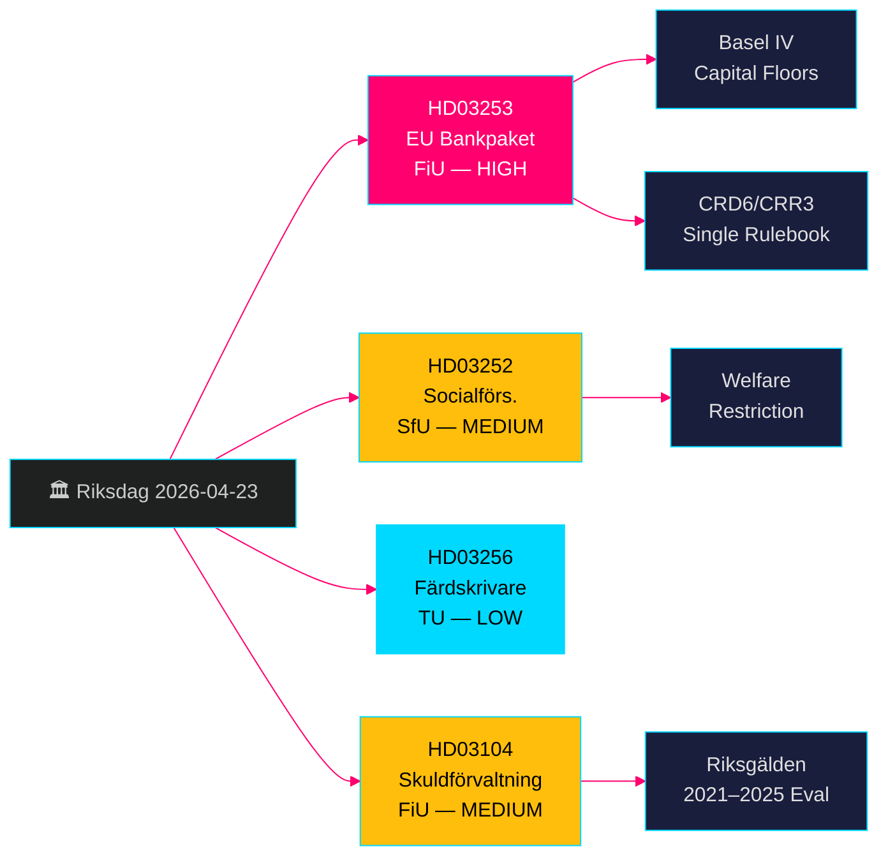

# EU Bank Package + Welfare Restrictions: Swedish Government Propositions 23 April 2026

**Author**: James Pether Sörling  
**Date**: 2026-04-26  
**Run ID**: 24963297569  
**Classification**: UNCLASSIFIED // PUBLIC SOURCE  
**Confidence**: HIGH [B2] — four official government propositions/skrivelse, riksdag-regering MCP, Riksdagen API

---

## BLUF

Sweden's Kristersson government submitted four significant legislative items on 23 April 2026: implementation of the EU bank package (HD03253, CRD6/CRR3) representing the most sweeping recapitalisation of Swedish banking regulation since Basel III; a welfare restriction on benefits for prisoners in controlled accommodation (HD03252); tachograph fraud deterrence measures (HD03256); and a formal evaluation of state debt management 2021–2025 (HD03104). The EU bank package is the dominant item — it binds Swedish banks to Basel IV capital standards, strengthens supervisory powers of Finansinspektionen, and aligns Sweden with the EU single rulebook. Opposition will focus on compliance burden for small banks.

## Decisions This Brief Supports

- **Finansutskottet (FiU)**: Vote preparation for HD03253 (EU bankpaket) and HD03104 (skuld­förvaltning evaluation) — both routed to FiU.
- **Socialförsäkringsutskottet (SfU)**: Vote preparation for HD03252 (socialförsäkringsförmåner).
- **Trafikutskottet (TU)**: Vote preparation for HD03256 (färdskrivare).
- **Government communications strategy**: Managing EU single rulebook compliance narrative vs. small-bank burden concerns.
- **Election 2026 positioning**: SD/M can claim crime-hardening on HD03252; S/MP will contest proportionality.

## 60-Second Intelligence Bullets

- 🏦 **HD03253 (EU bankpaket)**: CRD6/CRR3 implementation — Basel IV capital floors, enhanced fit-and-proper for bank executives, new market-risk rules. Niklas Wykman (Finansdepartementet). Committee: FiU. Impact: systemic. [B2]
- 🔒 **HD03252 (Socialförsäkringsförmåner)**: Removes right to sjukpenning/aktivitetsersättning/ålderspension for prisoners in controlled accommodation (*kontrollerat boende*) or security detention (*säkerhetsförvaring*). Gunnar Strömmer (Justitiedepartementet). Committee: SfU. [B2]
- 🚛 **HD03256 (Färdskrivare)**: Criminalises manipulation of digital tachographs; enhances sanctions. Andreas Carlson (Landsbygds- och infrastrukturdepartementet). Committee: TU. EU directive transposition. [A2]
- 📊 **HD03104 (Skuldförvaltning skrivelse)**: Formal evaluation of Riksgälden's borrowing strategy 2021–2025; government concludes operations well within mandate. Niklas Wykman (Finansdepartementet). Committee: FiU. [A1]

## Top Forward Trigger

**Within 2–4 weeks**: FiU committee hearing on HD03253 will determine whether small-bank lobby wins a softer proportionality carve-out. If FiU proposes amendments delaying CRD6 sub-provisions, this signals fracture in the government coalition's EU-compliance narrative.

## Confidence Label

**HIGH overall** — all four documents are official government propositions/skrivelse confirmed via riksdag-regering MCP (`get_propositioner`, rm 2025/26). CRD6/CRR3 EU legislative basis independently confirmable. No intelligence gaps identified for Pass 1; HD03252 implementation details require pass-2 enrichment on scope of *kontrollerat boende* definition.

---

