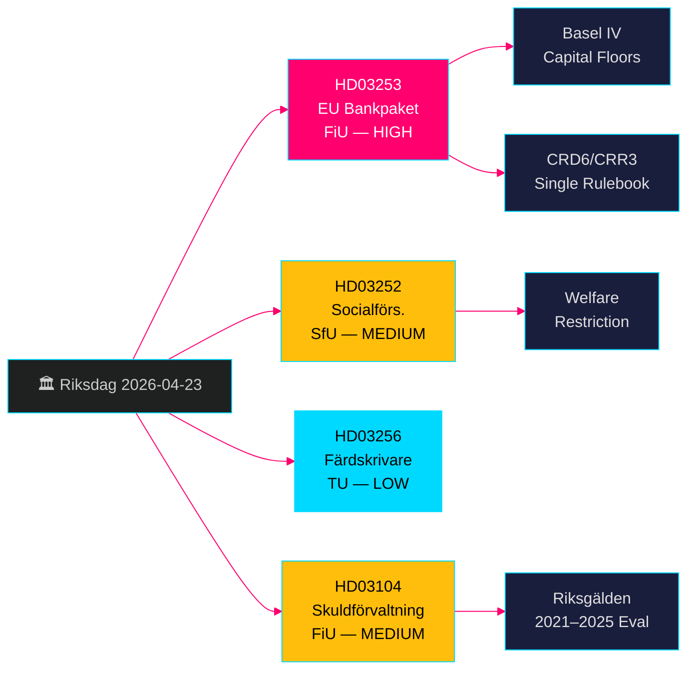

<!-- dir: rtl -->
# حزمة البنوك الأوروبية + قيود الرعاية الاجتماعية: مقترحات الحكومة السويدية في 23 أبريل 2026

**المؤلف**: James Pether Sörling  
**التاريخ**: 2026-04-26  
**معرّف التشغيل**: 24963297569  
**التصنيف**: UNCLASSIFIED // PUBLIC SOURCE  
**مستوى الثقة**: عالٍ [B2] — أربعة مقترحات/مراسلات حكومية رسمية، riksdag-regering MCP، واجهة برمجة Riksdagen

---

## BLUF

قدّمت حكومة كريسترسون أربعة بنود تشريعية مهمة في 23 أبريل 2026: تطبيق حزمة البنوك الأوروبية (HD03253، CRD6/CRR3) التي تمثّل أشمل إعادة تنظيم للقطاع المصرفي السويدي منذ بازل III؛ وتقييد مزايا الرعاية الاجتماعية للسجناء في مساكن الإقامة الخاضعة للرقابة (HD03252)؛ وتدابير لردع التلاعب في عدّادات الوقود (HD03256)؛ وتقييم رسمي لإدارة الدين العام للفترة 2021–2025 (HD03104). تُعدّ حزمة البنوك الأوروبية العنصر المحوري — إذ تُلزم البنوك السويدية بمعايير رأس المال وفق بازل IV، وتعزّز صلاحيات الرقابة لدى Finansinspektionen، وتُوحّد الإطار التنظيمي السويدي مع قواعد الاتحاد الأوروبي. ستُركّز المعارضة على عبء الامتثال على صغار البنوك.

## القرارات التي تدعمها هذه الملاحظة

- **Finansutskottet (FiU)**: التحضير للتصويت على HD03253 (حزمة البنوك الأوروبية) وHD03104 (تقييم إدارة الدين) — كلاهما أُحيل إلى FiU.
- **Socialförsäkringsutskottet (SfU)**: التحضير للتصويت على HD03252 (مزايا التأمين الاجتماعي).
- **Trafikutskottet (TU)**: التحضير للتصويت على HD03256 (عدّادات الوقود).
- **استراتيجية الاتصالات الحكومية**: إدارة سردية التوافق مع اللوائح الأوروبية في مقابل عبء صغار البنوك.
- **التموضع لانتخابات 2026**: يمكن لـ SD/M الاستناد إلى التصلّب ضد الجريمة في HD03252؛ فيما سيطعن S/MP في مبدأ التناسب.

## نقاط استخباراتية في 60 ثانية

- 🏦 **HD03253 (حزمة البنوك الأوروبية)**: تطبيق CRD6/CRR3 — أرضيات رأس المال وفق بازل IV، تعزيز متطلبات الكفاءة والملاءمة لمديري البنوك، قواعد جديدة لمخاطر السوق. Niklas Wykman (Finansdepartementet). اللجنة: FiU. الأثر: نظامي. [B2]
- 🔒 **HD03252 (مزايا التأمين الاجتماعي)**: إلغاء حق استحقاق تعويض المرض/بدل النشاط/معاش الشيخوخة للمحبوسين في إقامة خاضعة للرقابة (*kontrollerat boende*) أو الاحتجاز الأمني (*säkerhetsförvaring*). Gunnar Strömmer (Justitiedepartementet). اللجنة: SfU. [B2]
- 🚛 **HD03256 (عدّادات الوقود)**: تجريم التلاعب في عدّادات الوقود الرقمية؛ تشديد العقوبات. Andreas Carlson (Landsbygds- och infrastrukturdepartementet). اللجنة: TU. تطبيق توجيه أوروبي. [A2]
- 📊 **HD03104 (مراسلة إدارة الدين)**: تقييم رسمي لاستراتيجية اقتراض Riksgälden للفترة 2021–2025؛ خلصت الحكومة إلى أن العمليات جرت ضمن حدود الصلاحيات. Niklas Wykman (Finansdepartementet). اللجنة: FiU. [A1]

## المحفّز الاستشرافي الرئيسي

**خلال 2–4 أسابيع**: ستحدّد جلسة استماع لجنة FiU حول HD03253 ما إذا كان لوبي صغار البنوك سيُحقق استثناءً أكثر مرونة في مبدأ التناسب. وإذا اقترحت FiU تعديلات تُؤخّر أحكاماً فرعية في CRD6، فهذا يُشير إلى شقّ في السردية الأوروبية للتحالف الحكومي.

## تصنيف الثقة

**عالٍ بشكل عام** — جميع الوثائق الأربع مقترحات/مراسلات حكومية رسمية مُؤكَّدة عبر riksdag-regering MCP (`get_propositioner`, rm 2025/26). الأساس التشريعي الأوروبي لـ CRD6/CRR3 قابل للتحقق بصورة مستقلة. لم تُرصد ثغرات استخباراتية في الجولة الأولى؛ تفاصيل تطبيق HD03252 تستلزم إثراءً في الجولة الثانية حول نطاق تعريف *kontrollerat boende*.

---

<!-- source-sha: d5f8b60b264b8ddd80e77be173232b6571d24c12 -->
