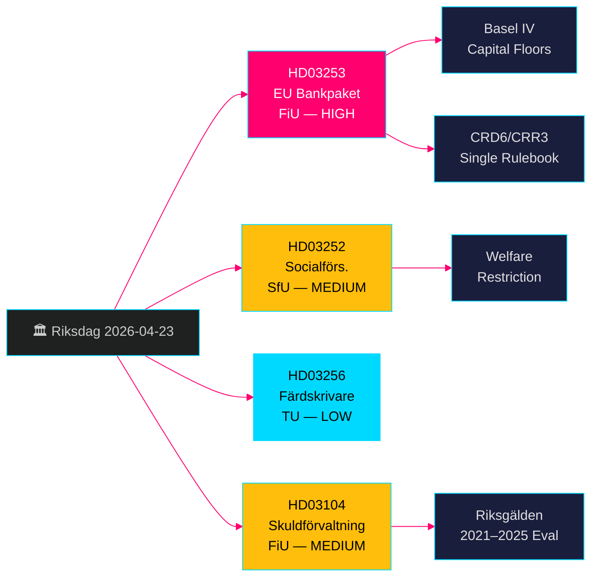

# EU-bankpakke + Velfærdsbegrænsninger: Svenske Regeringens Lovforslag 23. april 2026

**Forfatter**: James Pether Sörling  
**Dato**: 2026-04-26  
**Kørings-ID**: 24963297569  
**Klassifikation**: UNCLASSIFIED // PUBLIC SOURCE  
**Konfidensgrad**: HØJ [B2] — fire officielle regeringspropositioner/skrivelse, riksdag-regering MCP, Riksdagen API

---

## BLUF

Sveriges Kristerssonregering fremlagde fire vigtige lovgivningspunkter den 23. april 2026: implementering af EU's bankpakke (HD03253, CRD6/CRR3), der repræsenterer den mest vidtgående omregulering af svensk banklovgivning siden Basel III; en velfærdsbegrænsning af ydelser til indsatte i kontrolleret bolig (HD03252); tiltag mod manipulation med fartskrivere (HD03256); og en formel evaluering af statsgældsforvaltningen 2021–2025 (HD03104). EU's bankpakke er det dominerende punkt — den binder svenske banker til Basel IV-kapitalstandarder, styrker Finansinspektionens tilsynsbeføjelser og tilpasser Sverige til EU's fælles regelsæt. Oppositionen vil fokusere på efterlevnelsesbyrden for mindre banker.

## Beslutninger dette underlag understøtter

- **Finansutskottet (FiU)**: Forberedelse af afstemning om HD03253 (EU bankpakke) og HD03104 (evaluering af gældsforvaltning) — begge henvist til FiU.
- **Socialförsäkringsutskottet (SfU)**: Forberedelse af afstemning om HD03252 (socialforsikringsydelser).
- **Trafikutskottet (TU)**: Forberedelse af afstemning om HD03256 (fartskrivere).
- **Regeringens kommunikationsstrategi**: Håndtering af EU-regelverks-narrativet over for byrden for mindre banker.
- **Valg 2026-positionering**: SD/M kan hævde kriminalitetshårdhed ved HD03252; S/MP vil bestride proportionaliteten.

## 60-sekunders efterretningspunkter

- 🏦 **HD03253 (EU bankpakke)**: CRD6/CRR3-implementering — Basel IV-kapitalgulve, styrket egnethedskontrol for bankdirektører, nye markedsrisikregler. Niklas Wykman (Finansdepartementet). Udvalg: FiU. Konsekvens: systemisk. [B2]
- 🔒 **HD03252 (Socialforsikringsydelser)**: Fjerner retten til sygedagpenge/aktivitetsydelse/alderspension for indsatte i kontrolleret bolig (*kontrollerat boende*) eller sikkerhedsforvaring (*säkerhetsförvaring*). Gunnar Strömmer (Justitiedepartementet). Udvalg: SfU. [B2]
- 🚛 **HD03256 (Fartskrivere)**: Kriminaliserer manipulation med digitale fartskrivere; styrker sanktioner. Andreas Carlson (Landsbygds- och infrastrukturdepartementet). Udvalg: TU. EU-direktivimplementering. [A2]
- 📊 **HD03104 (Gældsforvaltning skrivelse)**: Formel evaluering af Riksgäldens lånestrategi 2021–2025; regeringen konkluderer, at driften lå klart inden for mandatets rammer. Niklas Wykman (Finansdepartementet). Udvalg: FiU. [A1]

## Vigtigste fremtidige trigger

**Inden for 2–4 uger**: FiU's udvalgshøring om HD03253 afgør, om lobbyister for mindre banker opnår en blødere proportionalitetsundtagelse. Hvis FiU foreslår ændringer, der forsinker CRD6-delbestemmelser, signalerer dette brud i regeringskoalitionens EU-efterlevelsesnarrativ.

## Konfidensetiket

**HØJ overordnet** — alle fire dokumenter er officielle regeringspropositioner/skrivelse bekræftet via riksdag-regering MCP (`get_propositioner`, rm 2025/26). CRD6/CRR3 EU-lovgivningsgrundlag kan bekræftes uafhængigt. Ingen efterretningsgab identificeret for Pass 1; implementeringsdetaljer for HD03252 kræver Pass 2-berigelse om definitionen af *kontrollerat boende*.

---

<!-- source-sha: d5f8b60b264b8ddd80e77be173232b6571d24c12 -->
