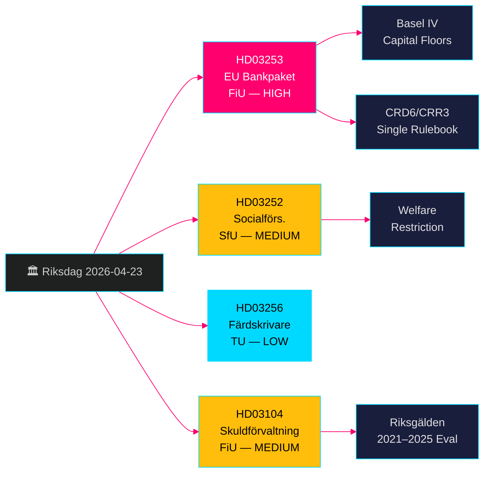

# EU-Bankenpaket + Sozialleistungseinschränkungen: Schwedische Regierungsproposionen 23. April 2026

**Autor**: James Pether Sörling  
**Datum**: 2026-04-26  
**Ausführungs-ID**: 24963297569  
**Einstufung**: UNCLASSIFIED // PUBLIC SOURCE  
**Konfidenzniveau**: HOCH [B2] — vier offizielle Regierungsproposionen/Skrivelse, riksdag-regering MCP, Riksdagen API

---

## BLUF

Die schwedische Kristerssonregierung legte am 23. April 2026 vier bedeutende Gesetzgebungsvorhaben vor: die Umsetzung des EU-Bankenpakets (HD03253, CRD6/CRR3), die die weitreichendste Neuregulierung des schwedischen Bankwesens seit Basel III darstellt; eine Einschränkung von Sozialleistungen für Strafgefangene in kontrollierter Unterbringung (HD03252); Maßnahmen zur Abschreckung von Tachographenbetrug (HD03256); und eine formelle Bewertung der Staatsschuldenverwaltung 2021–2025 (HD03104). Das EU-Bankenpaket ist das dominierende Element — es verpflichtet schwedische Banken zu Basel-IV-Kapitalstandards, stärkt die Aufsichtsbefugnisse der Finansinspektion und passt Schweden an das einheitliche EU-Regelwerk an. Die Opposition wird sich auf den Erfüllungsaufwand für kleinere Banken konzentrieren.

## Entscheidungen, die diese Zusammenfassung unterstützt

- **Finansutskottet (FiU)**: Abstimmungsvorbereitung für HD03253 (EU-Bankenpaket) und HD03104 (Bewertung der Schuldenverwaltung) — beide an FiU verwiesen.
- **Socialförsäkringsutskottet (SfU)**: Abstimmungsvorbereitung für HD03252 (Sozialversicherungsleistungen).
- **Trafikutskottet (TU)**: Abstimmungsvorbereitung für HD03256 (Fahrtenschreiber).
- **Regierungskommunikationsstrategie**: Steuerung des EU-Regelwerksnarrativs gegenüber der Belastung kleinerer Banken.
- **Wahlpositionierung 2026**: SD/M können bei HD03252 auf Kriminalitätshärte verweisen; S/MP werden die Verhältnismäßigkeit anfechten.

## 60-Sekunden-Geheimdienstpunkte

- 🏦 **HD03253 (EU-Bankenpaket)**: CRD6/CRR3-Umsetzung — Basel-IV-Kapitalböden, verbesserte Eignungsanforderungen für Bankvorstände, neue Marktrisikoregelungen. Niklas Wykman (Finansdepartementet). Ausschuss: FiU. Wirkung: systemisch. [B2]
- 🔒 **HD03252 (Sozialversicherungsleistungen)**: Entzug des Anspruchs auf Krankengeld/Aktivitätsersatz/Altersrente für Strafgefangene in kontrollierter Unterbringung (*kontrollerat boende*) oder Sicherungsverwahrung (*säkerhetsförvaring*). Gunnar Strömmer (Justitiedepartementet). Ausschuss: SfU. [B2]
- 🚛 **HD03256 (Fahrtenschreiber)**: Kriminalisierung der Manipulation digitaler Fahrtenschreiber; Verschärfung der Sanktionen. Andreas Carlson (Landsbygds- och infrastrukturdepartementet). Ausschuss: TU. EU-Richtlinienumsetzung. [A2]
- 📊 **HD03104 (Schuldenverwaltung Skrivelse)**: Formelle Bewertung der Kreditstrategie der Riksgälden 2021–2025; die Regierung stellt fest, dass der Betrieb klar im Rahmen des Mandats blieb. Niklas Wykman (Finansdepartementet). Ausschuss: FiU. [A1]

## Wichtigster Zukunftsauslöser

**Innerhalb von 2–4 Wochen**: Die FiU-Ausschussanhörung zu HD03253 wird entscheiden, ob die Lobbyisten kleinerer Banken eine weichere Verhältnismäßigkeitsausnahme durchsetzen. Schlägt FiU Änderungen vor, die CRD6-Teilbestimmungen verzögern, signalisiert dies Risse im EU-Compliance-Narrativ der Regierungskoalition.

## Konfidenzkennzeichnung

**HOCH insgesamt** — alle vier Dokumente sind offizielle Regierungsproposionen/Skrivelse, bestätigt über riksdag-regering MCP (`get_propositioner`, rm 2025/26). Die CRD6/CRR3 EU-Gesetzgebungsgrundlage ist unabhängig verifizierbar. Für Pass 1 keine Nachrichten­lücken identifiziert; Umsetzungsdetails von HD03252 erfordern Pass-2-Anreicherung zur Definition von *kontrollerat boende*.

---

<!-- source-sha: d5f8b60b264b8ddd80e77be173232b6571d24c12 -->
