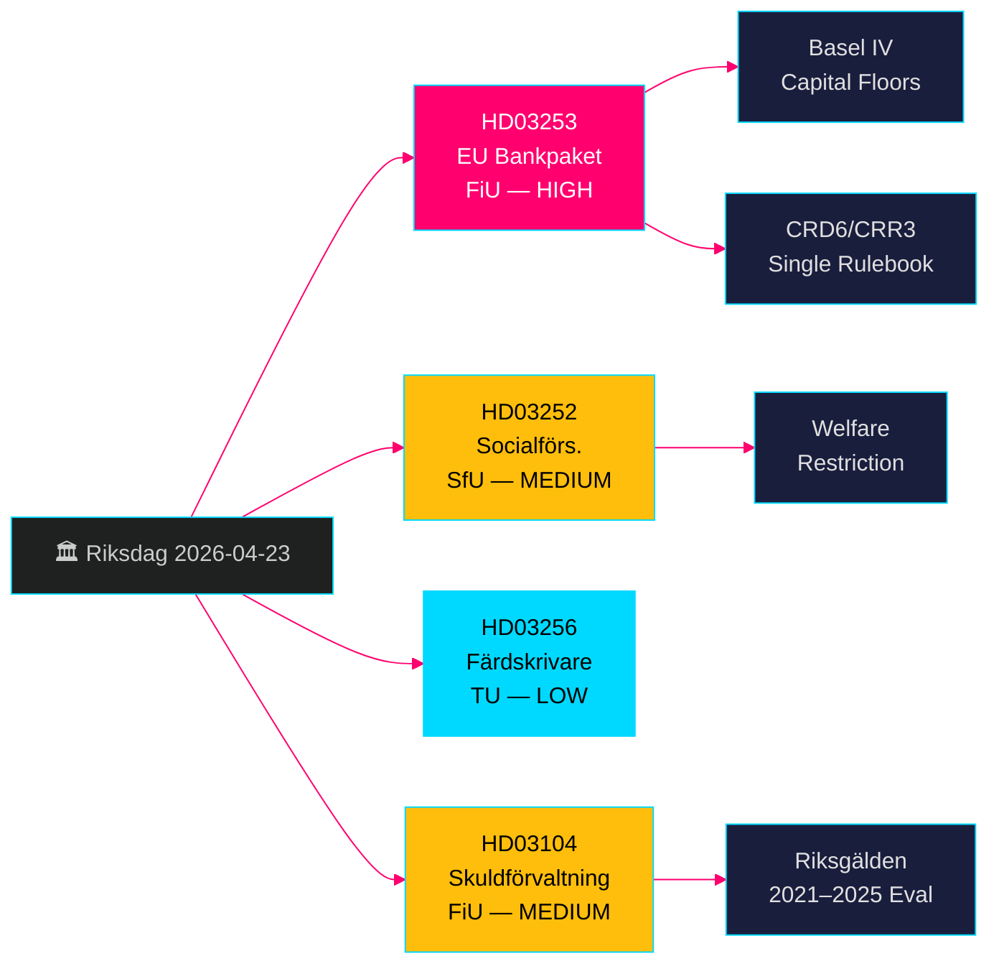

# Paquete bancario de la UE + Restricciones de prestaciones sociales: Proposiciones del Gobierno sueco del 23 de abril de 2026

**Autor**: James Pether Sörling  
**Fecha**: 2026-04-26  
**ID de ejecución**: 24963297569  
**Clasificación**: UNCLASSIFIED // PUBLIC SOURCE  
**Nivel de confianza**: ALTO [B2] — cuatro proposiciones/skrivelse oficiales del gobierno, riksdag-regering MCP, API del Riksdagen

---

## BLUF

El gobierno Kristersson presentó cuatro medidas legislativas significativas el 23 de abril de 2026: la implementación del paquete bancario de la UE (HD03253, CRD6/CRR3), que representa la revisión más profunda de la regulación bancaria sueca desde Basilea III; una restricción de prestaciones sociales para reclusos en alojamiento controlado (HD03252); medidas disuasorias contra el fraude del tacógrafo (HD03256); y una evaluación formal de la gestión de la deuda pública 2021–2025 (HD03104). El paquete bancario es el elemento dominante — vincula a los bancos suecos con los estándares de capital de Basilea IV, refuerza las facultades de supervisión de la Finansinspektion y alinea a Suecia con el reglamento único de la UE. La oposición se centrará en la carga de cumplimiento para los bancos más pequeños.

## Decisiones que apoya esta nota

- **Finansutskottet (FiU)**: Preparación de la votación sobre HD03253 (paquete bancario UE) y HD03104 (evaluación de gestión de deuda) — ambos remitidos al FiU.
- **Socialförsäkringsutskottet (SfU)**: Preparación de la votación sobre HD03252 (prestaciones del seguro social).
- **Trafikutskottet (TU)**: Preparación de la votación sobre HD03256 (tacógrafos).
- **Estrategia de comunicación gubernamental**: Gestionar el narrativo de cumplimiento del reglamento único de la UE frente a la carga para los bancos pequeños.
- **Posicionamiento para las elecciones de 2026**: SD/M pueden invocar la dureza contra el crimen en HD03252; S/MP impugnarán la proporcionalidad.

## Puntos de inteligencia de 60 segundos

- 🏦 **HD03253 (Paquete bancario UE)**: Implementación CRD6/CRR3 — suelos de capital de Basilea IV, requisitos de idoneidad reforzados para directivos bancarios, nuevas reglas de riesgo de mercado. Niklas Wykman (Finansdepartementet). Comisión: FiU. Impacto: sistémico. [B2]
- 🔒 **HD03252 (Prestaciones del seguro social)**: Suprime el derecho a prestación por incapacidad/subsidio de actividad/pensión de jubilación para reclusos en alojamiento controlado (*kontrollerat boende*) o custodia de seguridad (*säkerhetsförvaring*). Gunnar Strömmer (Justitiedepartementet). Comisión: SfU. [B2]
- 🚛 **HD03256 (Tacógrafos)**: Criminaliza la manipulación de tacógrafos digitales; refuerza las sanciones. Andreas Carlson (Landsbygds- och infrastrukturdepartementet). Comisión: TU. Transposición de directiva UE. [A2]
- 📊 **HD03104 (Skrivelse gestión de deuda)**: Evaluación formal de la estrategia de endeudamiento de la Riksgälden 2021–2025; el gobierno concluye que las operaciones se mantuvieron claramente dentro del mandato. Niklas Wykman (Finansdepartementet). Comisión: FiU. [A1]

## Principal desencadenante prospectivo

**En 2–4 semanas**: La audiencia del FiU sobre HD03253 determinará si el lobby de los bancos pequeños logra una exención de proporcionalidad más flexible. Si el FiU propone enmiendas que retrasen subdisposiciones de CRD6, señala fractura en el narrativo de cumplimiento UE de la coalición gubernamental.

## Etiqueta de confianza

**ALTO en general** — los cuatro documentos son proposiciones/skrivelse oficiales del gobierno confirmadas a través de riksdag-regering MCP (`get_propositioner`, rm 2025/26). La base legislativa de la UE CRD6/CRR3 es verificable de forma independiente. No se identificaron lagunas de inteligencia para el Pass 1; los detalles de implementación de HD03252 requieren enriquecimiento en el Pass 2 sobre el alcance de la definición de *kontrollerat boende*.

---

<!-- source-sha: d5f8b60b264b8ddd80e77be173232b6571d24c12 -->
