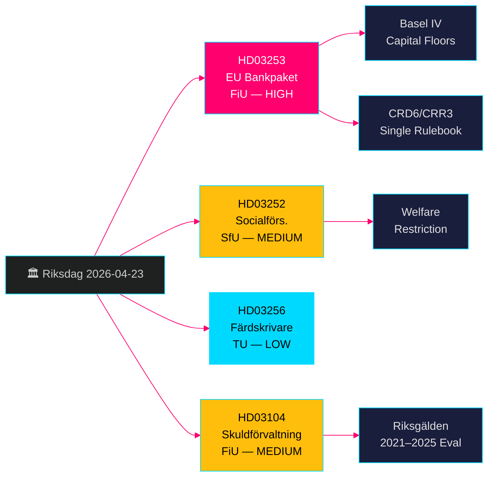

# EU-pankkipaketti + Hyvinvointirajoitukset: Ruotsin Hallituksen Proposiot 23. huhtikuuta 2026

**Tekijä**: James Pether Sörling  
**Päivämäärä**: 2026-04-26  
**Ajotunn.: 24963297569  
**Luokittelu**: UNCLASSIFIED // PUBLIC SOURCE  
**Luottamusaste**: KORKEA [B2] — neljä virallista hallituksen propositiota/skrivelse, riksdag-regering MCP, Riksdagen API

---

## BLUF

Ruotsin Kristerssonin hallitus esitti neljä merkittävää lainsäädäntökohdetta 23. huhtikuuta 2026: EU:n pankkipaketin implementointi (HD03253, CRD6/CRR3), joka edustaa perusteellisinta ruotsalaisen pankkisääntelyn uudistusta sitten Basel III:n; hyvinvointirajoitus valvotun asumisen vangeille myönnettävistä etuuksista (HD03252); ajopiirturitypetosten torjuntatoimet (HD03256); ja valtion velanhoidon 2021–2025 virallinen arviointi (HD03104). EU:n pankkipaketti on hallitseva kohde — se sitoo ruotsalaiset pankit Basel IV:n pääomastandardeihin, vahvistaa Finansinspektionenin valvontavaltuuksia ja yhdenmukaistaa Ruotsin EU:n yhteisen sääntökirjan kanssa. Oppositio keskittyy pienten pankkien noudattamistaan.

## Päätökset, joita tämä katsaus tukee

- **Finansutskottet (FiU)**: Äänestyksen valmistelu HD03253:lle (EU:n pankkipaketti) ja HD03104:lle (velanhoidon arviointi) — molemmat siirretty FiU:lle.
- **Socialförsäkringsutskottet (SfU)**: Äänestyksen valmistelu HD03252:lle (sosiaalivakuutusetuudet).
- **Trafikutskottet (TU)**: Äänestyksen valmistelu HD03256:lle (ajopiirturit).
- **Hallituksen viestintästrategia**: EU:n yhteisen sääntökirjan noudattamistaan narraavin hallinta vs. pienille pankeille aiheutuva taakka.
- **Vaalien 2026 asemointi**: SD/M voi vedota rikostorjuntaan HD03252:ssa; S/MP kiistää suhteellisuusperiaatteen.

## 60 sekunnin tiedustelukohdat

- 🏦 **HD03253 (EU:n pankkipaketti)**: CRD6/CRR3-implementointi — Basel IV:n pääomapohjat, pankkijohtajien soveltuvuusvaatimusten vahvistaminen, uudet markkinariskisäännöt. Niklas Wykman (Finansdepartementet). Valiokunta: FiU. Vaikutus: systeeminen. [B2]
- 🔒 **HD03252 (Sosiaalivakuutusetuudet)**: Poistaa oikeuden sairauspäivärahaan/toimintakorvaukseen/vanhuuseläkkeeseen valvotussa asumisessa (*kontrollerat boende*) tai turvasäilytyksessä (*säkerhetsförvaring*) olevilta vangeilta. Gunnar Strömmer (Justitiedepartementet). Valiokunta: SfU. [B2]
- 🚛 **HD03256 (Ajopiirturit)**: Kriminalisoi digitaalisten ajopiirturien manipuloinnin; tiukentaa seuraamuksia. Andreas Carlson (Landsbygds- och infrastrukturdepartementet). Valiokunta: TU. EU-direktiivin toimeenpano. [A2]
- 📊 **HD03104 (Velanhoidon skrivelse)**: Riksgäldenin lainausstrategian 2021–2025 virallinen arviointi; hallitus toteaa toiminnan pysyneen selvästi toimeksiannon rajoissa. Niklas Wykman (Finansdepartementet). Valiokunta: FiU. [A1]

## Tärkein tuleva laukaisija

**2–4 viikon sisällä**: FiU:n valiokuntakuuleminen HD03253:sta ratkaisee, saako pienpankkilobbaus pehmeämmän suhteellisuuspoikkeuksen. Jos FiU ehdottaa muutoksia, jotka viivästyttävät CRD6:n alasäännöksiä, se merkitsee halkeilua hallituskoalition EU-noudattamisnarraavin osalta.

## Luottamusmerkki

**KORKEA kokonaisuutena** — kaikki neljä asiakirjaa ovat virallisia hallituksen propositioita/skrivelse, vahvistettu riksdag-regering MCP:n kautta (`get_propositioner`, rm 2025/26). CRD6/CRR3 EU:n lainsäädäntöpohja on vahvistettavissa itsenäisesti. Pass 1:lle ei tunnistettu tiedustelupuutteita; HD03252:n implementointitiedot edellyttävät Pass 2 -rikastamista *kontrollerat boende* -määritelmän osalta.

---

<!-- source-sha: d5f8b60b264b8ddd80e77be173232b6571d24c12 -->
