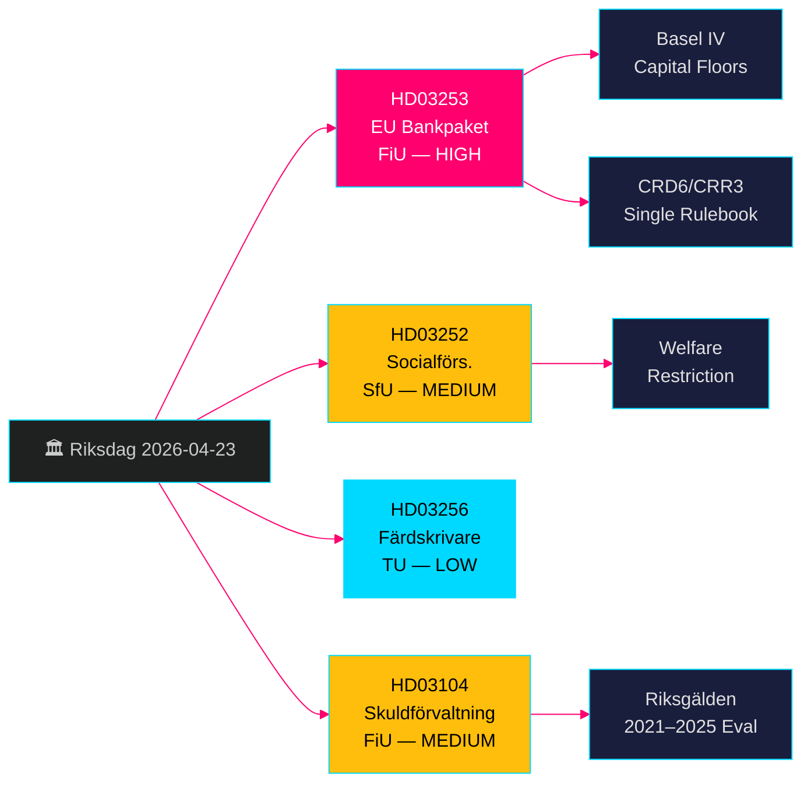

# Paquet bancaire européen + Restrictions de prestations sociales : Propositions du gouvernement suédois du 23 avril 2026

**Auteur** : James Pether Sörling  
**Date** : 2026-04-26  
**ID d'exécution** : 24963297569  
**Classification** : UNCLASSIFIED // PUBLIC SOURCE  
**Niveau de confiance** : ÉLEVÉ [B2] — quatre propositions/skrivelse officielles du gouvernement, riksdag-regering MCP, API Riksdagen

---

## BLUF

Le gouvernement Kristersson a soumis quatre mesures législatives importantes le 23 avril 2026 : la mise en œuvre du paquet bancaire européen (HD03253, CRD6/CRR3), qui représente la révision la plus profonde de la réglementation bancaire suédoise depuis Bâle III ; une restriction des prestations sociales pour les détenus en hébergement contrôlé (HD03252) ; des mesures de dissuasion contre la fraude au tachygraphe (HD03256) ; et une évaluation formelle de la gestion de la dette publique 2021–2025 (HD03104). Le paquet bancaire est l'élément dominant — il soumet les banques suédoises aux normes de fonds propres de Bâle IV, renforce les pouvoirs de surveillance de la Finansinspektion et aligne la Suède sur le règlement uniforme de l'UE. L'opposition se concentrera sur la charge de conformité pour les petites banques.

## Décisions soutenues par cette note

- **Finansutskottet (FiU)** : Préparation du vote sur HD03253 (paquet bancaire UE) et HD03104 (évaluation de la gestion de la dette) — tous deux renvoyés au FiU.
- **Socialförsäkringsutskottet (SfU)** : Préparation du vote sur HD03252 (prestations d'assurance sociale).
- **Trafikutskottet (TU)** : Préparation du vote sur HD03256 (tachygraphes).
- **Stratégie de communication gouvernementale** : Gérer le narratif du règlement uniforme UE face à la charge pour les petites banques.
- **Positionnement pour les élections 2026** : SD/M peuvent invoquer la sévérité anti-crime sur HD03252 ; S/MP contesteront la proportionnalité.

## Bulletins de renseignement en 60 secondes

- 🏦 **HD03253 (Paquet bancaire UE)** : Mise en œuvre CRD6/CRR3 — planchers de fonds propres Bâle IV, exigences d'aptitude renforcées pour les dirigeants de banques, nouvelles règles de risque de marché. Niklas Wykman (Finansdepartementet). Commission : FiU. Impact : systémique. [B2]
- 🔒 **HD03252 (Prestations d'assurance sociale)** : Suppression du droit aux indemnités maladie/allocation d'activité/retraite vieillesse pour les détenus en hébergement contrôlé (*kontrollerat boende*) ou en détention de sécurité (*säkerhetsförvaring*). Gunnar Strömmer (Justitiedepartementet). Commission : SfU. [B2]
- 🚛 **HD03256 (Tachygraphes)** : Pénalisation de la manipulation des tachygraphes numériques ; renforcement des sanctions. Andreas Carlson (Landsbygds- och infrastrukturdepartementet). Commission : TU. Transposition de directive UE. [A2]
- 📊 **HD03104 (Skrivelse gestion de la dette)** : Évaluation formelle de la stratégie d'emprunt de la Riksgälden 2021–2025 ; le gouvernement conclut que les opérations sont restées clairement dans le cadre du mandat. Niklas Wykman (Finansdepartementet). Commission : FiU. [A1]

## Principal déclencheur prospectif

**Dans 2 à 4 semaines** : L'audition du FiU sur HD03253 déterminera si le lobbying des petites banques obtient une dérogation de proportionnalité assouplie. Si le FiU propose des amendements retardant des sous-dispositions de CRD6, cela signale une fracture dans le narratif de conformité UE de la coalition gouvernementale.

## Étiquette de confiance

**ÉLEVÉ dans l'ensemble** — les quatre documents sont des propositions/skrivelse officielles du gouvernement confirmées via riksdag-regering MCP (`get_propositioner`, rm 2025/26). La base législative UE CRD6/CRR3 est vérifiable indépendamment. Aucune lacune de renseignement identifiée pour le Pass 1 ; les détails de mise en œuvre de HD03252 nécessitent un enrichissement Pass 2 sur la portée de la définition de *kontrollerat boende*.

---

<!-- source-sha: d5f8b60b264b8ddd80e77be173232b6571d24c12 -->
