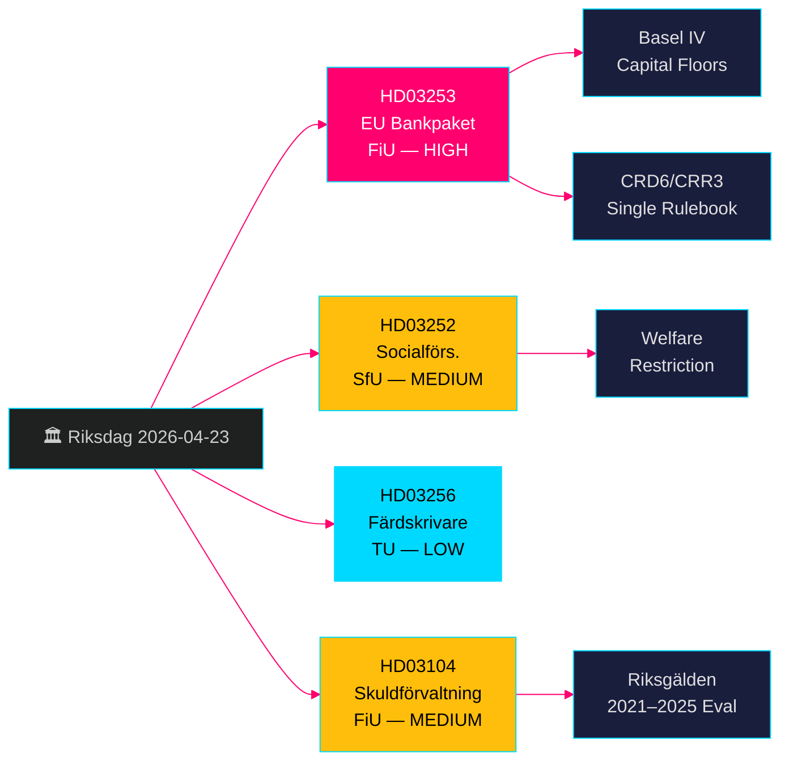

<!-- dir: rtl -->
# חבילת הבנקים האירופית + הגבלות בקצבאות הרווחה: הצעות החוק הממשלתיות השוודיות מ-23 באפריל 2026

**מחבר**: James Pether Sörling  
**תאריך**: 2026-04-26  
**מזהה ריצה**: 24963297569  
**סיווג**: UNCLASSIFIED // PUBLIC SOURCE  
**רמת אמינות**: גבוהה [B2] — ארבע הצעות/מכתבי ממשל רשמיים, riksdag-regering MCP, ממשק ה-API של Riksdagen

---

## BLUF

ממשלת קריסטרסון הגישה ארבעה פריטי חקיקה משמעותיים ב-23 באפריל 2026: יישום חבילת הבנקים האירופית (HD03253, CRD6/CRR3), המייצגת את הרגולציה המקיפה ביותר בתחום הבנקאות השוודית מאז בזל III; הגבלה על קצבאות רווחה לאסירים בדיור מפוקח (HD03252); אמצעים להרתעה מפני מניפולציה בטכוגרפים (HD03256); והערכה רשמית של ניהול החוב הממלכתי לשנים 2021–2025 (HD03104). חבילת הבנקים האירופית היא הפריט המרכזי — היא מחייבת את הבנקים השוודיים בסטנדרטים הוניים של בזל IV, מחזקת את סמכויות הפיקוח של Finansinspektionen ומיישרת את שוודיה עם ה-single rulebook של האיחוד האירופי. האופוזיציה תתמקד בנטל הציות על הבנקים הקטנים.

## החלטות שמסמך זה תומך בהן

- **Finansutskottet (FiU)**: הכנה להצבעה על HD03253 (חבילת הבנקים האירופית) ו-HD03104 (הערכת ניהול חוב) — שניהם הופנו ל-FiU.
- **Socialförsäkringsutskottet (SfU)**: הכנה להצבעה על HD03252 (קצבאות ביטוח לאומי).
- **Trafikutskottet (TU)**: הכנה להצבעה על HD03256 (טכוגרפים).
- **אסטרטגיית תקשורת ממשלתית**: ניהול הנרטיב של ציות לרגולציה האירופית לעומת הנטל על הבנקים הקטנים.
- **מיצוב לבחירות 2026**: SD/M יכולים לטעון לנוקשות בנושא הפשיעה ב-HD03252; S/MP יערערו על המידתיות.

## נקודות מודיעיניות ב-60 שניות

- 🏦 **HD03253 (חבילת הבנקים האירופית)**: יישום CRD6/CRR3 — רצפות הון בזל IV, חיזוק דרישות כשירות למנהלי בנקים, כללי סיכוני שוק חדשים. Niklas Wykman (Finansdepartementet). ועדה: FiU. השפעה: מערכתית. [B2]
- 🔒 **HD03252 (קצבאות ביטוח לאומי)**: ביטול הזכאות לדמי מחלה/תגמול פעילות/קצבת זקנה לאסירים בדיור מפוקח (*kontrollerat boende*) או במעצר ביטחוני (*säkerhetsförvaring*). Gunnar Strömmer (Justitiedepartementet). ועדה: SfU. [B2]
- 🚛 **HD03256 (טכוגרפים)**: עיצור מניפולציה בטכוגרפים דיגיטליים; הידוק עונשים. Andreas Carlson (Landsbygds- och infrastrukturdepartementet). ועדה: TU. יישום הנחיה אירופית. [A2]
- 📊 **HD03104 (מכתב ניהול חוב)**: הערכה רשמית של אסטרטגיית ההלוואות של Riksgälden לשנים 2021–2025; הממשלה מסכמת כי הפעילות נשמרה בבירור בגבולות הסמכות. Niklas Wykman (Finansdepartementet). ועדה: FiU. [A1]

## הגורם המפעיל המרכזי לעתיד

**בתוך 2–4 שבועות**: שימוע ועדת FiU על HD03253 יקבע אם לוביסטים של הבנקים הקטנים ישיגו פטור מידתיות מקל יותר. אם FiU יציע תיקונים המעכבים תתי-סעיפים של CRD6, הדבר מסמן סדק בנרטיב הציות האירופי של קואליציית הממשלה.

## תווית אמינות

**גבוהה בסך הכל** — ארבעת המסמכים הם הצעות/מכתבי ממשל רשמיים שאושרו דרך riksdag-regering MCP (`get_propositioner`, rm 2025/26). הבסיס החקיקתי האירופי של CRD6/CRR3 ניתן לאימות עצמאי. לא זוהו פערי מודיעין ב-Pass 1; פרטי היישום של HD03252 דורשים העשרה ב-Pass 2 לגבי הגדרת *kontrollerat boende*.

---

<!-- source-sha: d5f8b60b264b8ddd80e77be173232b6571d24c12 -->
