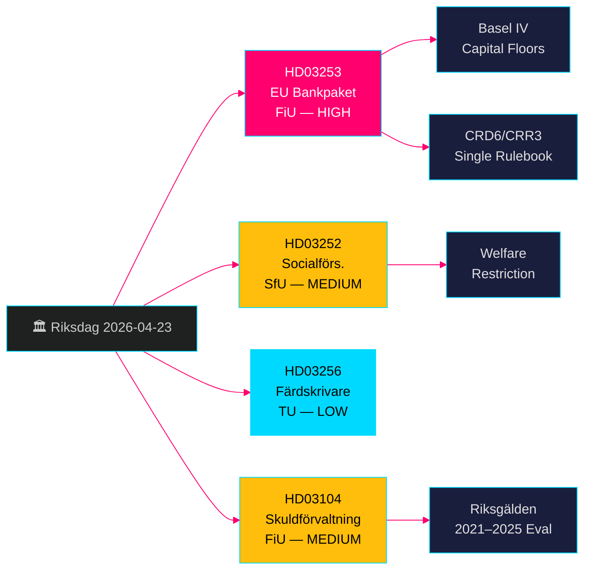

# EUバンキング・パッケージ＋社会給付制限：スウェーデン政府法案 2026年4月23日

**著者**: James Pether Sörling  
**日付**: 2026-04-26  
**実行ID**: 24963297569  
**分類**: UNCLASSIFIED // PUBLIC SOURCE  
**信頼度**: 高 [B2] — 4件の政府公式法案/スクリヴェルセ、riksdag-regering MCP、Riksdagen API

---

## BLUF

スウェーデンのクリスターソン政府は2026年4月23日、4件の重要な立法案を提出した。EU銀行パッケージ（HD03253、CRD6/CRR3）の実施はバーゼルIII以来最大規模のスウェーデン銀行規制の抜本改革を意味し、管理下住居に収容された受刑者への社会給付制限（HD03252）、デジタルタコグラフ不正防止措置（HD03256）、2021–2025年の国家債務管理の正式評価（HD03104）も盛り込まれた。EU銀行パッケージが主要項目であり、スウェーデンの銀行をバーゼルIV資本基準に拘束し、Finansinspektionenの監督権限を強化し、スウェーデンをEUシングルルールブックに合致させる。野党は中小銀行へのコンプライアンス負担に焦点を当てる見込みである。

## 本報告書が支援する意思決定

- **Finansutskottet (FiU)**: HD03253（EU銀行パッケージ）とHD03104（債務管理評価）の採決準備 — 両案ともFiUへ付託。
- **Socialförsäkringsutskottet (SfU)**: HD03252（社会保険給付）の採決準備。
- **Trafikutskottet (TU)**: HD03256（タコグラフ）の採決準備。
- **政府のコミュニケーション戦略**: EU規制統一ナラティブ対中小銀行への負担に関するメッセージ管理。
- **2026年選挙へのポジショニング**: SD/MはHD03252で犯罪への強硬姿勢を主張できる；S/MPは比例原則を争う。

## 60秒インテリジェンス・ポイント

- 🏦 **HD03253（EU銀行パッケージ）**: CRD6/CRR3実施 — バーゼルIV資本フロア、銀行幹部の適格性要件強化、新たな市場リスク規制。Niklas Wykman（Finansdepartementet）。委員会: FiU。影響: システミック。[B2]
- 🔒 **HD03252（社会保険給付）**: 管理下住居（*kontrollerat boende*）または保安拘禁（*säkerhetsförvaring*）の受刑者に対する傷病手当/活動補償/老齢年金の受給権を撤廃。Gunnar Strömmer（Justitiedepartementet）。委員会: SfU。[B2]
- 🚛 **HD03256（タコグラフ）**: デジタルタコグラフ改ざんの刑事罰化；制裁強化。Andreas Carlson（Landsbygds- och infrastrukturdepartementet）。委員会: TU。EU指令の国内法化。[A2]
- 📊 **HD03104（債務管理スクリヴェルセ）**: Riksgäldenの2021–2025年借入戦略の正式評価；政府は業務が権限範囲内に明確に収まっていたと結論付け。Niklas Wykman（Finansdepartementet）。委員会: FiU。[A1]

## 最重要の将来トリガー

**2〜4週間以内**: FiU委員会のHD03253に関する公聴会が、中小銀行ロビーが柔らかな比例原則適用除外を勝ち取るかどうかを決する。FiUがCRD6の下位条項を遅延させる修正案を提案した場合、政府連立のEUコンプライアンス・ナラティブに亀裂が生じる兆候となる。

## 信頼度ラベル

**総じて高い** — 4件の文書はすべてriksdags-regering MCP（`get_propositioner`、rm 2025/26）を通じて確認された政府公式法案/スクリヴェルセ。CRD6/CRR3のEU立法根拠は独立して検証可能。Pass 1でインテリジェンス・ギャップは確認されず；HD03252の実施詳細については*kontrollerat boende*の定義範囲に関してPass 2の充実が必要。

---

<!-- source-sha: d5f8b60b264b8ddd80e77be173232b6571d24c12 -->
