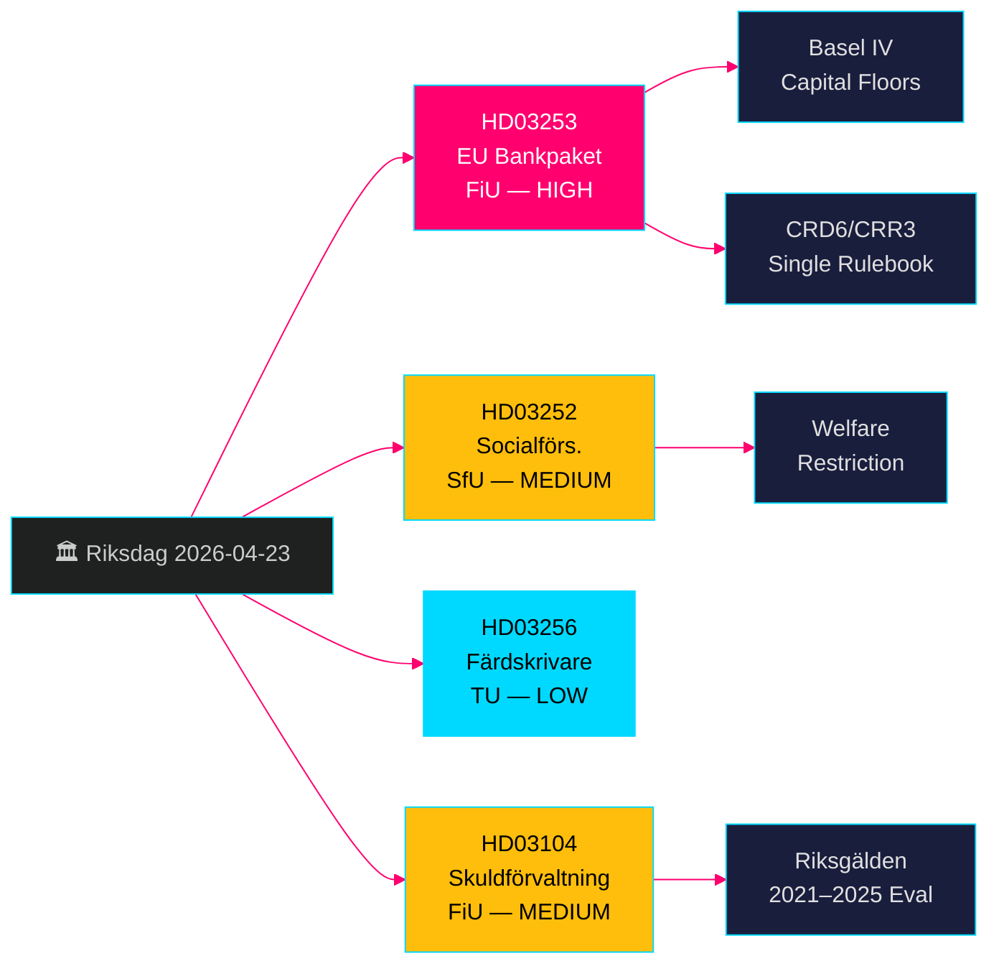

# EU 은행 패키지 + 복지 급여 제한: 스웨덴 정부 법안 2026년 4월 23일

**저자**: James Pether Sörling  
**날짜**: 2026-04-26  
**실행 ID**: 24963297569  
**분류**: UNCLASSIFIED // PUBLIC SOURCE  
**신뢰도**: 높음 [B2] — 4건의 공식 정부 법안/스크리벨세, riksdag-regering MCP, Riksdagen API

---

## BLUF

스웨덴 크리스터손 정부는 2026년 4월 23일 4건의 중요한 입법안을 제출했습니다. EU 은행 패키지 구현(HD03253, CRD6/CRR3)은 바젤 III 이후 스웨덴 은행 규제의 가장 포괄적인 개편을 의미하며, 통제 시설 수용 수감자에 대한 복지 급여 제한(HD03252), 디지털 운행 기록계 조작 방지 조치(HD03256), 2021–2025년 국가 채무 관리에 대한 공식 평가(HD03104)도 포함되었습니다. EU 은행 패키지가 핵심 항목으로, 스웨덴 은행을 바젤 IV 자본 기준에 구속하고 Finansinspektionen의 감독 권한을 강화하며 스웨덴을 EU 단일 규정집과 일치시킵니다. 야당은 중소 은행의 준수 부담에 초점을 맞출 것입니다.

## 본 보고서가 지원하는 결정 사항

- **Finansutskottet (FiU)**: HD03253 (EU 은행 패키지) 및 HD03104 (채무 관리 평가) 표결 준비 — 모두 FiU로 회부됨.
- **Socialförsäkringsutskottet (SfU)**: HD03252 (사회보험 급여) 표결 준비.
- **Trafikutskottet (TU)**: HD03256 (운행 기록계) 표결 준비.
- **정부 소통 전략**: EU 단일 규정집 준수 서사 대 중소 은행 부담 관리.
- **2026년 선거 포지셔닝**: SD/M은 HD03252에서 범죄 강경 대응을 주장할 수 있음; S/MP는 비례성을 다툴 것.

## 60초 인텔리전스 포인트

- 🏦 **HD03253 (EU 은행 패키지)**: CRD6/CRR3 이행 — 바젤 IV 자기자본 하한, 은행 임원 적합성 요건 강화, 새로운 시장 위험 규정. Niklas Wykman (Finansdepartementet). 위원회: FiU. 영향: 시스템적. [B2]
- 🔒 **HD03252 (사회보험 급여)**: 통제 시설(*kontrollerat boende*) 또는 보안 구금(*säkerhetsförvaring*) 수감자에 대한 상병급여/활동보상/노령연금 수급권 박탈. Gunnar Strömmer (Justitiedepartementet). 위원회: SfU. [B2]
- 🚛 **HD03256 (운행 기록계)**: 디지털 운행 기록계 조작 형사 처벌; 제재 강화. Andreas Carlson (Landsbygds- och infrastrukturdepartementet). 위원회: TU. EU 지침 이행. [A2]
- 📊 **HD03104 (채무 관리 스크리벨세)**: Riksgälden의 2021–2025년 차입 전략 공식 평가; 정부는 운영이 권한 범위 내에 있었음을 확인. Niklas Wykman (Finansdepartementet). 위원회: FiU. [A1]

## 주요 미래 트리거

**2–4주 이내**: FiU 위원회 청문회 결과에 따라 중소 은행 로비가 완화된 비례성 적용 예외를 얻을 수 있는지 결정됩니다. FiU가 CRD6 세부 조항을 지연시키는 수정안을 제안하면 정부 연립의 EU 준수 서사에 균열이 생길 조짐입니다.

## 신뢰도 레이블

**전반적으로 높음** — 4건의 문서 모두 riksdag-regering MCP(`get_propositioner`, rm 2025/26)를 통해 확인된 공식 정부 법안/스크리벨세입니다. CRD6/CRR3 EU 입법 근거는 독립적으로 확인 가능합니다. Pass 1에서 인텔리전스 공백 없음 확인; HD03252 이행 세부 사항은 *kontrollerat boende* 정의 범위에 대한 Pass 2 보강이 필요합니다.

---

<!-- source-sha: d5f8b60b264b8ddd80e77be173232b6571d24c12 -->
