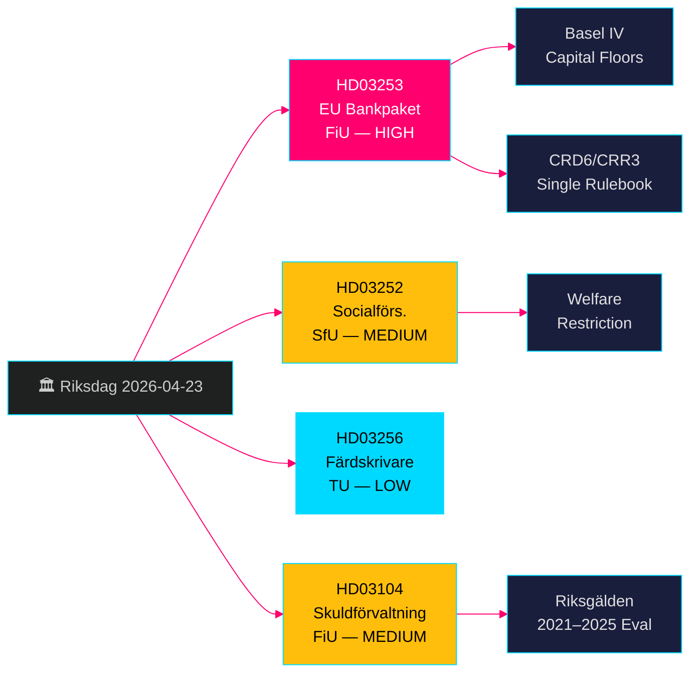

# EU-bankenpakket + Beperkingen sociale uitkeringen: Zweedse regerings­proposities 23 april 2026

**Auteur**: James Pether Sörling  
**Datum**: 2026-04-26  
**Uitvoerings-ID**: 24963297569  
**Classificatie**: UNCLASSIFIED // PUBLIC SOURCE  
**Betrouwbaarheidsniveau**: HOOG [B2] — vier officiële regerings­proposities/skrivelse, riksdag-regering MCP, Riksdagen API

---

## BLUF

De Zweedse regering-Kristersson diende op 23 april 2026 vier belangrijke wetgevings­voorstellen in: implementatie van het EU-bankenpakket (HD03253, CRD6/CRR3), de meest ingrijpende herregulering van de Zweedse bankregelgeving sinds Bazel III; een beperking van sociale uitkeringen voor gevangenen in gecontroleerde huisvesting (HD03252); maatregelen ter afschrikking van tachograaf­fraude (HD03256); en een formele evaluatie van het staatsschuld­beheer 2021–2025 (HD03104). Het EU-bankenpakket is het dominante onderdeel — het verplicht Zweedse banken tot Bazel-IV-kapitaalstandaarden, versterkt de toezicht­bevoegdheden van de Finansinspektion en brengt Zweden in lijn met het EU-single rulebook. De oppositie zal zich richten op de nalevings­last voor kleinere banken.

## Besluiten die dit overzicht ondersteunen

- **Finansutskottet (FiU)**: Stemvoorbereiding voor HD03253 (EU-bankenpakket) en HD03104 (evaluatie schuld­beheer) — beide verwezen naar FiU.
- **Socialförsäkringsutskottet (SfU)**: Stemvoorbereiding voor HD03252 (sociale verzekerings­uitkeringen).
- **Trafikutskottet (TU)**: Stemvoorbereiding voor HD03256 (tachografen).
- **Communicatie­strategie van de regering**: Beheer van het EU-single-rulebook-narratief tegenover de last voor kleinere banken.
- **Verkiezingspositionering 2026**: SD/M kunnen bij HD03252 de misdaadaanpak benadrukken; S/MP zullen de evenredigheid betwisten.

## 60-seconden inlichtingen­punten

- 🏦 **HD03253 (EU-bankenpakket)**: CRD6/CRR3-implementatie — Bazel-IV-kapitaal­vloeren, versterkte geschiktheidseisen voor bank­bestuurders, nieuwe markt­risicoregels. Niklas Wykman (Finansdepartementet). Commissie: FiU. Impact: systemisch. [B2]
- 🔒 **HD03252 (Sociale verzekerings­uitkeringen)**: Verwijdering van het recht op ziekte­uitkering/activiteits­vergoeding/ouderdoms­pensioen voor gevangenen in gecontroleerde huisvesting (*kontrollerat boende*) of beveiligings­bewaring (*säkerhetsförvaring*). Gunnar Strömmer (Justitiedepartementet). Commissie: SfU. [B2]
- 🚛 **HD03256 (Tachografen)**: Strafbaar­stelling van manipulatie van digitale tachografen; verzwaring van sancties. Andreas Carlson (Landsbygds- och infrastrukturdepartementet). Commissie: TU. Implementatie EU-richtlijn. [A2]
- 📊 **HD03104 (Schuld­beheer skrivelse)**: Formele evaluatie van de leenstrategie van Riksgälden 2021–2025; de regering concludeert dat de activiteiten duidelijk binnen het mandaat bleven. Niklas Wykman (Finansdepartementet). Commissie: FiU. [A1]

## Belangrijkste toekomstige trigger

**Binnen 2–4 weken**: De FiU-commissie­hoorzitting over HD03253 zal bepalen of lobbyisten van kleinere banken een soepelere evenredigheids­uitzondering winnen. Als FiU wijzigingen voorstelt die CRD6-deelbepalingen vertragen, signaleert dit een breuk in het EU-nalevings­narratief van de regerings­coalitie.

## Betrouwbaarheidslabel

**HOOG overall** — alle vier documenten zijn officiële regerings­proposities/skrivelse bevestigd via riksdag-regering MCP (`get_propositioner`, rm 2025/26). De CRD6/CRR3 EU-wetgevings­basis is onafhankelijk verifieerbaar. Geen inlichtingen­lacunes geïdentificeerd voor Pass 1; implementatie­details van HD03252 vereisen Pass-2-verrijking over de definitie van *kontrollerat boende*.

---

<!-- source-sha: d5f8b60b264b8ddd80e77be173232b6571d24c12 -->
