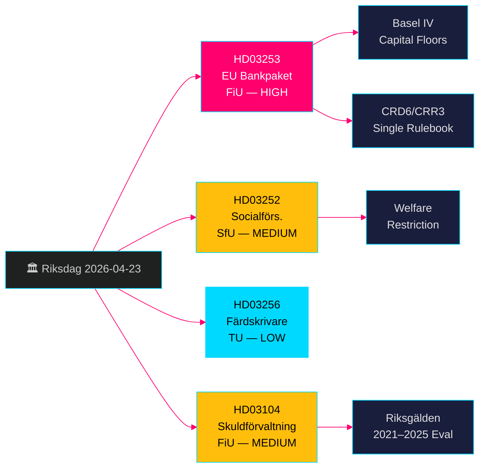

# EU-bankpakke + Velferdsbegrensninger: Svenske Regjerings Proposisjoner 23. april 2026

**Forfatter**: James Pether Sörling  
**Dato**: 2026-04-26  
**Kjørings-ID**: 24963297569  
**Klassifisering**: UNCLASSIFIED // PUBLIC SOURCE  
**Konfidensnivå**: HØY [B2] — fire offisielle regjeringsproposisjoner/skrivelse, riksdag-regering MCP, Riksdagen API

---

## BLUF

Sveriges Kristerssonregjering la frem fire viktige lovgivningssaker 23. april 2026: implementering av EUs bankpakke (HD03253, CRD6/CRR3) som representerer den mest vidtrekkende omreguleringen av svensk banklovgivning siden Basel III; en velferdsbegrensning på ytelser for innsatte i kontrollert bolig (HD03252); tiltak mot manipulering av fartsskrivere (HD03256); og en formell evaluering av statsgjeldforvaltningen 2021–2025 (HD03104). EUs bankpakke er det dominerende punktet — det binder svenske banker til Basel IV kapitalstandarder, styrker Finansinspeksjonens tilsynsmyndigheter og tilpasser Sverige til EUs felles regelverk. Opposisjonen vil fokusere på etterlevningsbyrden for mindre banker.

## Beslutninger dette underlaget støtter

- **Finansutskottet (FiU)**: Forberedelse av avstemning om HD03253 (EU bankpakke) og HD03104 (evaluering av gjeldforvaltning) — begge henvist til FiU.
- **Socialförsäkringsutskottet (SfU)**: Forberedelse av avstemning om HD03252 (trygdeytelser).
- **Trafikutskottet (TU)**: Forberedelse av avstemning om HD03256 (fartsskrivere).
- **Regjeringens kommunikasjonsstrategi**: Håndtere EUs regelverksnarrativ kontra byrden for mindre banker.
- **Valg 2026-posisjonering**: SD/M kan hevde kriminalitetshardhet ved HD03252; S/MP vil bestride proporsjonaliteten.

## 60-sekunders etterretningspunkter

- 🏦 **HD03253 (EU bankpakke)**: CRD6/CRR3-implementering — Basel IV kapitaltak, styrket skikkethetskontroll for bankdirektører, nye markedsrisikregler. Niklas Wykman (Finansdepartementet). Utvalg: FiU. Konsekvens: systemisk. [B2]
- 🔒 **HD03252 (Trygdeytelser)**: Fjerner retten til sykepenger/aktivitetserstatning/alderspensjon for innsatte i kontrollert bolig (*kontrollerat boende*) eller sikkerhetsforvaring (*säkerhetsförvaring*). Gunnar Strömmer (Justitiedepartementet). Utvalg: SfU. [B2]
- 🚛 **HD03256 (Fartsskrivere)**: Kriminaliserer manipulering av digitale fartsskrivere; styrker sanksjoner. Andreas Carlson (Landsbygds- och infrastrukturdepartementet). Utvalg: TU. EU-direktiv-implementering. [A2]
- 📊 **HD03104 (Gjeldforvaltning skrivelse)**: Formell evaluering av Riksgäldens lånestrategi 2021–2025; regjeringen konkluderer med at driften lå klart innenfor mandatets rammer. Niklas Wykman (Finansdepartementet). Utvalg: FiU. [A1]

## Viktigste fremtidige trigger

**Innen 2–4 uker**: FiUs utvalgsforhør om HD03253 avgjør om lobbyister for mindre banker oppnår et mykere proporsjonalitetsunntak. Dersom FiU foreslår endringer som forsinker CRD6-delbestemmelser, signalerer dette sprekk i regjeringskoalisjonens EU-etterlevelsesnarrativ.

## Konfidensetikett

**HØY totalt sett** — alle fire dokumenter er offisielle regjeringsproposisjoner/skrivelse bekreftet via riksdag-regering MCP (`get_propositioner`, rm 2025/26). CRD6/CRR3 EU-lovgivningsgrunnlag kan bekreftes uavhengig. Ingen etterretningsgap identifisert for Pass 1; implementeringsdetaljer for HD03252 krever Pass 2-berikelse om definisjonen av *kontrollerat boende*.

---

<!-- source-sha: d5f8b60b264b8ddd80e77be173232b6571d24c12 -->
