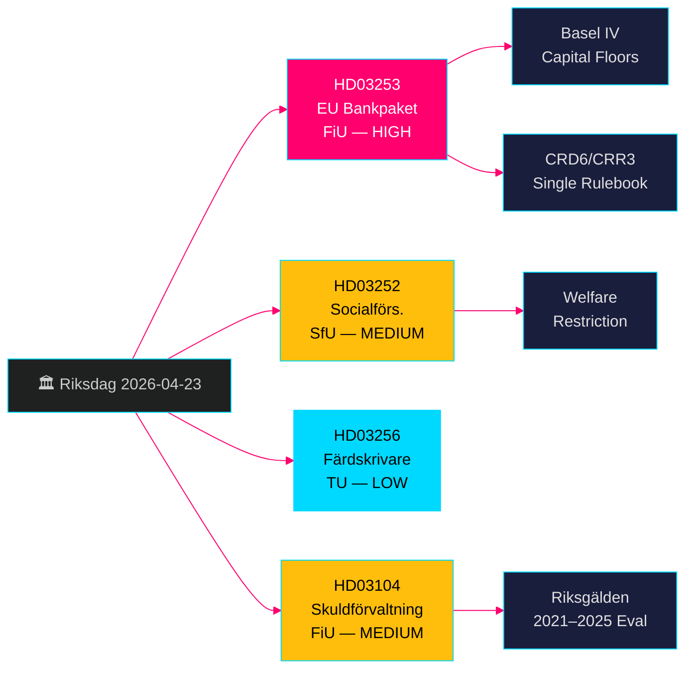

# EU-bankpaket + Välfärdsbegränsningar: Svenska Regeringens Propositioner 23 April 2026

**Författare**: James Pether Sörling  
**Datum**: 2026-04-26  
**Körning ID**: 24963297569  
**Klassificering**: UNCLASSIFIED // PUBLIC SOURCE  
**Konfidensgrad**: HÖG [B2] — fyra officiella regeringspropositioner/skrivelse, riksdag-regering MCP, Riksdagen API

---

## BLUF

Sveriges Kristerssonregering lade fram fyra viktiga lagstiftningsärenden den 23 april 2026: implementering av EU:s bankpaket (HD03253, CRD6/CRR3) som representerar den mest genomgripande omregleringen av svensk banklagstiftning sedan Basel III; en välfärdsbegränsning av förmåner för intagna i kontrollerat boende (HD03252); åtgärder mot färdskrivarbedrägeri (HD03256); och en formell utvärdering av statsskuldsförvaltningen 2021–2025 (HD03104). EU:s bankpaket är det dominerande ärendet — det binder svenska banker till Basel IV kapitalstandarder, stärker Finansinspektionens tillsynsbefogenheter och anpassar Sverige till EU:s gemensamma regelverk. Oppositionen kommer att fokusera på efterlevnadsbördan för mindre banker.

## Beslut som detta underlag stöder

- **Finansutskottet (FiU)**: Röstförberedelse för HD03253 (EU bankpaket) och HD03104 (skuld­förvaltningsutvärdering) — båda remitterade till FiU.
- **Socialförsäkringsutskottet (SfU)**: Röstförberedelse för HD03252 (socialförsäkringsförmåner).
- **Trafikutskottet (TU)**: Röstförberedelse för HD03256 (färdskrivare).
- **Regeringens kommunikationsstrategi**: Hantera EU:s regelverksnarrativ kontra bördan för mindre banker.
- **Val 2026-positionering**: SD/M kan hävda kriminalhärdning vid HD03252; S/MP kommer att bestrida proportionaliteten.

## 60-sekunders underrättelsepunkter

- 🏦 **HD03253 (EU bankpaket)**: CRD6/CRR3-implementering — Basel IV kapitaltak, förstärkta lämplighetskrav för bankdirektörer, nya marknadsriskbestämmelser. Niklas Wykman (Finansdepartementet). Utskott: FiU. Konsekvens: systemisk. [B2]
- 🔒 **HD03252 (Socialförsäkringsförmåner)**: Upphäver rätten till sjukpenning/aktivitetsersättning/ålderspension för intagna i kontrollerat boende (*kontrollerat boende*) eller säkerhetsförvaring (*säkerhetsförvaring*). Gunnar Strömmer (Justitiedepartementet). Utskott: SfU. [B2]
- 🚛 **HD03256 (Färdskrivare)**: Kriminaliserar manipulation av digitala färdskrivare; skärper sanktioner. Andreas Carlson (Landsbygds- och infrastrukturdepartementet). Utskott: TU. EU-direktivimplementering. [A2]
- 📊 **HD03104 (Skuldförvaltning skrivelse)**: Formell utvärdering av Riksgäldens lånestrategi 2021–2025; regeringen konstaterar att verksamheten välhölls inom mandatets ramar. Niklas Wykman (Finansdepartementet). Utskott: FiU. [A1]

## Viktigaste framtida trigger

**Inom 2–4 veckor**: FiU:s utskottsutfrågning om HD03253 avgör om lobbyister för mindre banker lyckas få igenom ett mjukare proportionalitetsundantag. Om FiU föreslår ändringar som fördröjer CRD6-delparagrafer signalerar det en spricka i regeringskoalitionens EU-efterlevnadsnarrativ.

## Konfidensetikett

**HÖG totalt sett** — alla fyra dokument är officiella regeringspropositioner/skrivelse bekräftade via riksdag-regering MCP (`get_propositioner`, rm 2025/26). CRD6/CRR3 EU-lagstiftningsbas kan bekräftas oberoende. Inga underrättelseluckor identifierade för Pass 1; HD03252-implementeringsdetaljer kräver Pass 2-berikning kring definitionen av *kontrollerat boende*.

---

<!-- source-sha: d5f8b60b264b8ddd80e77be173232b6571d24c12 -->
