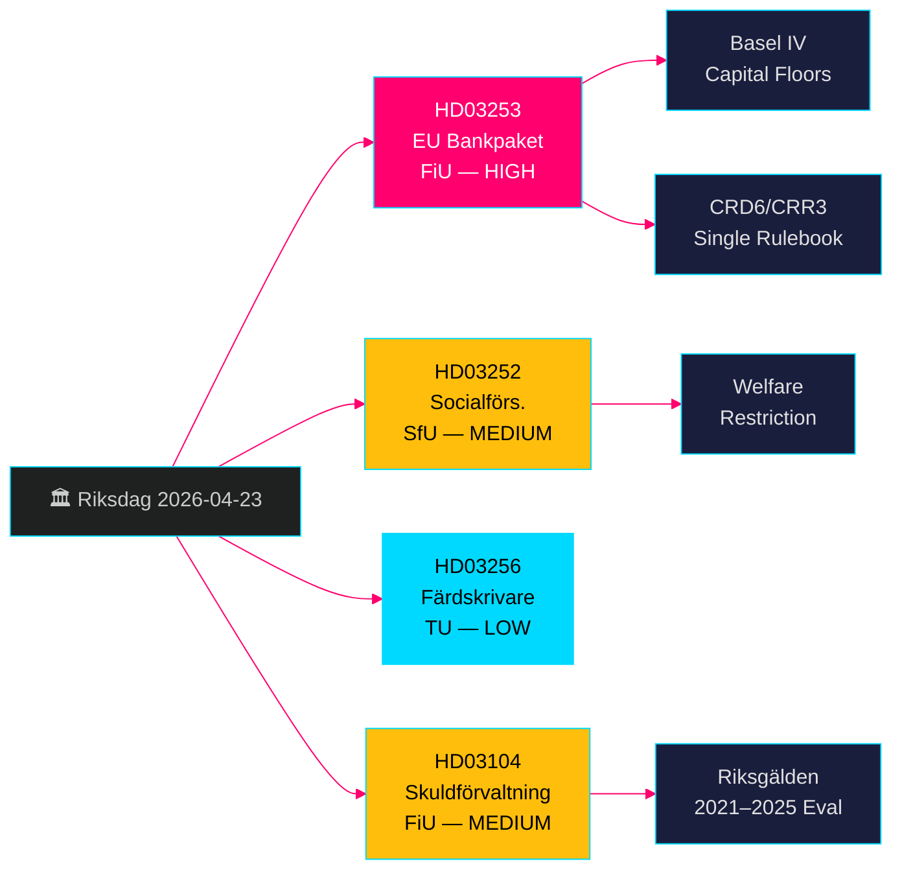

# 欧盟银行一揽子方案 + 福利限制：瑞典政府法案 2026年4月23日

**作者**：James Pether Sörling  
**日期**：2026-04-26  
**运行编号**：24963297569  
**分类**：UNCLASSIFIED // PUBLIC SOURCE  
**置信度**：高 [B2] — 四项官方政府提案/skrivelse，riksdag-regering MCP，Riksdagen API

---

## BLUF

瑞典克里斯特松政府于2026年4月23日提交了四项重要立法事项：落实欧盟银行一揽子方案（HD03253，CRD6/CRR3），这是自巴塞尔III以来对瑞典银行监管最全面的修订；限制受控住宿囚犯的福利待遇（HD03252）；防止数字行驶记录仪舞弊的威慑措施（HD03256）；以及对2021–2025年国家债务管理的正式评估（HD03104）。欧盟银行一揽子方案是核心内容——它将瑞典银行纳入巴塞尔IV资本标准，强化Finansinspektionen的监管权力，并使瑞典与欧盟单一规则手册保持一致。反对党将聚焦于中小银行的合规负担。

## 本报告支持的决策

- **Finansutskottet (FiU)**：HD03253（欧盟银行方案）和HD03104（债务管理评估）的投票准备——两者均提交FiU审议。
- **Socialförsäkringsutskottet (SfU)**：HD03252（社会保险福利）的投票准备。
- **Trafikutskottet (TU)**：HD03256（行驶记录仪）的投票准备。
- **政府传播战略**：管理欧盟单一规则手册合规叙事与中小银行负担之间的张力。
- **2026年选举定位**：SD/M可在HD03252上宣扬打击犯罪的强硬立场；S/MP将对比例原则提出异议。

## 60秒情报要点

- 🏦 **HD03253（欧盟银行方案）**：CRD6/CRR3落实——巴塞尔IV资本底线、强化银行高管适任要求、新市场风险规则。Niklas Wykman（Finansdepartementet）。委员会：FiU。影响：系统性。[B2]
- 🔒 **HD03252（社会保险福利）**：取消受控住宿（*kontrollerat boende*）或安全羁押（*säkerhetsförvaring*）囚犯领取病假津贴/活动补偿/退休金的权利。Gunnar Strömmer（Justitiedepartementet）。委员会：SfU。[B2]
- 🚛 **HD03256（行驶记录仪）**：将篡改数字行驶记录仪入罪；加重制裁。Andreas Carlson（Landsbygds- och infrastrukturdepartementet）。委员会：TU。欧盟指令转化。[A2]
- 📊 **HD03104（债务管理skrivelse）**：对Riksgälden 2021–2025年借贷战略的正式评估；政府认定运营明确在授权范围内。Niklas Wykman（Finansdepartementet）。委员会：FiU。[A1]

## 最重要的前瞻性触发因素

**2–4周内**：FiU委员会关于HD03253的听证将决定中小银行游说是否赢得更宽松的比例原则豁免。若FiU提议推迟CRD6部分条款，则预示执政联盟欧盟合规叙事出现裂痕。

## 置信度标签

**总体高置信度** — 四份文件均为官方政府提案/skrivelse，已通过riksdag-regering MCP（`get_propositioner`，rm 2025/26）确认。CRD6/CRR3欧盟立法依据可独立核实。Pass 1未发现情报缺口；HD03252实施细节需Pass 2进一步补充*kontrollerat boende*定义范围。

---

<!-- source-sha: d5f8b60b264b8ddd80e77be173232b6571d24c12 -->
