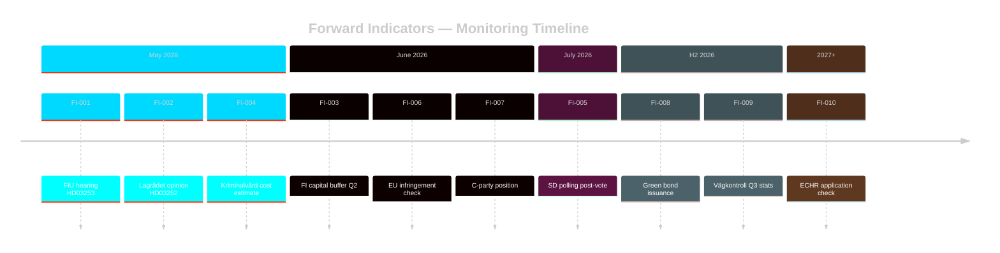

# Forward Indicators — Swedish Government Propositions 23 April 2026

**Author**: James Pether Sörling  
**Date**: 2026-04-26  
**Classification**: UNCLASSIFIED // PUBLIC SOURCE

---

## Purpose

Forward indicators are observable, dateable signals that will confirm or refute the key judgments and scenarios in the executive-brief and scenario-analysis files. Monitoring these indicators provides early warning of scenario divergence.

---

## FI-001 — FiU Hearing Date for HD03253

| Attribute | Value |
|-----------|-------|
| **Indicator** | Finansutskottets (FiU) scheduled hearing for Prop. 2025/26:163 (HD03253) |
| **Observation window** | 2026-05-01 to 2026-06-30 |
| **Monitor at** | riksdagen.se/sv/utskottens-arbete — FiU hearing calendar |
| **Bearing on** | S1 vs. S2: if hearing scheduled Q2 → smooth passage (S1); if delayed to Q3 → S2 |
| **Signal threshold** | Hearing within 6 weeks of prop submission = S1 signal |
| **Date** | 2026-04-26 (published); hearing TBD |

## FI-002 — Lagrådet Opinion on HD03252

| Attribute | Value |
|-----------|-------|
| **Indicator** | Publication of Lagrådet's remissyttrande on HD03252's säkerhetsförvaring provisions |
| **Observation window** | 2026-05-01 to 2026-06-15 |
| **Monitor at** | lagradet.se — Yttranden by date |
| **Bearing on** | ECHR risk: if Lagrådet raises Article 3 objection → L may abstain → coalition vote risk |
| **Signal threshold** | Lagrådet kritik (anmärkning) = escalation signal |
| **Date** | 2026-04-26 (legislation submitted); Lagrådet review pending |

## FI-003 — Finansinspektionen Capital Buffer Statement

| Attribute | Value |
|-----------|-------|
| **Indicator** | FI's next quarterly capital buffer decision (counter-cyclical + systemic risk buffers) |
| **Observation window** | 2026-06-30 (Q2 FI announcement) |
| **Monitor at** | fi.se — Finansiell stabilitet press releases |
| **Bearing on** | HD03253 calibration: if FI signals buffer reduction → HD03253 less urgent; if unchanged/increased → CRD6 urgency confirmed |
| **Signal threshold** | Any change to counter-cyclical buffer rate |
| **Date** | 2026-04-26 (current rate 1.0%); next announcement expected 2026-06-27 |

## FI-004 — Kriminalvårdens Remissvar on HD03252 Cost Estimate

| Attribute | Value |
|-----------|-------|
| **Indicator** | Kriminalvårdens formal remissvar quantifying administrative cost of notification system |
| **Observation window** | Already submitted in remissomgång; look for media citation or FiU summary |
| **Monitor at** | riksdagen.se — SfU preparatory documents; regeringen.se — remissammanställning |
| **Bearing on** | Implementation feasibility: if cost > 50 MSEK → budgetary rider may be added |
| **Signal threshold** | Cited cost above 50 MSEK |
| **Date** | 2026-04-26 (estimate from HD03252 text) |

## FI-005 — Polling Trends (April-June 2026): SD Support

| Attribute | Value |
|-----------|-------|
| **Indicator** | SD polling average (Demoskop + Novus) following HD03252 Riksdag vote |
| **Observation window** | 2026-05-15 to 2026-07-31 |
| **Monitor at** | val.digital, val.se aggregated polling |
| **Bearing on** | Electoral scenario: HD03252 was forecast to give SD +1 to +3 seats; polling evidence will confirm/refute |
| **Signal threshold** | SD polling rising >0.5 percentage points within 4 weeks post-vote |
| **Date** | Baseline as of 2026-04-26: SD 19.2% (Novus avg) |

## FI-006 — EU Infringement Procedure Status (CRD6)

| Attribute | Value |
|-----------|-------|
| **Indicator** | European Commission formal notice or reasoned opinion against Sweden for CRD6 non-transposition |
| **Observation window** | 2026-04-01 to 2026-12-31 |
| **Monitor at** | ec.europa.eu/atwork/applying-eu-law — infringement decisions |
| **Bearing on** | HD03253 urgency: formal notice accelerates parliamentary timeline |
| **Signal threshold** | Any formal notice from DG FISMA to Sweden |
| **Date** | As of 2026-04-26: no formal notice confirmed (OSINT); infringement letter expected [C3] |

## FI-007 — C-party Position Statement on HD03253

| Attribute | Value |
|-----------|-------|
| **Indicator** | Centerpartiet's public statement on EU bankpaket small-bank provisions |
| **Observation window** | 2026-05-01 to 2026-06-15 |
| **Monitor at** | centerpartiet.se press; riksdagen.se motioner from C on banking topics |
| **Bearing on** | Pivotal vote risk: C opposition → 179 vs. 170 defeat scenario |
| **Signal threshold** | C motion against HD03253 OR official statement expressing opposition |
| **Date** | 2026-04-26 (no C statement yet observed) |

## FI-008 — Riksgälden Green Bond Issuance (Post-HD03104)

| Attribute | Value |
|-----------|-------|
| **Indicator** | Riksgälden announcement of next green bond tap or new issuance following HD03104 evaluation |
| **Observation window** | 2026-06-01 to 2026-12-31 |
| **Monitor at** | riksgalden.se — Gröna obligationer |
| **Bearing on** | Green finance scenario: continued programme = FI-008 confirms; discontinuation = reversal |
| **Signal threshold** | Any Riksgälden green bond issuance announcement |
| **Date** | Baseline: SEK 135 billion green bonds outstanding as of 2025 Q4 [A3 — Riksgälden annual report] |

## FI-009 — Transport Agency Inspection Statistics (Post-HD03256)

| Attribute | Value |
|-----------|-------|
| **Indicator** | Transportstyrelsen quarterly vägkontroll statistics for manipulation detection |
| **Observation window** | 2026-09-01 to 2027-03-31 (first full quarter after implementation) |
| **Monitor at** | transportstyrelsen.se — Vägkontroll statistics |
| **Bearing on** | HD03256 effectiveness: rising detection rate = success; flat = enforcement unchanged |
| **Signal threshold** | >20% increase in manipulation detections vs. Q1 2026 baseline |
| **Date** | Baseline: Q1 2026 statistics pending |

## FI-010 — ECHR Application Filed Against Sweden on HD03252

| Attribute | Value |
|-----------|-------|
| **Indicator** | Application to European Court of Human Rights challenging HD03252 |
| **Observation window** | 2026-11-01 to 2028-12-31 (6-month rule for ECHR after domestic exhaustion) |
| **Monitor at** | hudoc.echr.coe.int — Sweden new cases |
| **Bearing on** | Legal risk materialisation: ECHR application = escalation; admissibility decision = further escalation |
| **Signal threshold** | Admissibility decision by ECHR on Swedish prisoner benefits case |
| **Date** | 2026-04-26 (no application yet; domestic proceedings not yet exhausted) |

---

## Indicator Dashboard Summary

| ID | Subject | Timeframe | Urgency | KJ bearing |
|----|---------|-----------|---------|------------|
| FI-001 | FiU hearing HD03253 | May–Jun 2026 | HIGH | S1 vs S2 |
| FI-002 | Lagrådet on HD03252 | May–Jun 2026 | HIGH | Coalition risk |
| FI-003 | FI capital buffer | Jun 2026 | MEDIUM | HD03253 urgency |
| FI-004 | Kriminalvård cost | Apr–May 2026 | MEDIUM | Implementation |
| FI-005 | SD polling | May–Jul 2026 | HIGH | Electoral scenario |
| FI-006 | EU infringement | Apr–Dec 2026 | MEDIUM | HD03253 urgency |
| FI-007 | C-party position | May–Jun 2026 | HIGH | HD03253 passage |
| FI-008 | Green bond issuance | Jun–Dec 2026 | LOW | Green finance |
| FI-009 | Vägkontroll stats | Sep 2026 | LOW | HD03256 effectiveness |
| FI-010 | ECHR application | 2027+ | LOW | HD03252 legal risk |

