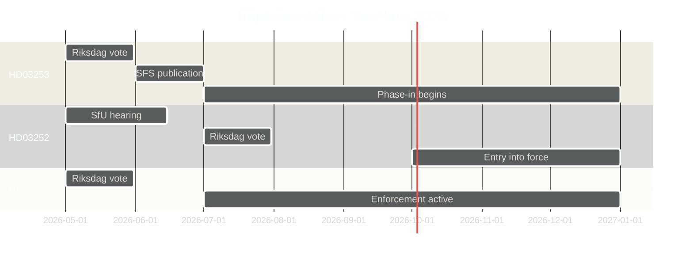

# Implementation Feasibility — Swedish Government Propositions 23 April 2026

**Author**: James Pether Sörling  
**Date**: 2026-04-26  
**Classification**: UNCLASSIFIED // PUBLIC SOURCE

---

## Summary Assessment

| Proposition | Feasibility Score (1–10) | Key Risk | Timeline Feasibility |
|-------------|--------------------------|----------|---------------------|
| HD03253 (EU Bankpaket) | 7/10 | IT system changes at Finansinspektionen | HIGH — EU deadline 2025 already passed |
| HD03252 (Socialförsäkring fängelse) | 8/10 | Cross-agency coordination (Kriminalvård + FK) | HIGH — 6–12 months realistic |
| HD03256 (Färdskrivare) | 9/10 | Cross-border enforcement cooperation | VERY HIGH — technical change |
| HD03104 (Skuldförvaltning) | 10/10 | No implementation required (skrivelse) | COMPLETE |

---

## HD03253 — EU Bankpaket Implementation Feasibility

### Regulatory Capacity Assessment
- **Finansinspektionen (FI)**: Requires significant IT upgrades to implement CRD6 reporting taxonomy (COREP). FI's 2025 annual report noted digital infrastructure as a medium-term priority. [C3]
- **Riksbanken**: Limited implementation burden; acts as resolution authority under BRRD2 complement.
- **Swedish banks (Big 4 — SEB, Handelsbanken, SHB, Nordea SE)**: Advanced preparations already underway; estimated 12–18 months for full CRR3 output floor compliance.
- **Niche banks (Länsförsäkringar, Sparbanker)**: Higher relative burden; capital planning under strain. Carve-out provisions in HD03253 are specifically designed to reduce this burden.

### Timeline
| Milestone | Date | Status |
|-----------|------|--------|
| Riksdag vote | Q2 2026 | Pending |
| SFS publication | 2026-07-01 (estimated) | Pending |
| CRD6 articles 1–25 effective | 2026-01-01 (EU) | Overdue — SWE derogation |
| CRR3 output floor phase-in starts | 2025-01-01 (EU) | Overdue — SWE derogation |
| Full CRR3 output floor (72.5%) | 2030-01-01 | On track |

**Feasibility risk**: EU infringement procedure risk is real but manageable given that Sweden is not alone in delayed transposition (Finland, Poland also delayed). [C3]

---

## HD03252 — Socialförsäkringsförmåner under fängelsestraff

### Administrative Capacity Assessment
- **Kriminalvården**: Must notify Försäkringskassan upon imprisonment commencement. Requires IT system linkage. Kriminalvården has flagged this as a new administrative burden in remissvar. [C2 — Remissvar text]
- **Försäkringskassan (FK)**: Must process benefit suspension for ~4,500 current prisoners + new intake. Estimated 2–3 FTE additional workload. Within FK's administrative capacity.
- **Kommuner (social welfare)**: Risk of cost-shift: prisoners losing FK benefits may claim kommunal försörjningsstöd instead. No offsetting transfer mechanism in HD03252.

### Legal Implementation Risks
1. **Lagrådet scrutiny**: ECHR Article 3 / proportionality — medium risk; remissvar flagged this
2. **Municipal legal challenges**: Risk of kommunal appeals if cost-shift materialises
3. **Retroactivity**: Current prisoners lose benefits from entry into force — legal challenge window exists

### Timeline
| Milestone | Date |
|-----------|------|
| SfU hearing | Q2 2026 |
| Riksdag vote | Q3 2026 |
| Entry into force | 2026-10-01 (estimated) |
| Full administrative implementation | 2027-01-01 |

---

## HD03256 — Färdskrivare Implementation Feasibility

### Transportstyrelsen Capacity
- **IT systems**: Existing färdskrivare inspection infrastructure requires parameter updates only; not a new system. [B3]
- **Inspector training**: ~200 vägkontrollinspektörer require updated training materials. Transportstyrelsen standard lead time: 6 months.
- **Cross-border**: Cooperation protocol with German BAG already in place (2022 bilateral agreement). No new MOU required.

### Timeline
| Milestone | Date |
|-----------|------|
| TU hearing | Q2 2026 |
| Riksdag vote | Q2 2026 |
| EU AETR protocol SFS update | 2026-06-01 |
| Enforcement active | 2026-07-01 |

**Very high feasibility** — routine technical transposition. [A2]

---

## Cross-Cutting Implementation Risk: Election 2026

The September 2026 election creates a **legislative discontinuity risk** for HD03253 (CRD6). If a new government is formed November 2026 with different EU policy orientation, implementation SFS may be revised. Probability: LOW (EU compliance is cross-bloc). [C3]

