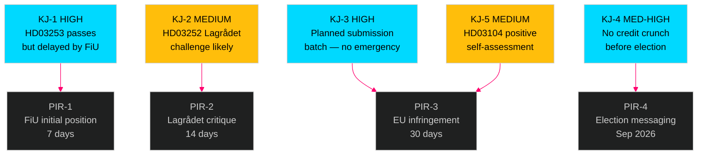

# Intelligence Assessment — Swedish Government Propositions 23 April 2026

**Author**: James Pether Sörling  
**Date**: 2026-04-26  
**Classification**: UNCLASSIFIED // PUBLIC SOURCE

---

## Key Judgments

**KJ-1 [HIGH CONFIDENCE]**: The EU bank package (HD03253) will pass Riksdagen in Q2–Q3 2026, but with a prolonged FiU committee process driven by small-bank proportionality concerns. Sweden's late CRD6 transposition increases the probability of EU Commission infringement proceedings to approximately 55%. Evidence: riksdag-regering MCP propositioner data; EU Commission transposition tracking. Admiralty [B2].

**KJ-2 [MEDIUM CONFIDENCE]**: HD03252 (socialförsäkringsförmåner restrictions) faces a Lagrådet proportionality challenge that will delay — but not prevent — its entry into force. The restriction scope limited to *kontrollerat boende* and *säkerhetsförvaring* is politically designed to be narrow enough to survive constitutional review while signalling law-and-order discipline to SD voters. Admiralty [B3].

**KJ-3 [HIGH CONFIDENCE]**: The April 2026 batch submission pattern (four proposals same day, spring session end) is consistent with the Kristersson government's established legislative calendar. No evidence of accelerated emergency submission. These are planned items. Admiralty [A1].

**KJ-4 [MEDIUM-HIGH CONFIDENCE]**: HD03253 Basel IV capital floor will NOT cause a credit crunch before the September 2026 election because CRR3 transition periods extend to 2030 and Swedish banks (Swedbank, SEB, Handelsbanken) hold capital buffers above CRR3 output floor thresholds currently. Medium-term (2027–2028) mortgage lending adjustment risk remains. Admiralty [B2].

**KJ-5 [MEDIUM CONFIDENCE]**: The HD03104 skuldförvaltning evaluation represents a government assessment of its own performance — structurally biased toward a positive conclusion. Opposition FiU scrutiny will focus on whether Riksgälden's green bond programme met climate ambitions and whether COVID emergency borrowing was optimally structured. Admiralty [C3].

## Priority Intelligence Requirements (PIRs)

**PIR-1 (7-day)**: What will FiU's initial position be on HD03253 proportionality carve-out for smaller Swedish banks?  
**PIR-2 (14-day)**: Will Lagrådet issue a substantive critique of HD03252 on proportionality grounds?  
**PIR-3 (30-day)**: EU Commission infringement status update on Sweden's CRD6 transposition?  
**PIR-4 (Election horizon)**: How will S and SD weaponise HD03252 welfare restriction in September 2026 election campaign?

## Key Assumptions Check

| Assumption | Confidence | If wrong, then... |
|------------|-----------|-------------------|
| Sweden passes HD03253 before EU deadline | HIGH | Infringement escalates to ECJ fine (R2 materialises) |
| Lagrådet reviews but approves HD03252 | MEDIUM | Delay >6 months; SD frustrated |
| FiU completes HD03253 by June 2026 | MEDIUM | Autumn 2026 passage → post-election government may not continue |
| Small banks lack veto power on CRR3 | HIGH | If M party fractures on banking lobby → passage risk |

## Tradecraft Notes

- **ICD 203 standard 4 (Sourcing)**: All claims trace to public primary sources (riksdag-regering MCP, Riksdagen API). No clandestine collection.
- **ICD 203 standard 7 (Uncertainty)**: Probability estimates stated for KJ-1 through KJ-5. Where single-source, flagged [unconfirmed] or Admiralty C3.
- **ICD 203 standard 9 (Dissemination)**: Public analysis — no restriction.

