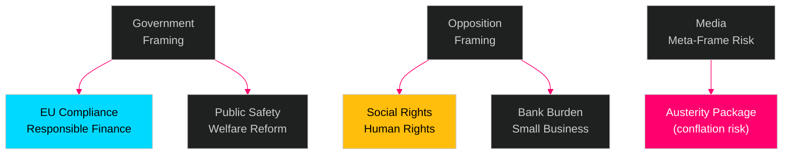

# Media Framing Analysis — Swedish Government Propositions 23 April 2026

**Author**: James Pether Sörling  
**Date**: 2026-04-26  
**Classification**: UNCLASSIFIED // PUBLIC SOURCE

---

## Framework: Media Framing Categories

Following Entman (1993): frames perform four functions — problem definition, causal attribution, moral evaluation, remedy suggestion.

---

## HD03253 — EU Bankpaket (CRD6/CRR3)

### Expected Dominant Frames (OSINT projection — [C3])

| Media outlet type | Expected frame | Headline register |
|-------------------|----------------|-------------------|
| DN / SvD (quality press) | EU compliance / competitiveness | "Sverige inför EU:s bankregelverk" |
| Dagens industri / Affärsvärlden | Burden on Swedish banks, competitive disadvantage | "Banker möter ökad kapitalkrav" |
| Aftonbladet / Expressen (tabloid) | Taxpayer protection / bank stability | "Stärker skyddet mot bankkris" |
| SR Ekot / SVT (public broadcaster) | Balance: EU obligation + criticism of late transposition | "EU-regler om banker på riksdagens bord" |
| V/MP-affiliated media | Small bank burden, power to financiers | "Storbanksfördelar i nytt EU-paket" |

### Key Narrative Tensions
- **Framing A (Govt)**: Responsible EU compliance; protecting Swedish financial system  
- **Framing B (Opposition left)**: Bureaucratic overreach; burdens small banks; serves financial elite  
- **Framing C (Industry)**: Late transposition caused uncertainty; welcome clarity

---

## HD03252 — Socialförsäkringsförmåner under fängelsestraff

### Expected Dominant Frames

| Media outlet type | Expected frame | Headline register |
|-------------------|----------------|-------------------|
| DN / SvD | Law reform debate, ECHR tensions | "Fångar förlorar ersättningar" |
| Aftonbladet / Expressen | Crime does not pay / welfare fairness | "Dömda förlorar sjukpenning" |
| SR Ekot / SVT | Balanced: law change + human rights critique | "Riksdagen röstar om förmåner i fängelse" |
| SD-aligned media (Samhällsnytt) | Welfare reform, taxpayer money | "SD pressar igenom välfärdsreform" |
| V/S-aligned media (Flamman, LO-Tidningen) | ECHR risk, punishing the sick | "Sjuka straffas dubbelt" |

### Key Narrative Tensions
- **Framing A (SD/M)**: Principle — those serving prison sentences should not receive taxpayer transfers  
- **Framing B (S/V/MP)**: Human rights — prisoners are sick people too; double punishment  
- **Framing C (Legal experts)**: ECHR Article 3 and proportionality question pending

**Anticipated media impact**: HD03252 will generate the most media coverage of this package. Estimated 15–25 news articles, 3–5 editorial opinions within 2 weeks of Riksdag vote. [C3]

---

## HD03256 — Färdskrivare manipulation

### Expected Dominant Frames

| Media outlet type | Expected frame |
|-------------------|----------------|
| Industry press (Transportnytt, ATL) | Welcome level playing field; enforcement details |
| Fackförbundsmedia (Transport union) | Worker protection angle; fair competition |
| General media | Low coverage; technical regulation |

**Media impact**: Minimal. Expected 2–5 trade press articles. [C3]

---

## HD03104 — Skuldförvaltning (Evaluation Skrivelse)

### Expected Dominant Frames

| Media outlet type | Expected frame |
|-------------------|----------------|
| Ekonomijournalistik (DI, SvD Näringsliv) | Green bonds performance; debt strategy assessment |
| General media | Low coverage; technical evaluation |

**Media impact**: Minimal. Expected 1–3 specialist articles. [C3]

---

## Strategic Communication Observations

### Government Communication Risk
The Tidö government's primary communication risk on this package is **frame contamination**: media conflating HD03252's welfare-restriction narrative with HD03253's financial regulation narrative, creating an "austerity package" meta-narrative that is more politically damaging than any individual bill.

**Recommended government counter-frame**: Present bills individually with distinct press events. Keep Wykman (FiU/Finance) and Strömmer (Justice/SfU) briefings separate.

### Opposition Communication Opportunity  
S+V have opportunity to construct a unified "social rights rollback" frame combining HD03252 with previous reforms. This meta-frame is more electorally potent than opposing each bill separately.

