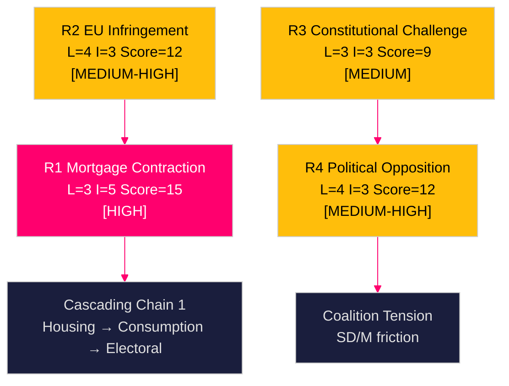

# Risk Assessment — Swedish Government Propositions 23 April 2026

**Author**: James Pether Sörling  
**Date**: 2026-04-26  
**Classification**: UNCLASSIFIED // PUBLIC SOURCE

---

## 5-Dimension Risk Register

| Risk ID | Risk | Dimension | Likelihood (1-5) | Impact (1-5) | L×I Score | Mitigation |
|---------|------|-----------|-----------------|--------------|-----------|------------|
| R1 | CRR3 output floor triggers Swedish bank mortgage lending contraction in election year | Financial stability | 3 | 5 | **15** | FI supervisory guidance; CRR3 transition periods to 2030 |
| R2 | Sweden faces EU infringement proceedings for late CRD6 transposition | Legal/Diplomatic | 4 | 3 | **12** | Fast-track Riksdag processing of HD03253 |
| R3 | HD03252 constitutional proportionality challenge delays welfare restriction entry into force | Legal | 3 | 3 | **9** | Lagrådet review (pre-submission); proportionality analysis in prop. |
| R4 | Opposition weaponises welfare restriction (HD03252) as election-year poverty narrative | Political | 4 | 3 | **12** | Government messaging on crime/benefit asymmetry |
| R5 | Riksgälden evaluation (HD03104) reveals underperformance vs. mandate targets | Reputational/Fiscal | 2 | 4 | **8** | Skrivelse structure limits formal accountability |
| R6 | Tachograph enforcement creates trucking industry compliance cost burden | Economic/Industry | 2 | 2 | **4** | EU transition guidance; digital tachograph subsidy |

## Cascading Risk Chains

**Chain 1 (Banking Systemic)**:
CRR3 capital floor (HD03253) → Mortgage credit tightening → Housing price correction → Household balance-sheet stress → Consumption decline → Electoral backlash against M-led government

**Chain 2 (Legal/Political)**:
HD03252 Lagrådet concerns → Constitutional Court referral → Implementation delay → SD electoral frustration → Coalition tension → Early election risk

**Chain 3 (EU Compliance)**:
Sweden CRD6 lateness (HD03253 late submission) → EU Commission infringement notice → ECJ fine → Swedish EU credibility damage → EUR/SEK pressure

## Posterior Probabilities

| Risk | Prior probability | Update condition | Posterior |
|------|------------------|------------------|-----------|
| R1 (mortgage contraction) | 35% | FI capital guidance issued | 20% |
| R2 (EU infringement) | 60% | Riksdag fast-tracks HD03253 | 30% |
| R3 (legal challenge HD03252) | 40% | Lagrådet critique material | 55% |
| R4 (political opposition HD03252) | 85% | Opposition confirms SfU hearing objections | 85% |
| R5 (Riksgälden underperformance) | 15% | FiU finds mandate deviations | 35% |

